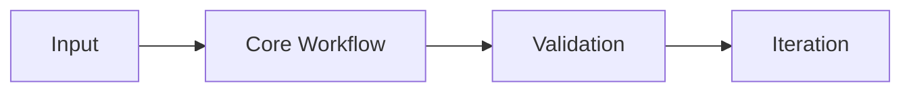

# <Tutorial Name> Tutorial: <Clear Value Proposition>

> <One concise paragraph on what this track teaches and for whom.>

## Why This Track Matters

- <Reader pain point 1>
- <Reader pain point 2>
- <Reader pain point 3>

## Current Snapshot (Verified <Month Day, Year>)

- repository: `<org>/<repo>`
- stars: about **<N>**
- latest release/version: `<tag or version>`
- current focus: <short note>

## <Tutorial Name> Mental Model

## Chapter Guide

| Chapter | Key Question | Outcome |
|:--------|:-------------|:--------|
| `01 - ...` | ... | ... |
| `02 - ...` | ... | ... |
| `03 - ...` | ... | ... |
| `04 - ...` | ... | ... |
| `05 - ...` | ... | ... |
| `06 - ...` | ... | ... |
| `07 - ...` | ... | ... |
| `08 - ...` | ... | ... |

## What You Will Learn

- <Outcome 1>
- <Outcome 2>
- <Outcome 3>
- <Outcome 4>

## Source References

- [Official README](https://github.com/example/example-repo/blob/main/README.md)
- [Official Docs](https://docs.example.com)
- [Releases](https://github.com/example/example-repo/releases)

## Related Tutorials

- `../related-a/`
- `../related-b/`

---

Start with chapter 1 file: `01-...md`.
