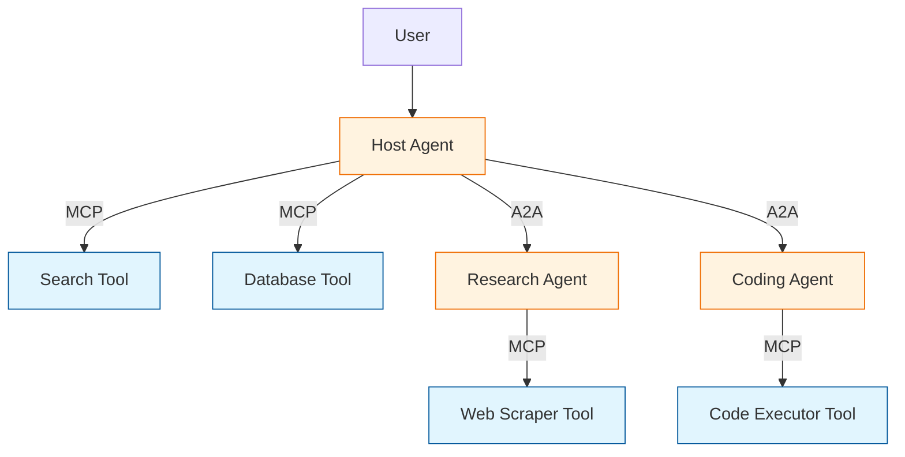
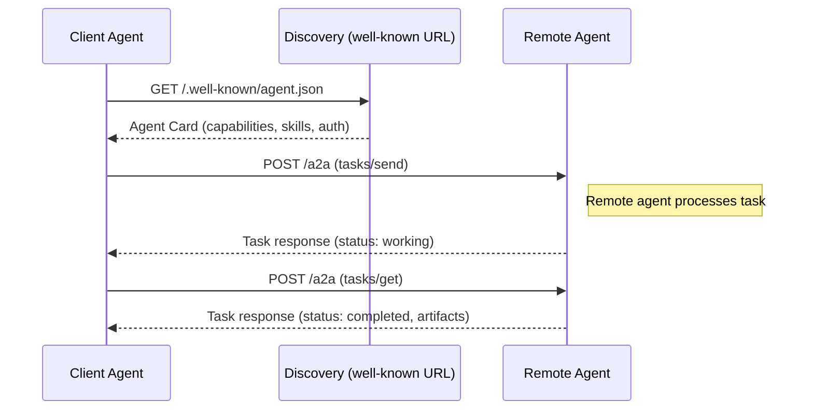

# Chapter 1: Getting Started With the A2A Protocol

Welcome to the Agent-to-Agent (A2A) protocol tutorial. A2A is an open standard — originally created by Google and now governed by the Linux Foundation — that defines how AI agents discover and communicate with each other across platforms, frameworks, and vendors.

## What Problem Does This Solve?

Today's AI ecosystem has a fragmentation problem. You might build an agent with LangChain, your partner uses CrewAI, and a third service runs on a custom framework. Each agent is capable on its own, but making them collaborate requires custom glue code for every pair of integrations.

A2A provides a universal protocol so that any agent can:

1. **Discover** what other agents can do (via Agent Cards)
2. **Send tasks** to remote agents over standard HTTP
3. **Receive streaming updates** as work progresses
4. **Collect artifacts** (results) in a structured format

Think of it like HTTP for agent collaboration — a shared language that lets independently built agents work together.

## MCP vs A2A: Two Complementary Standards

A common question is how A2A relates to MCP (Model Context Protocol). They solve different problems and are designed to work together:

| Aspect | MCP | A2A |
|:-------|:----|:----|
| **Relationship** | Agent → Tool/Data | Agent → Agent |
| **Primary use** | Give an agent access to APIs, databases, files | Let agents delegate work to other agents |
| **Discovery** | Server capabilities negotiation | Agent Cards with skills and endpoints |
| **Communication** | JSON-RPC over stdio/HTTP | JSON-RPC over HTTP with streaming |
| **Governance** | Anthropic / open community | Linux Foundation |



**MCP** connects an agent to tools and data sources. **A2A** connects an agent to other agents. A host agent might use MCP to access a database and A2A to delegate a research task to a specialized agent — which itself uses MCP to access a web scraping tool.

## Core Concepts at a Glance

### Agent Card

Every A2A agent publishes a JSON document called an **Agent Card** at a well-known URL (typically `/.well-known/agent.json`). This card describes:

- The agent's name, description, and provider
- What skills it offers
- What authentication it requires
- Its endpoint URL

```json
{
  "name": "Research Assistant",
  "description": "Finds and summarizes information on any topic",
  "url": "https://research-agent.example.com/a2a",
  "version": "1.0.0",
  "capabilities": {
    "streaming": true,
    "pushNotifications": false
  },
  "skills": [
    {
      "id": "web-research",
      "name": "Web Research",
      "description": "Search the web and synthesize findings",
      "tags": ["research", "search", "summarize"]
    }
  ],
  "authentication": {
    "schemes": ["oauth2"]
  }
}
```

### Task

A **Task** is the unit of work in A2A. A client agent sends a task to a remote agent, which processes it and returns results. Tasks have a lifecycle:

```
submitted → working → completed
                   → failed
                   → canceled
```

### Message and Artifact

Communication within a task happens through **Messages** (conversational turns) and **Artifacts** (structured output). A message might say "I'm analyzing the data now..." while an artifact contains the final research report.

## Setting Up Your Environment

### Install the A2A Python SDK

```bash
# Create a virtual environment
python -m venv a2a-env
source a2a-env/bin/activate

# Install the A2A SDK
pip install a2a-sdk
```

### Verify the Installation

```python
import a2a

# Check SDK version
print(f"A2A SDK version: {a2a.__version__}")
```

### Quick Smoke Test: Fetching an Agent Card

```python
import httpx
import json

async def discover_agent(base_url: str):
    """Fetch an agent's card from its well-known URL."""
    async with httpx.AsyncClient() as client:
        response = await client.get(
            f"{base_url}/.well-known/agent.json"
        )
        response.raise_for_status()
        card = response.json()

    print(f"Agent: {card['name']}")
    print(f"Skills: {[s['name'] for s in card.get('skills', [])]}")
    return card

# Usage:
# import asyncio
# asyncio.run(discover_agent("https://research-agent.example.com"))
```

## How It Works Under the Hood

When a client agent wants to collaborate with a remote agent, the full flow looks like this:



1. **Discovery**: The client fetches the remote agent's Agent Card to learn its capabilities.
2. **Task submission**: The client sends a task via JSON-RPC over HTTP.
3. **Processing**: The remote agent works on the task, potentially streaming updates.
4. **Result retrieval**: The client gets the final result as artifacts.

## Project Structure

A typical A2A project looks like this:

```
my-a2a-agent/
├── agent_card.json          # Your agent's capability declaration
├── server.py                # A2A server handling incoming tasks
├── client.py                # A2A client for calling other agents
├── task_handler.py          # Business logic for processing tasks
├── requirements.txt
└── tests/
    ├── test_agent_card.py
    └── test_task_lifecycle.py
```

## What You Will Build in This Tutorial

Across the following chapters, you will:

1. Understand the full protocol specification (Chapter 2)
2. Create discoverable Agent Cards (Chapter 3)
3. Implement task lifecycle management (Chapter 4)
4. Secure agent communication (Chapter 5)
5. Build working A2A agents in Python (Chapter 6)
6. Design multi-agent delegation patterns (Chapter 7)
7. Combine A2A with MCP for the complete ecosystem (Chapter 8)

---

**Next: [Chapter 2: Protocol Specification](02-protocol-specification.md)** — Dive into Agent Cards, task lifecycle, and streaming mechanics.

[Back to Tutorial Overview](README.md) | [All Tutorials](../../README.md#-tutorial-catalog)
