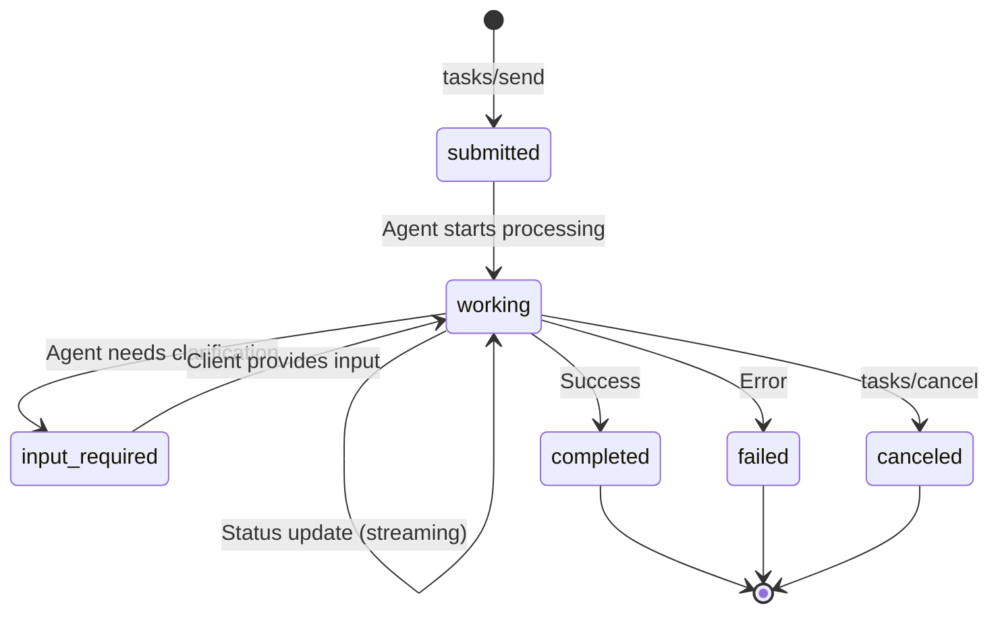
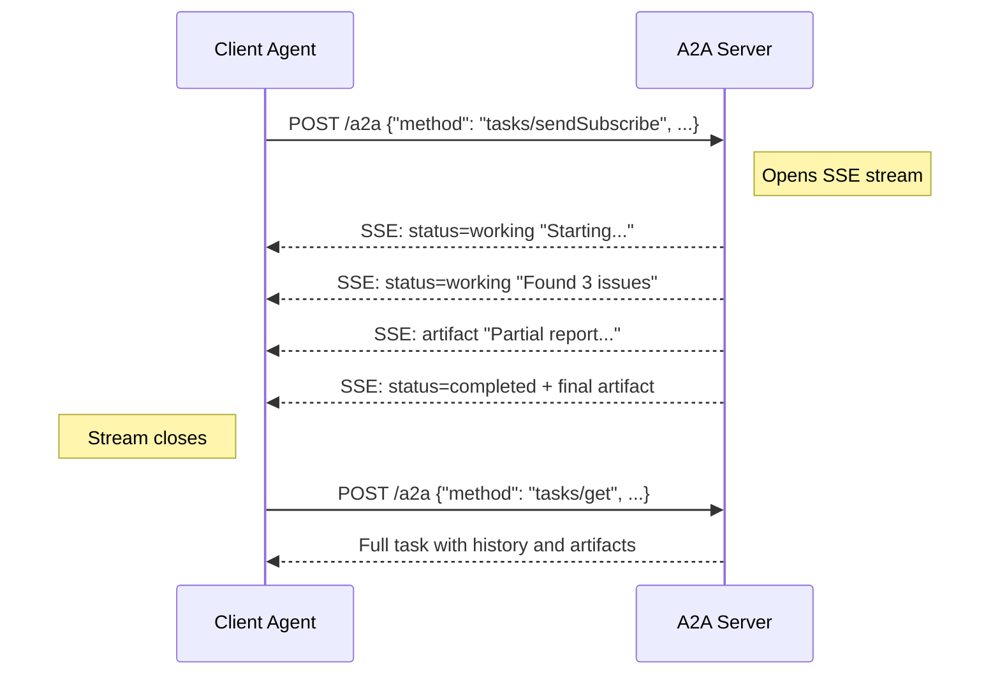

# Chapter 2: Protocol Specification

The A2A protocol is built on JSON-RPC 2.0 over HTTP, providing a familiar foundation for developers. This chapter walks through every core primitive: Agent Cards, Messages, Tasks, Artifacts, and streaming — the building blocks of all agent-to-agent communication.

## What Problem Does This Solve?

Without a shared protocol specification, every multi-agent integration is ad hoc. Team A invents one JSON format, Team B invents another, and a mediator layer must translate between them. A2A defines the canonical wire format so that any conforming agent can talk to any other.

## JSON-RPC Foundation

All A2A communication uses JSON-RPC 2.0. Every request has a `method`, `params`, and `id`:

```json
{
  "jsonrpc": "2.0",
  "id": "req-001",
  "method": "tasks/send",
  "params": {
    "id": "task-abc-123",
    "message": {
      "role": "user",
      "parts": [
        { "type": "text", "text": "Summarize the latest AI safety research" }
      ]
    }
  }
}
```

Responses follow the standard JSON-RPC format with either a `result` or `error` field.

## Agent Card Schema

The Agent Card is the identity document of an A2A agent. It is a JSON object served at `/.well-known/agent.json`:

```json
{
  "name": "Code Review Agent",
  "description": "Automated code review with security and style analysis",
  "url": "https://code-review.example.com/a2a",
  "version": "2.0.0",
  "provider": {
    "organization": "DevTools Corp",
    "url": "https://devtools.example.com"
  },
  "capabilities": {
    "streaming": true,
    "pushNotifications": true,
    "stateTransitionHistory": true
  },
  "skills": [
    {
      "id": "security-review",
      "name": "Security Review",
      "description": "Analyze code for security vulnerabilities",
      "tags": ["security", "code-review", "vulnerabilities"],
      "examples": [
        "Review this Python file for SQL injection risks",
        "Check this API endpoint for authentication issues"
      ]
    },
    {
      "id": "style-review",
      "name": "Style Review",
      "description": "Check code against style guidelines",
      "tags": ["style", "linting", "best-practices"]
    }
  ],
  "authentication": {
    "schemes": ["oauth2"],
    "credentials": "https://auth.devtools.example.com/.well-known/openid-configuration"
  },
  "defaultInputModes": ["text", "file"],
  "defaultOutputModes": ["text", "file"]
}
```

### Key Fields Explained

| Field | Purpose |
|:------|:--------|
| `name`, `description` | Human-readable identity |
| `url` | The JSON-RPC endpoint for sending tasks |
| `capabilities` | What protocol features the agent supports |
| `skills` | Discrete things the agent can do, with tags for matching |
| `authentication` | How to authenticate before sending tasks |
| `defaultInputModes` | What content types the agent accepts (text, file, data) |
| `defaultOutputModes` | What content types the agent produces |

## Message Structure

Messages represent conversational turns between agents. Each message has a `role` and a list of `parts`:

```json
{
  "role": "user",
  "parts": [
    {
      "type": "text",
      "text": "Please review this code for security issues"
    },
    {
      "type": "file",
      "file": {
        "name": "handler.py",
        "mimeType": "text/x-python",
        "bytes": "aW1wb3J0IG9z..."
      }
    }
  ]
}
```

### Part Types

A2A supports multiple part types within a single message:

```python
# Text part — plain text or markdown
text_part = {"type": "text", "text": "Analyze this data"}

# File part — binary content with metadata
file_part = {
    "type": "file",
    "file": {
        "name": "report.pdf",
        "mimeType": "application/pdf",
        "bytes": "<base64-encoded>"  # or use "uri" for remote files
    }
}

# Data part — structured JSON data
data_part = {
    "type": "data",
    "data": {
        "metrics": {"complexity": 42, "lines": 500},
        "language": "python"
    }
}
```

## Task Lifecycle

A Task is the central unit of work. It has a well-defined state machine:



### Task Object

```json
{
  "id": "task-abc-123",
  "sessionId": "session-xyz",
  "status": {
    "state": "working",
    "message": {
      "role": "agent",
      "parts": [{"type": "text", "text": "Analyzing code..."}]
    },
    "timestamp": "2026-03-21T10:30:00Z"
  },
  "artifacts": [],
  "history": [
    {
      "role": "user",
      "parts": [{"type": "text", "text": "Review this code"}]
    }
  ],
  "metadata": {}
}
```

### Task States

| State | Meaning |
|:------|:--------|
| `submitted` | Task received, not yet started |
| `working` | Agent is actively processing |
| `input-required` | Agent needs more information from the client |
| `completed` | Task finished successfully |
| `failed` | Task encountered an unrecoverable error |
| `canceled` | Task was canceled by the client |

## Artifacts

Artifacts are the structured outputs of a task. Unlike status messages (which are ephemeral), artifacts persist as deliverables:

```json
{
  "id": "artifact-001",
  "name": "Security Review Report",
  "description": "Analysis of handler.py for security vulnerabilities",
  "parts": [
    {
      "type": "text",
      "text": "## Security Review\n\n### Critical: SQL Injection on line 42\n..."
    },
    {
      "type": "data",
      "data": {
        "vulnerabilities": 3,
        "severity": {"critical": 1, "high": 1, "medium": 1}
      }
    }
  ],
  "metadata": {
    "reviewType": "security",
    "linesAnalyzed": 500
  }
}
```

## Protocol Methods

The A2A specification defines these JSON-RPC methods:

### Core Methods

```typescript
// Send a task to an agent
interface TaskSendRequest {
  method: "tasks/send";
  params: {
    id: string;
    sessionId?: string;
    message: Message;
    metadata?: Record<string, unknown>;
    pushNotification?: PushNotificationConfig;
  };
}

// Send a task with streaming response (SSE)
interface TaskSendSubscribeRequest {
  method: "tasks/sendSubscribe";
  params: TaskSendRequest["params"];
}

// Get current task status
interface TaskGetRequest {
  method: "tasks/get";
  params: {
    id: string;
    historyLength?: number;
  };
}

// Cancel a running task
interface TaskCancelRequest {
  method: "tasks/cancel";
  params: { id: string };
}
```

### Push Notification Methods

```typescript
// Set up push notification webhook
interface SetPushNotificationRequest {
  method: "tasks/pushNotification/set";
  params: {
    id: string;
    pushNotificationConfig: {
      url: string;
      token?: string;
    };
  };
}

// Get current push notification config
interface GetPushNotificationRequest {
  method: "tasks/pushNotification/get";
  params: { id: string };
}
```

## Streaming With Server-Sent Events

When using `tasks/sendSubscribe`, the server responds with a stream of Server-Sent Events (SSE):

```python
# What the HTTP response stream looks like:
# Content-Type: text/event-stream

# data: {"jsonrpc":"2.0","id":"req-1","result":{"id":"task-1","status":{"state":"working","message":{"role":"agent","parts":[{"type":"text","text":"Starting analysis..."}]}}}}

# data: {"jsonrpc":"2.0","id":"req-1","result":{"id":"task-1","status":{"state":"working","message":{"role":"agent","parts":[{"type":"text","text":"Found 3 issues..."}]}}}}

# data: {"jsonrpc":"2.0","id":"req-1","result":{"id":"task-1","status":{"state":"completed"},"artifacts":[{"name":"report","parts":[{"type":"text","text":"## Final Report..."}]}]}}
```

### SSE Event Types

Each SSE event carries either a `TaskStatusUpdateEvent` or a `TaskArtifactUpdateEvent`:

```json
{
  "jsonrpc": "2.0",
  "id": "req-1",
  "result": {
    "id": "task-1",
    "status": {
      "state": "working",
      "message": {
        "role": "agent",
        "parts": [{"type": "text", "text": "Processing step 2 of 5..."}]
      }
    }
  }
}
```

## How It Works Under the Hood



The protocol separates **status updates** (transient progress) from **artifacts** (persistent outputs), so a client can display real-time progress while also accumulating deliverables.

## Error Handling

A2A uses standard JSON-RPC error codes plus protocol-specific extensions:

```json
{
  "jsonrpc": "2.0",
  "id": "req-1",
  "error": {
    "code": -32001,
    "message": "Task not found",
    "data": { "taskId": "task-unknown" }
  }
}
```

| Code | Meaning |
|:-----|:--------|
| `-32700` | Parse error |
| `-32600` | Invalid request |
| `-32601` | Method not found |
| `-32602` | Invalid params |
| `-32603` | Internal error |
| `-32001` | Task not found |
| `-32002` | Task not cancelable |
| `-32003` | Push notification not supported |

---

**Next: [Chapter 3: Agent Discovery](03-agent-discovery.md)** — How agents find each other and evaluate capabilities.

[Previous: Chapter 1](01-getting-started.md) | [Back to Tutorial Overview](README.md)
