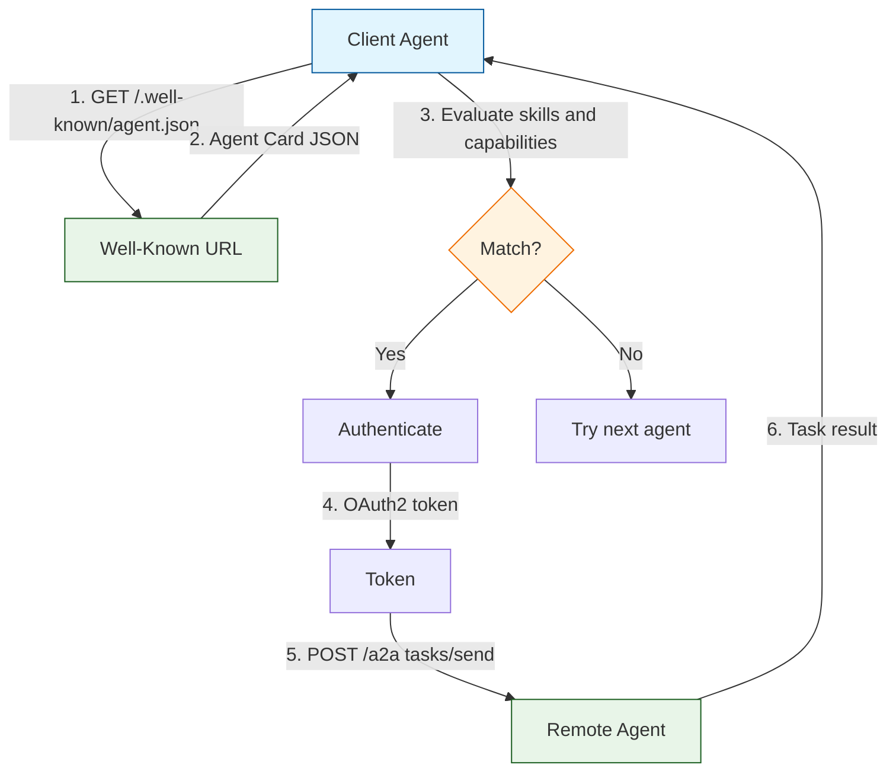

# Chapter 3: Agent Discovery

Agent discovery is the foundation of A2A interoperability. Before agents can collaborate, they need a reliable way to find each other, understand capabilities, and evaluate fitness for a task. The A2A protocol solves this through Agent Cards — self-describing JSON documents served at well-known URLs.

## What Problem Does This Solve?

In a world of hundreds of specialized agents, a client agent needs to answer: "Which agent should I delegate this task to?" Without a standard discovery mechanism, you would need a central registry that every agent vendor agrees on, or hard-code agent URLs into your application. Agent Cards provide a decentralized, web-native solution — the same pattern that `robots.txt` and `.well-known/openid-configuration` use.

## The Well-Known URL Pattern

Every A2A agent MUST serve its Agent Card at:

```
https://<agent-host>/.well-known/agent.json
```

This follows [RFC 8615](https://tools.ietf.org/html/rfc8615) for well-known URIs. Any client that knows an agent's hostname can discover its capabilities with a single GET request.

```python
import httpx

async def fetch_agent_card(host: str) -> dict:
    """Discover an agent by fetching its card from the well-known URL."""
    url = f"https://{host}/.well-known/agent.json"
    async with httpx.AsyncClient() as client:
        response = await client.get(url, follow_redirects=True)
        response.raise_for_status()
        return response.json()

# Example usage
# card = await fetch_agent_card("research-agent.example.com")
```

## Anatomy of an Agent Card

Let us build a complete Agent Card for a translation agent:

```json
{
  "name": "Polyglot Translator",
  "description": "High-quality translation between 50+ languages with domain specialization in legal, medical, and technical texts",
  "url": "https://translate.example.com/a2a",
  "version": "3.1.0",
  "documentationUrl": "https://translate.example.com/docs",
  "provider": {
    "organization": "LinguaTech",
    "url": "https://linguatech.example.com",
    "contactEmail": "agents@linguatech.example.com"
  },
  "capabilities": {
    "streaming": true,
    "pushNotifications": true,
    "stateTransitionHistory": true
  },
  "skills": [
    {
      "id": "general-translation",
      "name": "General Translation",
      "description": "Translate text between any supported language pair",
      "tags": ["translation", "language", "i18n"],
      "examples": [
        "Translate this paragraph from English to Japanese",
        "Convert this French legal document to English"
      ],
      "inputModes": ["text", "file"],
      "outputModes": ["text", "file"]
    },
    {
      "id": "medical-translation",
      "name": "Medical Translation",
      "description": "Translate medical documents with terminology accuracy",
      "tags": ["translation", "medical", "healthcare"],
      "examples": [
        "Translate this patient discharge summary to Spanish",
        "Convert this clinical trial report from German to English"
      ],
      "inputModes": ["text", "file"],
      "outputModes": ["text", "file"]
    }
  ],
  "defaultInputModes": ["text", "file"],
  "defaultOutputModes": ["text"],
  "authentication": {
    "schemes": ["oauth2"],
    "credentials": "https://auth.linguatech.example.com/.well-known/openid-configuration"
  },
  "supportsAuthenticatedExtendedCard": true
}
```

### Skills as the Primary Matching Mechanism

Skills are how client agents determine if a remote agent is right for a task. Each skill has:

- **`id`**: A stable identifier for programmatic matching
- **`name` / `description`**: Human-readable context
- **`tags`**: Keywords for search and filtering
- **`examples`**: Sample prompts that show what this skill handles
- **`inputModes` / `outputModes`**: Content type constraints

## Building an Agent Card in Python

```python
from dataclasses import dataclass, field, asdict
from typing import Optional
import json

@dataclass
class Skill:
    id: str
    name: str
    description: str
    tags: list[str] = field(default_factory=list)
    examples: list[str] = field(default_factory=list)
    input_modes: list[str] = field(default_factory=lambda: ["text"])
    output_modes: list[str] = field(default_factory=lambda: ["text"])

@dataclass
class AgentCard:
    name: str
    description: str
    url: str
    version: str
    skills: list[Skill]
    provider: Optional[dict] = None
    capabilities: dict = field(default_factory=lambda: {
        "streaming": False,
        "pushNotifications": False,
    })
    authentication: Optional[dict] = None
    default_input_modes: list[str] = field(default_factory=lambda: ["text"])
    default_output_modes: list[str] = field(default_factory=lambda: ["text"])

    def to_json(self) -> str:
        """Serialize to the A2A Agent Card JSON format."""
        data = {
            "name": self.name,
            "description": self.description,
            "url": self.url,
            "version": self.version,
            "skills": [
                {
                    "id": s.id,
                    "name": s.name,
                    "description": s.description,
                    "tags": s.tags,
                    "examples": s.examples,
                    "inputModes": s.input_modes,
                    "outputModes": s.output_modes,
                }
                for s in self.skills
            ],
            "capabilities": self.capabilities,
            "defaultInputModes": self.default_input_modes,
            "defaultOutputModes": self.default_output_modes,
        }
        if self.provider:
            data["provider"] = self.provider
        if self.authentication:
            data["authentication"] = self.authentication
        return json.dumps(data, indent=2)

# Create an agent card
card = AgentCard(
    name="Data Analyst",
    description="Statistical analysis and visualization agent",
    url="https://analyst.example.com/a2a",
    version="1.0.0",
    skills=[
        Skill(
            id="statistical-analysis",
            name="Statistical Analysis",
            description="Run statistical tests and generate insights",
            tags=["statistics", "analysis", "data"],
            examples=["Analyze the correlation between X and Y in this dataset"],
        ),
        Skill(
            id="visualization",
            name="Data Visualization",
            description="Create charts and graphs from datasets",
            tags=["charts", "graphs", "visualization"],
            input_modes=["text", "data", "file"],
            output_modes=["text", "file"],
        ),
    ],
    capabilities={"streaming": True, "pushNotifications": False},
)

print(card.to_json())
```

## Serving the Agent Card

Here is a minimal server that serves an Agent Card alongside the A2A endpoint:

```python
from starlette.applications import Starlette
from starlette.responses import JSONResponse
from starlette.routing import Route

agent_card = {
    "name": "Echo Agent",
    "description": "Simple agent that echoes messages back",
    "url": "https://echo.example.com/a2a",
    "version": "1.0.0",
    "capabilities": {"streaming": False, "pushNotifications": False},
    "skills": [
        {
            "id": "echo",
            "name": "Echo",
            "description": "Echoes your message back",
            "tags": ["echo", "test"],
        }
    ],
    "defaultInputModes": ["text"],
    "defaultOutputModes": ["text"],
}

async def serve_agent_card(request):
    """Serve the Agent Card at the well-known URL."""
    return JSONResponse(
        agent_card,
        headers={
            "Content-Type": "application/json",
            "Cache-Control": "public, max-age=3600",
        },
    )

async def handle_a2a(request):
    """Handle A2A JSON-RPC requests."""
    body = await request.json()
    # ... dispatch based on body["method"]
    return JSONResponse({"jsonrpc": "2.0", "id": body["id"], "result": {}})

app = Starlette(routes=[
    Route("/.well-known/agent.json", serve_agent_card),
    Route("/a2a", handle_a2a, methods=["POST"]),
])
```

## Agent Discovery Patterns

### Pattern 1: Direct Discovery

The simplest pattern — the client knows the agent's hostname:

```python
card = await fetch_agent_card("research-agent.example.com")
```

### Pattern 2: Registry-Based Discovery

An organization maintains a registry of known agents:

```python
async def discover_from_registry(
    registry_url: str, tags: list[str]
) -> list[dict]:
    """Query a registry for agents matching specific tags."""
    async with httpx.AsyncClient() as client:
        response = await client.get(
            f"{registry_url}/agents",
            params={"tags": ",".join(tags)},
        )
        agents = response.json()

    # Fetch full Agent Card for each result
    cards = []
    for agent in agents:
        card = await fetch_agent_card(agent["host"])
        cards.append(card)
    return cards

# Find all agents that can do translation
# cards = await discover_from_registry(
#     "https://registry.example.com", ["translation"]
# )
```

### Pattern 3: Skill-Based Routing

Match incoming requests to the best agent based on skill tags:

```python
def find_best_agent(
    agent_cards: list[dict], required_tags: set[str]
) -> dict | None:
    """Find the agent whose skills best match the required tags."""
    best_match = None
    best_score = 0

    for card in agent_cards:
        for skill in card.get("skills", []):
            skill_tags = set(skill.get("tags", []))
            overlap = len(skill_tags & required_tags)
            if overlap > best_score:
                best_score = overlap
                best_match = card

    return best_match

# Example
agents = [card_a, card_b, card_c]
best = find_best_agent(agents, {"medical", "translation"})
```

## Extended Agent Cards

A2A supports the concept of **extended Agent Cards** — additional capability details that are only available after authentication. This lets agents hide sensitive details from anonymous discovery while still being findable:

```json
{
  "supportsAuthenticatedExtendedCard": true
}
```

After authenticating, a client can fetch the extended card with additional fields like rate limits, SLA guarantees, or internal-only skills.

## How It Works Under the Hood



The discovery process is intentionally lightweight — a single HTTP GET returns everything a client needs to decide whether to use an agent. No handshake, no session setup, no registration required.

## Caching and Versioning

Agent Cards should be cached by clients. The `version` field helps clients detect changes:

```python
import hashlib

class AgentCardCache:
    def __init__(self):
        self._cache: dict[str, tuple[str, dict]] = {}  # host -> (version, card)

    async def get_card(self, host: str) -> dict:
        cached = self._cache.get(host)
        card = await fetch_agent_card(host)

        if cached and cached[0] == card.get("version"):
            return cached[1]  # Use cached version

        self._cache[host] = (card.get("version", ""), card)
        return card
```

---

**Next: [Chapter 4: Task Management](04-task-management.md)** — Creating, tracking, and completing tasks with streaming updates.

[Previous: Chapter 2](02-protocol-specification.md) | [Back to Tutorial Overview](README.md)
