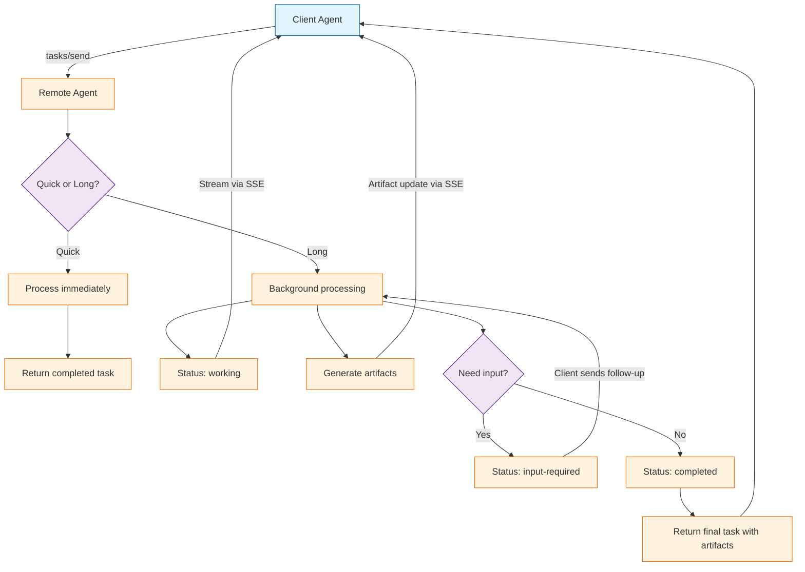

# Chapter 4: Task Management

Tasks are the core unit of work in the A2A protocol. This chapter covers the full task lifecycle — from creation through streaming updates to artifact collection — with practical implementations in Python and TypeScript.

## What Problem Does This Solve?

Agent-to-agent collaboration is inherently asynchronous. A research agent might take minutes to compile findings; a code review agent might need to ask clarifying questions mid-task. The A2A task model provides a structured way to handle all of these patterns: synchronous quick replies, long-running background work, multi-turn conversations, and real-time streaming — all through the same protocol.

## Task Creation

### Using `tasks/send` (Synchronous)

The simplest way to create a task — send and wait for the final result:

```python
import httpx
import uuid

async def send_task(
    agent_url: str,
    message: str,
    session_id: str | None = None,
    token: str | None = None,
) -> dict:
    """Send a task to a remote agent and wait for the result."""
    task_id = str(uuid.uuid4())
    headers = {"Content-Type": "application/json"}
    if token:
        headers["Authorization"] = f"Bearer {token}"

    payload = {
        "jsonrpc": "2.0",
        "id": f"req-{task_id[:8]}",
        "method": "tasks/send",
        "params": {
            "id": task_id,
            "message": {
                "role": "user",
                "parts": [{"type": "text", "text": message}],
            },
        },
    }

    if session_id:
        payload["params"]["sessionId"] = session_id

    async with httpx.AsyncClient(timeout=120.0) as client:
        response = await client.post(agent_url, json=payload)
        response.raise_for_status()
        return response.json()["result"]

# Usage
# result = await send_task(
#     "https://agent.example.com/a2a",
#     "Summarize the key findings from the Q4 report"
# )
```

### Using `tasks/sendSubscribe` (Streaming)

For real-time updates, use the streaming variant that returns Server-Sent Events:

```python
import httpx
import json

async def send_task_streaming(
    agent_url: str,
    message: str,
    on_status: callable = None,
    on_artifact: callable = None,
) -> dict:
    """Send a task and stream status updates and artifacts."""
    task_id = str(uuid.uuid4())

    payload = {
        "jsonrpc": "2.0",
        "id": f"req-{task_id[:8]}",
        "method": "tasks/sendSubscribe",
        "params": {
            "id": task_id,
            "message": {
                "role": "user",
                "parts": [{"type": "text", "text": message}],
            },
        },
    }

    final_result = None
    async with httpx.AsyncClient(timeout=300.0) as client:
        async with client.stream("POST", agent_url, json=payload) as response:
            async for line in response.aiter_lines():
                if not line.startswith("data: "):
                    continue

                event_data = json.loads(line[6:])
                result = event_data.get("result", {})

                # Handle status updates
                if "status" in result:
                    status = result["status"]
                    if on_status:
                        on_status(status)
                    if status["state"] in ("completed", "failed", "canceled"):
                        final_result = result
                        break

                # Handle artifact updates
                if "artifact" in result:
                    if on_artifact:
                        on_artifact(result["artifact"])

    return final_result

# Usage with callbacks
# async def handle_status(status):
#     print(f"[{status['state']}] {status.get('message', {}).get('parts', [{}])[0].get('text', '')}")
#
# result = await send_task_streaming(
#     "https://agent.example.com/a2a",
#     "Analyze this dataset for trends",
#     on_status=handle_status,
# )
```

### TypeScript Client

```typescript
interface TaskSendParams {
  id: string;
  sessionId?: string;
  message: {
    role: "user" | "agent";
    parts: Array<{ type: string; text?: string; data?: unknown }>;
  };
}

async function sendTask(
  agentUrl: string,
  message: string
): Promise<unknown> {
  const taskId = crypto.randomUUID();

  const response = await fetch(agentUrl, {
    method: "POST",
    headers: { "Content-Type": "application/json" },
    body: JSON.stringify({
      jsonrpc: "2.0",
      id: `req-${taskId.slice(0, 8)}`,
      method: "tasks/send",
      params: {
        id: taskId,
        message: {
          role: "user",
          parts: [{ type: "text", text: message }],
        },
      },
    }),
  });

  const result = await response.json();
  return result.result;
}

// Streaming variant
async function* sendTaskStreaming(
  agentUrl: string,
  message: string
): AsyncGenerator<unknown> {
  const taskId = crypto.randomUUID();

  const response = await fetch(agentUrl, {
    method: "POST",
    headers: { "Content-Type": "application/json" },
    body: JSON.stringify({
      jsonrpc: "2.0",
      id: `req-${taskId.slice(0, 8)}`,
      method: "tasks/sendSubscribe",
      params: {
        id: taskId,
        message: {
          role: "user",
          parts: [{ type: "text", text: message }],
        },
      },
    }),
  });

  const reader = response.body!.getReader();
  const decoder = new TextDecoder();
  let buffer = "";

  while (true) {
    const { done, value } = await reader.read();
    if (done) break;

    buffer += decoder.decode(value, { stream: true });
    const lines = buffer.split("\n");
    buffer = lines.pop()!;

    for (const line of lines) {
      if (line.startsWith("data: ")) {
        yield JSON.parse(line.slice(6));
      }
    }
  }
}
```

## Checking Task Status

For long-running tasks, poll the status:

```python
import asyncio

async def poll_task(
    agent_url: str,
    task_id: str,
    interval: float = 2.0,
    timeout: float = 300.0,
) -> dict:
    """Poll a task until it reaches a terminal state."""
    payload = {
        "jsonrpc": "2.0",
        "id": "poll",
        "method": "tasks/get",
        "params": {"id": task_id, "historyLength": 10},
    }

    elapsed = 0.0
    async with httpx.AsyncClient() as client:
        while elapsed < timeout:
            response = await client.post(agent_url, json=payload)
            result = response.json()["result"]
            state = result["status"]["state"]

            if state in ("completed", "failed", "canceled"):
                return result

            await asyncio.sleep(interval)
            elapsed += interval

    raise TimeoutError(f"Task {task_id} did not complete within {timeout}s")
```

## Multi-Turn Conversations

When an agent needs clarification, it sets the task state to `input-required`. The client then sends a follow-up message with the same task ID:

```python
async def handle_multi_turn(agent_url: str, initial_message: str) -> dict:
    """Handle a multi-turn task conversation."""
    task_id = str(uuid.uuid4())
    session_id = str(uuid.uuid4())

    # First turn
    result = await send_task(agent_url, initial_message)

    while result["status"]["state"] == "input-required":
        # Show the agent's question to the user
        agent_question = result["status"]["message"]["parts"][0]["text"]
        print(f"Agent asks: {agent_question}")

        # Get user's response (in practice, this might come from the client agent)
        user_response = input("Your answer: ")

        # Send follow-up with same task ID and session ID
        payload = {
            "jsonrpc": "2.0",
            "id": f"req-follow-up",
            "method": "tasks/send",
            "params": {
                "id": task_id,
                "sessionId": session_id,
                "message": {
                    "role": "user",
                    "parts": [{"type": "text", "text": user_response}],
                },
            },
        }

        async with httpx.AsyncClient() as client:
            response = await client.post(agent_url, json=payload)
            result = response.json()["result"]

    return result
```

## Canceling Tasks

```python
async def cancel_task(agent_url: str, task_id: str) -> dict:
    """Cancel a running task."""
    payload = {
        "jsonrpc": "2.0",
        "id": "cancel",
        "method": "tasks/cancel",
        "params": {"id": task_id},
    }

    async with httpx.AsyncClient() as client:
        response = await client.post(agent_url, json=payload)
        return response.json()["result"]
```

## Push Notifications

For very long-running tasks, instead of polling, the client can register a webhook:

```python
async def setup_push_notification(
    agent_url: str,
    task_id: str,
    webhook_url: str,
    webhook_token: str | None = None,
) -> dict:
    """Register a webhook for task completion notifications."""
    payload = {
        "jsonrpc": "2.0",
        "id": "push-setup",
        "method": "tasks/pushNotification/set",
        "params": {
            "id": task_id,
            "pushNotificationConfig": {
                "url": webhook_url,
                "token": webhook_token,
            },
        },
    }

    async with httpx.AsyncClient() as client:
        response = await client.post(agent_url, json=payload)
        return response.json()["result"]
```

The remote agent will POST to the webhook URL whenever the task status changes:

```python
from starlette.applications import Starlette
from starlette.responses import JSONResponse
from starlette.routing import Route

async def webhook_handler(request):
    """Receive push notifications from remote agents."""
    data = await request.json()
    task_id = data.get("id")
    status = data.get("status", {})
    state = status.get("state")

    print(f"Task {task_id} status: {state}")

    if state == "completed":
        artifacts = data.get("artifacts", [])
        for artifact in artifacts:
            print(f"  Artifact: {artifact.get('name')}")

    return JSONResponse({"received": True})

webhook_app = Starlette(routes=[
    Route("/webhook/task-updates", webhook_handler, methods=["POST"]),
])
```

## Working With Artifacts

Artifacts are the deliverables of a task. Extract and process them:

```python
def extract_artifacts(task_result: dict) -> list[dict]:
    """Extract and categorize artifacts from a completed task."""
    artifacts = task_result.get("artifacts", [])
    processed = []

    for artifact in artifacts:
        for part in artifact.get("parts", []):
            if part["type"] == "text":
                processed.append({
                    "name": artifact.get("name", "unnamed"),
                    "type": "text",
                    "content": part["text"],
                })
            elif part["type"] == "file":
                processed.append({
                    "name": artifact.get("name", "unnamed"),
                    "type": "file",
                    "filename": part["file"].get("name"),
                    "mime_type": part["file"].get("mimeType"),
                    "data": part["file"].get("bytes"),  # base64
                })
            elif part["type"] == "data":
                processed.append({
                    "name": artifact.get("name", "unnamed"),
                    "type": "data",
                    "content": part["data"],
                })

    return processed
```

## How It Works Under the Hood



## Session Management

Sessions group related tasks together. Using the same `sessionId` across multiple `tasks/send` calls lets the remote agent maintain context:

```python
class A2ASession:
    """Manage a series of related tasks with a single agent."""

    def __init__(self, agent_url: str, token: str | None = None):
        self.agent_url = agent_url
        self.session_id = str(uuid.uuid4())
        self.token = token
        self.task_history: list[str] = []

    async def send(self, message: str) -> dict:
        """Send a new task within this session."""
        result = await send_task(
            self.agent_url,
            message,
            session_id=self.session_id,
            token=self.token,
        )
        self.task_history.append(result["id"])
        return result

    async def get_last_task(self) -> dict | None:
        """Retrieve the last task in this session."""
        if not self.task_history:
            return None
        return await poll_task(self.agent_url, self.task_history[-1])
```

---

**Next: [Chapter 5: Authentication and Security](05-authentication-and-security.md)** — Securing agent-to-agent communication with OAuth2 and identity verification.

[Previous: Chapter 3](03-agent-discovery.md) | [Back to Tutorial Overview](README.md)
