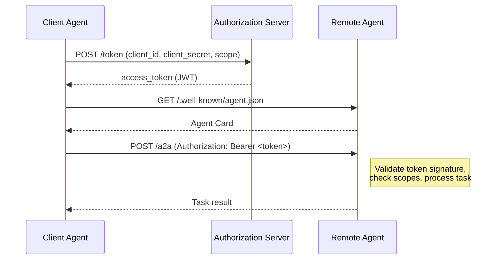

# Chapter 5: Authentication and Security

Agent-to-agent communication happens over the open internet between independently operated services. This chapter covers how A2A handles authentication, authorization, identity verification, and the trust model that makes agent collaboration safe.

## What Problem Does This Solve?

When Agent A sends a task to Agent B, both sides need answers to critical questions:

- **Agent B asks**: "Is Agent A who it claims to be? Does it have permission to use my capabilities?"
- **Agent A asks**: "Is Agent B's response authentic? Has the data been tampered with?"
- **Both ask**: "Is this communication confidential?"

Without standardized security, every agent integration would need custom auth negotiation. A2A builds on established web security standards — primarily OAuth 2.0 — so that agents can leverage existing identity infrastructure.

## Authentication Schemes in Agent Cards

The Agent Card declares what authentication the agent requires:

```json
{
  "name": "Enterprise Analysis Agent",
  "url": "https://analysis.corp.example.com/a2a",
  "authentication": {
    "schemes": ["oauth2"],
    "credentials": "https://auth.corp.example.com/.well-known/openid-configuration"
  }
}
```

### Supported Schemes

| Scheme | Use Case |
|:-------|:---------|
| `oauth2` | Standard OAuth 2.0 / OpenID Connect — recommended for production |
| `bearer` | Simple bearer token — useful for API keys and service-to-service |
| `none` | No authentication — only for public, read-only agents |

## OAuth 2.0 Flow for Agent-to-Agent

The recommended flow for A2A is the **OAuth 2.0 Client Credentials** grant, which is designed for machine-to-machine authentication:



### Implementing the Client Credentials Flow

```python
import httpx
from datetime import datetime, timedelta

class A2AAuthClient:
    """Handle OAuth2 client credentials for A2A communication."""

    def __init__(
        self,
        client_id: str,
        client_secret: str,
        token_endpoint: str,
        scopes: list[str] | None = None,
    ):
        self.client_id = client_id
        self.client_secret = client_secret
        self.token_endpoint = token_endpoint
        self.scopes = scopes or ["a2a:tasks:send"]
        self._token: str | None = None
        self._expires_at: datetime | None = None

    async def get_token(self) -> str:
        """Get a valid access token, refreshing if needed."""
        if self._token and self._expires_at and datetime.utcnow() < self._expires_at:
            return self._token

        async with httpx.AsyncClient() as client:
            response = await client.post(
                self.token_endpoint,
                data={
                    "grant_type": "client_credentials",
                    "client_id": self.client_id,
                    "client_secret": self.client_secret,
                    "scope": " ".join(self.scopes),
                },
            )
            response.raise_for_status()
            data = response.json()

        self._token = data["access_token"]
        expires_in = data.get("expires_in", 3600)
        self._expires_at = datetime.utcnow() + timedelta(seconds=expires_in - 60)
        return self._token

    async def send_authenticated_task(
        self, agent_url: str, task_params: dict
    ) -> dict:
        """Send a task with OAuth2 authentication."""
        token = await self.get_token()
        payload = {
            "jsonrpc": "2.0",
            "id": "req-auth",
            "method": "tasks/send",
            "params": task_params,
        }

        async with httpx.AsyncClient() as client:
            response = await client.post(
                agent_url,
                json=payload,
                headers={"Authorization": f"Bearer {token}"},
            )
            response.raise_for_status()
            return response.json()["result"]
```

### Discovering the Token Endpoint

The `credentials` field in the Agent Card typically points to an OpenID Connect discovery document:

```python
async def discover_token_endpoint(openid_config_url: str) -> str:
    """Fetch the token endpoint from OIDC discovery."""
    async with httpx.AsyncClient() as client:
        response = await client.get(openid_config_url)
        config = response.json()
        return config["token_endpoint"]

# Usage:
# token_url = await discover_token_endpoint(
#     "https://auth.corp.example.com/.well-known/openid-configuration"
# )
```

## Server-Side Token Validation

The A2A server must validate incoming tokens before processing tasks:

```python
import jwt
from functools import lru_cache

class TokenValidator:
    """Validate JWT access tokens for incoming A2A requests."""

    def __init__(self, issuer: str, audience: str, jwks_url: str):
        self.issuer = issuer
        self.audience = audience
        self.jwks_url = jwks_url
        self._jwks_client = jwt.PyJWKClient(jwks_url)

    def validate(self, token: str) -> dict:
        """Validate a JWT and return the claims."""
        signing_key = self._jwks_client.get_signing_key_from_jwt(token)

        claims = jwt.decode(
            token,
            signing_key.key,
            algorithms=["RS256"],
            issuer=self.issuer,
            audience=self.audience,
        )

        return claims

    def check_scope(self, claims: dict, required_scope: str) -> bool:
        """Check if the token has the required scope."""
        scopes = claims.get("scope", "").split()
        return required_scope in scopes
```

### Integrating Validation Into the A2A Server

```python
from starlette.applications import Starlette
from starlette.responses import JSONResponse
from starlette.routing import Route

validator = TokenValidator(
    issuer="https://auth.corp.example.com",
    audience="a2a-agents",
    jwks_url="https://auth.corp.example.com/.well-known/jwks.json",
)

async def handle_a2a(request):
    """A2A endpoint with authentication."""
    # Extract token
    auth_header = request.headers.get("Authorization", "")
    if not auth_header.startswith("Bearer "):
        return JSONResponse(
            {
                "jsonrpc": "2.0",
                "id": None,
                "error": {"code": -32000, "message": "Missing authentication"},
            },
            status_code=401,
        )

    token = auth_header[7:]

    # Validate token
    try:
        claims = validator.validate(token)
    except jwt.InvalidTokenError as e:
        return JSONResponse(
            {
                "jsonrpc": "2.0",
                "id": None,
                "error": {"code": -32000, "message": f"Invalid token: {e}"},
            },
            status_code=401,
        )

    # Check required scope
    if not validator.check_scope(claims, "a2a:tasks:send"):
        return JSONResponse(
            {
                "jsonrpc": "2.0",
                "id": None,
                "error": {"code": -32000, "message": "Insufficient scope"},
            },
            status_code=403,
        )

    # Process the request
    body = await request.json()
    # ... dispatch task handler
    return JSONResponse({"jsonrpc": "2.0", "id": body["id"], "result": {}})
```

## Agent Identity and Trust

### Verifying Agent Identity

Beyond token validation, agents may need to verify each other's identity:

```python
async def verify_agent_identity(
    agent_url: str,
    expected_provider: str | None = None,
) -> bool:
    """Verify an agent's identity by cross-checking its card and TLS certificate."""
    import ssl
    from urllib.parse import urlparse

    parsed = urlparse(agent_url)

    # Step 1: TLS certificate validates the domain
    # (httpx does this automatically)

    # Step 2: Fetch and validate the Agent Card
    async with httpx.AsyncClient(verify=True) as client:
        response = await client.get(
            f"https://{parsed.hostname}/.well-known/agent.json"
        )
        card = response.json()

    # Step 3: Verify the card's URL matches what we expect
    if card.get("url") != agent_url:
        return False

    # Step 4: Optionally verify the provider
    if expected_provider:
        provider = card.get("provider", {}).get("organization")
        if provider != expected_provider:
            return False

    return True
```

### Trust Levels

A practical trust model for A2A deployments:

```python
from enum import Enum

class TrustLevel(Enum):
    PUBLIC = "public"           # Open agents, no auth required
    AUTHENTICATED = "auth"      # Valid OAuth token required
    VERIFIED = "verified"       # Token + known provider verification
    INTERNAL = "internal"       # Same organization, mTLS or internal network

def determine_trust_level(
    claims: dict,
    agent_card: dict,
    is_internal: bool = False,
) -> TrustLevel:
    """Determine the trust level for an incoming request."""
    if is_internal:
        return TrustLevel.INTERNAL

    # Check if the client is from a verified/known provider
    client_org = claims.get("org", "")
    known_orgs = {"partner-corp.com", "trusted-vendor.io"}

    if client_org in known_orgs:
        return TrustLevel.VERIFIED

    if claims:
        return TrustLevel.AUTHENTICATED

    return TrustLevel.PUBLIC
```

## Securing Push Notifications

Push notification webhooks need their own security to prevent spoofed updates:

```python
import hmac
import hashlib

def sign_notification(payload: bytes, secret: str) -> str:
    """Sign a push notification payload."""
    return hmac.new(
        secret.encode(), payload, hashlib.sha256
    ).hexdigest()

def verify_notification_signature(
    payload: bytes, signature: str, secret: str
) -> bool:
    """Verify a push notification's HMAC signature."""
    expected = sign_notification(payload, secret)
    return hmac.compare_digest(signature, expected)
```

## How It Works Under the Hood

```mermaid
flowchart TD
    CA[Client Agent] -->|1. Discover OIDC config| OIDC[/.well-known/openid-configuration]
    OIDC -->|2. Token endpoint URL| CA
    CA -->|3. Client credentials grant| AS[Authorization Server]
    AS -->|4. JWT access token| CA
    CA -->|5. Bearer token + task| RA[Remote Agent]
    RA -->|6. Fetch JWKS| JWKS[JWKS Endpoint]
    JWKS -->|7. Public keys| RA
    RA -->|8. Validate JWT, check scopes| V{Valid?}
    V -->|Yes| PROC[Process task]
    V -->|No| ERR[401/403 Error]
    PROC -->|9. Result| CA

    classDef auth fill:#f3e5f5,stroke:#4a148c
    classDef agent fill:#e1f5fe,stroke:#01579b

    class AS,OIDC,JWKS,V auth
    class CA,RA agent
```

## Security Best Practices

1. **Always use TLS**: All A2A communication must happen over HTTPS.
2. **Rotate credentials**: Use short-lived tokens (< 1 hour) with automatic refresh.
3. **Principle of least privilege**: Request only the scopes your agent needs.
4. **Validate Agent Cards over TLS**: Only trust cards fetched over verified HTTPS connections.
5. **Log authentication events**: Track which agents are communicating for audit trails.
6. **Rate limit by identity**: Prevent any single agent from overwhelming your service.
7. **Verify webhook origins**: Always validate push notification signatures.

```python
# Example: Rate limiting by client identity
from collections import defaultdict
from time import time

class RateLimiter:
    def __init__(self, max_requests: int = 100, window_seconds: int = 60):
        self.max_requests = max_requests
        self.window = window_seconds
        self._requests: dict[str, list[float]] = defaultdict(list)

    def check(self, client_id: str) -> bool:
        """Return True if the request is allowed."""
        now = time()
        window_start = now - self.window
        self._requests[client_id] = [
            t for t in self._requests[client_id] if t > window_start
        ]
        if len(self._requests[client_id]) >= self.max_requests:
            return False
        self._requests[client_id].append(now)
        return True
```

---

**Next: [Chapter 6: Python SDK](06-python-sdk.md)** — Building complete A2A agents using the official Python SDK.

[Previous: Chapter 4](04-task-management.md) | [Back to Tutorial Overview](README.md)
