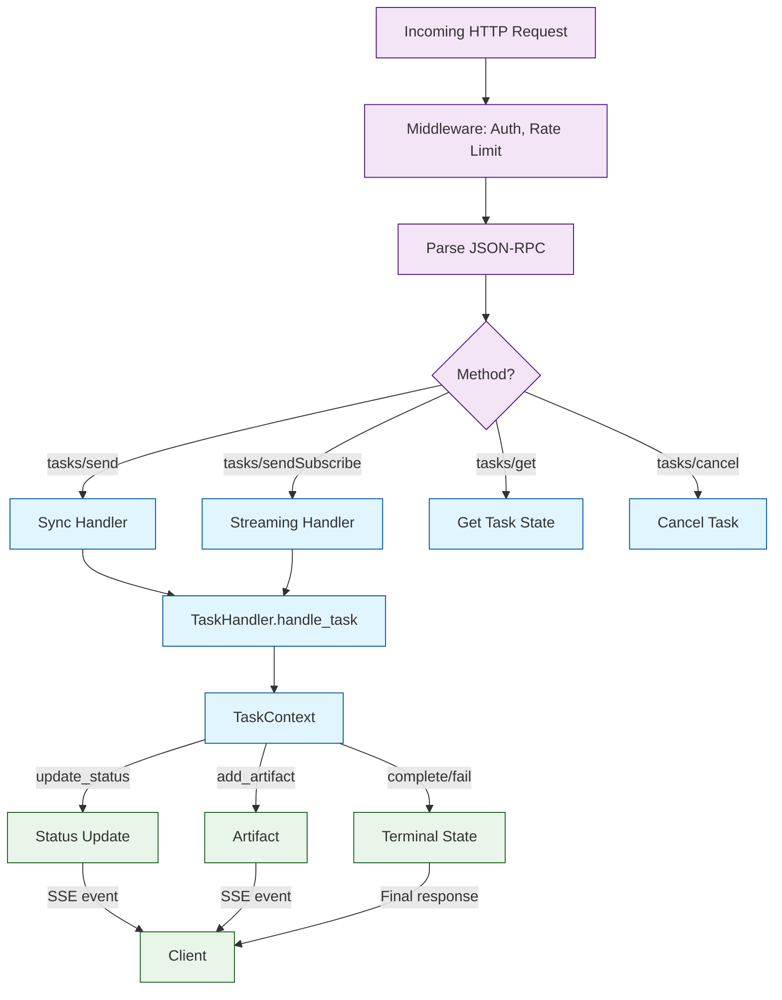

# Chapter 6: Python SDK

The A2A Python SDK provides high-level abstractions for building both A2A servers (agents that receive tasks) and A2A clients (agents that send tasks). This chapter shows how to build production-quality A2A agents from scratch.

## What Problem Does This Solve?

While you can implement A2A using raw HTTP and JSON-RPC (as shown in earlier chapters), the SDK handles the boilerplate: request parsing, response formatting, SSE streaming, Agent Card serving, error handling, and lifecycle management. This lets you focus on what your agent actually does rather than protocol plumbing.

## Installation

```bash
pip install a2a-sdk

# With optional dependencies for common patterns
pip install a2a-sdk[google]  # For Google AI integration
pip install a2a-sdk[openai]  # For OpenAI integration
```

## Building an A2A Server

### The Basic Structure

An A2A server has three main components:
1. An **Agent Card** that describes capabilities
2. A **Task Handler** that processes incoming tasks
3. An **A2A Server** that ties them together

```python
from a2a.server import A2AServer, TaskHandler, TaskContext
from a2a.types import AgentCard, Skill, AgentCapabilities

# Step 1: Define your Agent Card
card = AgentCard(
    name="Summarization Agent",
    description="Summarizes long texts, documents, and web pages",
    url="http://localhost:8000/a2a",
    version="1.0.0",
    capabilities=AgentCapabilities(
        streaming=True,
        push_notifications=False,
        state_transition_history=True,
    ),
    skills=[
        Skill(
            id="text-summary",
            name="Text Summarization",
            description="Condense long texts into concise summaries",
            tags=["summarize", "text", "condense"],
            examples=[
                "Summarize this article in 3 bullet points",
                "Give me a one-paragraph summary of this document",
            ],
        ),
        Skill(
            id="key-points",
            name="Key Point Extraction",
            description="Extract the most important points from a text",
            tags=["extract", "key-points", "highlights"],
        ),
    ],
    default_input_modes=["text", "file"],
    default_output_modes=["text"],
)
```

### Implementing the Task Handler

The task handler is where your agent's logic lives:

```python
from a2a.types import (
    Message, TextPart, Artifact, TaskStatus, TaskState
)

class SummarizationHandler(TaskHandler):
    """Handle summarization tasks."""

    async def handle_task(self, context: TaskContext) -> None:
        """Process an incoming task."""
        # Extract the user's message
        user_message = context.message
        text_parts = [
            part.text for part in user_message.parts
            if isinstance(part, TextPart)
        ]
        input_text = "\n".join(text_parts)

        if not input_text:
            await context.fail("No text provided to summarize")
            return

        # Update status to show we are working
        await context.update_status(
            TaskState.WORKING,
            message="Analyzing text...",
        )

        # Perform summarization (simplified — use your LLM here)
        summary = await self._summarize(input_text)

        # Return the result as an artifact
        await context.add_artifact(
            Artifact(
                name="Summary",
                description="Summarized version of the input text",
                parts=[TextPart(text=summary)],
            )
        )

        # Mark task as completed
        await context.complete("Summarization complete")

    async def _summarize(self, text: str) -> str:
        """Call an LLM to summarize text."""
        # In production, call OpenAI/Anthropic/Google here
        word_count = len(text.split())
        return (
            f"Summary of {word_count}-word text:\n\n"
            f"This text discusses the following key topics:\n"
            f"- {text[:100]}...\n"
            f"(This is a placeholder — integrate your LLM here)"
        )
```

### Starting the Server

```python
import uvicorn

# Step 3: Create and run the server
server = A2AServer(
    agent_card=card,
    task_handler=SummarizationHandler(),
    host="0.0.0.0",
    port=8000,
)

if __name__ == "__main__":
    uvicorn.run(server.app, host="0.0.0.0", port=8000)
```

## Building an A2A Client

### Basic Client Usage

```python
from a2a.client import A2AClient

async def main():
    # Create a client pointing to a remote agent
    client = A2AClient(url="http://localhost:8000")

    # Discover the agent's capabilities
    card = await client.get_agent_card()
    print(f"Connected to: {card.name}")
    print(f"Skills: {[s.name for s in card.skills]}")

    # Send a task
    result = await client.send_task(
        message="Summarize the following: The A2A protocol is an open standard..."
    )

    print(f"Status: {result.status.state}")
    for artifact in result.artifacts:
        for part in artifact.parts:
            if isinstance(part, TextPart):
                print(f"Result: {part.text}")

# import asyncio
# asyncio.run(main())
```

### Streaming Client

```python
async def streaming_example():
    client = A2AClient(url="http://localhost:8000")

    async for event in client.send_task_streaming(
        message="Summarize this long document about quantum computing..."
    ):
        if event.type == "status":
            print(f"[{event.status.state}] {event.status.message}")
        elif event.type == "artifact":
            print(f"Artifact: {event.artifact.name}")
            for part in event.artifact.parts:
                if isinstance(part, TextPart):
                    print(part.text)
```

## Streaming Server Implementation

For agents that produce output incrementally:

```python
class StreamingSummarizationHandler(TaskHandler):
    """Summarization with streaming status updates."""

    async def handle_task(self, context: TaskContext) -> None:
        text_parts = [
            part.text for part in context.message.parts
            if isinstance(part, TextPart)
        ]
        input_text = "\n".join(text_parts)

        # Stream progress updates
        sections = self._split_into_sections(input_text)
        summaries = []

        for i, section in enumerate(sections):
            await context.update_status(
                TaskState.WORKING,
                message=f"Summarizing section {i+1} of {len(sections)}...",
            )

            section_summary = await self._summarize_section(section)
            summaries.append(section_summary)

            # Send intermediate artifact
            await context.add_artifact(
                Artifact(
                    name=f"Section {i+1} Summary",
                    parts=[TextPart(text=section_summary)],
                    metadata={"section": i + 1, "partial": True},
                )
            )

        # Send final combined artifact
        final_summary = "\n\n".join(summaries)
        await context.add_artifact(
            Artifact(
                name="Complete Summary",
                parts=[TextPart(text=final_summary)],
                metadata={"partial": False},
            )
        )

        await context.complete("All sections summarized")

    def _split_into_sections(self, text: str) -> list[str]:
        """Split text into manageable sections."""
        words = text.split()
        chunk_size = 500
        return [
            " ".join(words[i:i+chunk_size])
            for i in range(0, len(words), chunk_size)
        ]

    async def _summarize_section(self, section: str) -> str:
        """Summarize a single section."""
        return f"Summary: {section[:200]}..."
```

## Multi-Turn Conversation Handler

Agents that need to ask clarifying questions:

```python
class ResearchHandler(TaskHandler):
    """Research agent that may ask for clarification."""

    async def handle_task(self, context: TaskContext) -> None:
        text_parts = [
            part.text for part in context.message.parts
            if isinstance(part, TextPart)
        ]
        query = "\n".join(text_parts)

        # Check if the query is too vague
        if len(query.split()) < 5:
            await context.request_input(
                message=(
                    "Your research query seems brief. Could you provide more "
                    "detail? For example:\n"
                    "- What specific aspect are you interested in?\n"
                    "- What time period should I focus on?\n"
                    "- Are there particular sources you prefer?"
                )
            )
            return  # Handler will be called again with the follow-up

        # Proceed with research
        await context.update_status(
            TaskState.WORKING,
            message="Researching your topic...",
        )

        findings = await self._research(query)

        await context.add_artifact(
            Artifact(
                name="Research Findings",
                parts=[TextPart(text=findings)],
            )
        )
        await context.complete("Research complete")

    async def _research(self, query: str) -> str:
        return f"Research findings for: {query}\n\n(Integrate your research pipeline here)"
```

## Putting It All Together: Full Agent Example

```python
"""Complete A2A agent with authentication, streaming, and multi-turn support."""
import uvicorn
from a2a.server import A2AServer, TaskHandler, TaskContext
from a2a.types import (
    AgentCard, Skill, AgentCapabilities, AgentAuthentication,
    Artifact, TextPart, DataPart, TaskState,
)

# Agent Card
card = AgentCard(
    name="Data Analysis Agent",
    description="Analyze datasets, generate insights, and create visualizations",
    url="http://localhost:9000/a2a",
    version="2.0.0",
    capabilities=AgentCapabilities(
        streaming=True,
        push_notifications=False,
        state_transition_history=True,
    ),
    skills=[
        Skill(
            id="analyze-data",
            name="Data Analysis",
            description="Statistical analysis of structured datasets",
            tags=["analysis", "statistics", "data"],
            input_modes=["text", "data", "file"],
            output_modes=["text", "data"],
        ),
    ],
    authentication=AgentAuthentication(schemes=["bearer"]),
)

class DataAnalysisHandler(TaskHandler):
    async def handle_task(self, context: TaskContext) -> None:
        # Extract input
        data_parts = []
        text_parts = []
        for part in context.message.parts:
            if isinstance(part, TextPart):
                text_parts.append(part.text)
            elif isinstance(part, DataPart):
                data_parts.append(part.data)

        query = "\n".join(text_parts)

        if not data_parts and "data" not in query.lower():
            await context.request_input(
                message="Please provide a dataset (as structured data or file) along with your analysis question."
            )
            return

        await context.update_status(TaskState.WORKING, message="Loading data...")
        await context.update_status(TaskState.WORKING, message="Running analysis...")

        # Produce results
        await context.add_artifact(
            Artifact(
                name="Analysis Results",
                parts=[
                    TextPart(text=f"Analysis of your data for query: {query}"),
                    DataPart(data={
                        "rows_analyzed": 1000,
                        "columns": 5,
                        "insights": ["Trend detected", "Anomaly in column 3"],
                    }),
                ],
            )
        )

        await context.complete("Analysis complete")

server = A2AServer(
    agent_card=card,
    task_handler=DataAnalysisHandler(),
)

if __name__ == "__main__":
    uvicorn.run(server.app, host="0.0.0.0", port=9000)
```

## How It Works Under the Hood



## Testing Your Agent

```python
import pytest
import httpx
from a2a.testing import MockA2AServer

@pytest.mark.asyncio
async def test_summarization_agent():
    """Test the summarization agent end-to-end."""
    handler = SummarizationHandler()
    async with MockA2AServer(handler=handler) as server:
        async with httpx.AsyncClient() as client:
            # Test Agent Card
            response = await client.get(
                f"{server.url}/.well-known/agent.json"
            )
            assert response.status_code == 200
            card = response.json()
            assert card["name"] == "Summarization Agent"

            # Test task
            response = await client.post(
                f"{server.url}/a2a",
                json={
                    "jsonrpc": "2.0",
                    "id": "test-1",
                    "method": "tasks/send",
                    "params": {
                        "id": "task-test",
                        "message": {
                            "role": "user",
                            "parts": [{"type": "text", "text": "Summarize: A2A is great."}],
                        },
                    },
                },
            )
            result = response.json()["result"]
            assert result["status"]["state"] == "completed"
            assert len(result["artifacts"]) > 0
```

---

**Next: [Chapter 7: Multi-Agent Scenarios](07-multi-agent-scenarios.md)** — Agent delegation, composition, and real-world multi-agent patterns.

[Previous: Chapter 5](05-authentication-and-security.md) | [Back to Tutorial Overview](README.md)
