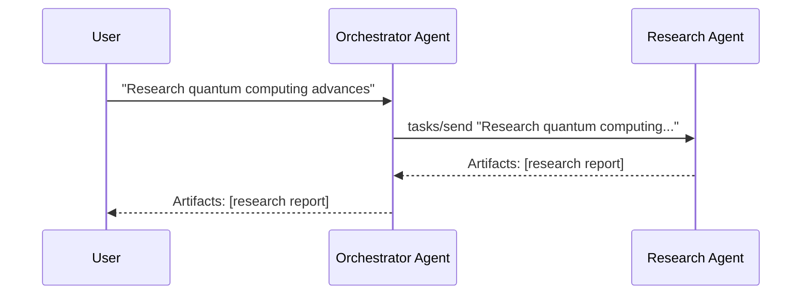
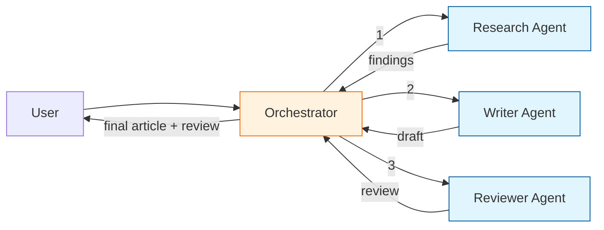
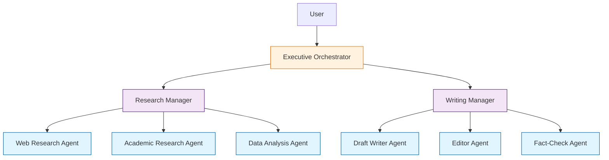
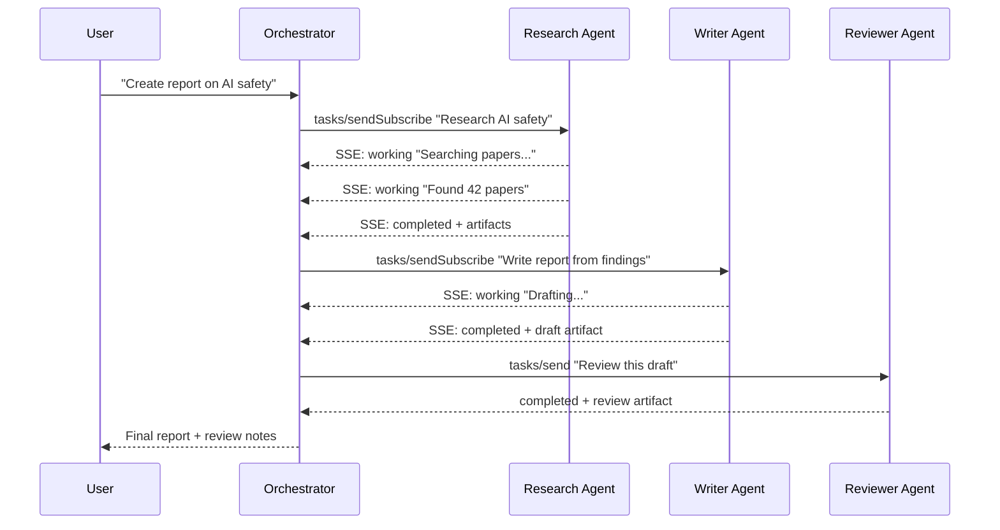

# Chapter 7: Multi-Agent Scenarios

Real-world AI systems rarely involve a single agent. This chapter explores how multiple A2A agents collaborate: delegation chains, parallel fan-out, hierarchical orchestration, and practical patterns for building resilient multi-agent systems.

## What Problem Does This Solve?

A single agent can answer questions or call tools, but complex workflows — "research a topic, write a report, review it for accuracy, then translate it into three languages" — require multiple specialized agents working together. A2A provides the interoperability layer so these agents can be built by different teams, run on different platforms, and still collaborate seamlessly.

## Pattern 1: Simple Delegation

An orchestrator agent delegates a task to a single specialist:

```python
from a2a.client import A2AClient
from a2a.server import TaskHandler, TaskContext
from a2a.types import Artifact, TextPart, TaskState

class OrchestratorHandler(TaskHandler):
    """Orchestrator that delegates to a specialist agent."""

    def __init__(self, research_agent_url: str):
        self.research_client = A2AClient(url=research_agent_url)

    async def handle_task(self, context: TaskContext) -> None:
        user_text = self._extract_text(context.message)

        await context.update_status(
            TaskState.WORKING,
            message="Delegating research to specialist agent...",
        )

        # Delegate to the research agent
        result = await self.research_client.send_task(
            message=f"Research the following topic thoroughly: {user_text}"
        )

        if result.status.state == "completed":
            # Pass through the research agent's artifacts
            for artifact in result.artifacts:
                await context.add_artifact(artifact)
            await context.complete("Research delegation complete")
        else:
            await context.fail(
                f"Research agent failed: {result.status.message}"
            )

    def _extract_text(self, message) -> str:
        return "\n".join(
            part.text for part in message.parts
            if isinstance(part, TextPart)
        )
```



## Pattern 2: Sequential Pipeline

Chain multiple agents in sequence, where each agent's output feeds into the next:

```python
class PipelineOrchestrator(TaskHandler):
    """Chain agents: Research → Write → Review."""

    def __init__(
        self,
        research_url: str,
        writer_url: str,
        reviewer_url: str,
    ):
        self.research = A2AClient(url=research_url)
        self.writer = A2AClient(url=writer_url)
        self.reviewer = A2AClient(url=reviewer_url)

    async def handle_task(self, context: TaskContext) -> None:
        topic = self._extract_text(context.message)

        # Stage 1: Research
        await context.update_status(
            TaskState.WORKING, message="Stage 1/3: Researching..."
        )
        research_result = await self.research.send_task(
            message=f"Research: {topic}"
        )
        research_text = self._artifacts_to_text(research_result.artifacts)

        # Stage 2: Writing
        await context.update_status(
            TaskState.WORKING, message="Stage 2/3: Writing article..."
        )
        writer_result = await self.writer.send_task(
            message=f"Write an article based on this research:\n\n{research_text}"
        )
        article_text = self._artifacts_to_text(writer_result.artifacts)

        # Stage 3: Review
        await context.update_status(
            TaskState.WORKING, message="Stage 3/3: Reviewing..."
        )
        review_result = await self.reviewer.send_task(
            message=f"Review this article for accuracy:\n\n{article_text}"
        )

        # Combine all artifacts
        await context.add_artifact(
            Artifact(
                name="Final Article",
                parts=[TextPart(text=article_text)],
                metadata={"stage": "writing"},
            )
        )
        for artifact in review_result.artifacts:
            artifact.metadata = artifact.metadata or {}
            artifact.metadata["stage"] = "review"
            await context.add_artifact(artifact)

        await context.complete("Pipeline complete: research → write → review")

    def _extract_text(self, message) -> str:
        return "\n".join(
            part.text for part in message.parts if isinstance(part, TextPart)
        )

    def _artifacts_to_text(self, artifacts) -> str:
        texts = []
        for a in artifacts:
            for p in a.parts:
                if isinstance(p, TextPart):
                    texts.append(p.text)
        return "\n\n".join(texts)
```



## Pattern 3: Parallel Fan-Out

Send tasks to multiple agents simultaneously and merge results:

```python
import asyncio

class ParallelResearchOrchestrator(TaskHandler):
    """Fan-out research to multiple specialized agents in parallel."""

    def __init__(self, agent_urls: dict[str, str]):
        self.agents = {
            name: A2AClient(url=url)
            for name, url in agent_urls.items()
        }

    async def handle_task(self, context: TaskContext) -> None:
        topic = self._extract_text(context.message)

        await context.update_status(
            TaskState.WORKING,
            message=f"Dispatching to {len(self.agents)} specialist agents...",
        )

        # Fan-out: send to all agents in parallel
        tasks = {
            name: client.send_task(
                message=f"From your {name} perspective, analyze: {topic}"
            )
            for name, client in self.agents.items()
        }

        results = {}
        for name, coro in tasks.items():
            try:
                results[name] = await coro
                await context.update_status(
                    TaskState.WORKING,
                    message=f"Received results from {name} agent",
                )
            except Exception as e:
                results[name] = None
                await context.update_status(
                    TaskState.WORKING,
                    message=f"Warning: {name} agent failed: {e}",
                )

        # Merge results into artifacts
        for name, result in results.items():
            if result and result.status.state == "completed":
                for artifact in result.artifacts:
                    artifact.name = f"{name}: {artifact.name}"
                    await context.add_artifact(artifact)

        successful = sum(1 for r in results.values() if r)
        await context.complete(
            f"Parallel analysis complete: {successful}/{len(self.agents)} agents responded"
        )

# Usage
# orchestrator = ParallelResearchOrchestrator({
#     "technical": "https://tech-agent.example.com",
#     "market": "https://market-agent.example.com",
#     "legal": "https://legal-agent.example.com",
# })
```

## Pattern 4: Dynamic Agent Selection

Choose which agent to delegate to based on the task content:

```python
class DynamicRouter(TaskHandler):
    """Route tasks to the best-matching agent based on skill tags."""

    def __init__(self, agent_hosts: list[str]):
        self.agent_hosts = agent_hosts
        self._cards: list[dict] = []

    async def initialize(self):
        """Discover all agent capabilities at startup."""
        for host in self.agent_hosts:
            client = A2AClient(url=f"https://{host}")
            card = await client.get_agent_card()
            self._cards.append({
                "host": host,
                "card": card,
                "client": client,
            })

    async def handle_task(self, context: TaskContext) -> None:
        user_text = self._extract_text(context.message)

        # Simple keyword matching against skill tags
        best_agent = self._find_best_agent(user_text)

        if not best_agent:
            await context.fail(
                "No suitable agent found for this task. "
                f"Available capabilities: {self._list_capabilities()}"
            )
            return

        await context.update_status(
            TaskState.WORKING,
            message=f"Routing to {best_agent['card'].name}...",
        )

        result = await best_agent["client"].send_task(message=user_text)

        for artifact in result.artifacts:
            await context.add_artifact(artifact)

        await context.complete(
            f"Handled by {best_agent['card'].name}"
        )

    def _find_best_agent(self, query: str) -> dict | None:
        query_words = set(query.lower().split())
        best = None
        best_score = 0

        for entry in self._cards:
            for skill in entry["card"].skills:
                tags = set(t.lower() for t in skill.tags)
                score = len(query_words & tags)
                if score > best_score:
                    best_score = score
                    best = entry

        return best

    def _list_capabilities(self) -> str:
        all_skills = []
        for entry in self._cards:
            for skill in entry["card"].skills:
                all_skills.append(f"{entry['card'].name}: {skill.name}")
        return ", ".join(all_skills)
```

## Pattern 5: Hierarchical Teams

Build a tree of orchestrators for complex workflows:



```python
class HierarchicalOrchestrator(TaskHandler):
    """Top-level orchestrator that delegates to sub-orchestrators."""

    def __init__(self, research_manager_url: str, writing_manager_url: str):
        self.research_mgr = A2AClient(url=research_manager_url)
        self.writing_mgr = A2AClient(url=writing_manager_url)

    async def handle_task(self, context: TaskContext) -> None:
        topic = self._extract_text(context.message)

        # Phase 1: Research (delegated to research manager, which
        # internally fans out to multiple research agents)
        await context.update_status(
            TaskState.WORKING, message="Phase 1: Commissioning research..."
        )
        research = await self.research_mgr.send_task(
            message=f"Conduct comprehensive research on: {topic}"
        )
        research_text = self._artifacts_to_text(research.artifacts)

        # Phase 2: Writing (delegated to writing manager, which
        # internally handles drafting, editing, and fact-checking)
        await context.update_status(
            TaskState.WORKING, message="Phase 2: Producing written output..."
        )
        writing = await self.writing_mgr.send_task(
            message=f"Create a polished report based on:\n\n{research_text}"
        )

        for artifact in writing.artifacts:
            await context.add_artifact(artifact)

        await context.complete("Hierarchical workflow complete")
```

## Error Handling and Resilience

Multi-agent systems need robust error handling:

```python
class ResilientDelegator:
    """Delegate tasks with retry, fallback, and timeout logic."""

    def __init__(self, primary_url: str, fallback_url: str | None = None):
        self.primary = A2AClient(url=primary_url)
        self.fallback = A2AClient(url=fallback_url) if fallback_url else None

    async def delegate(
        self,
        message: str,
        max_retries: int = 2,
        timeout: float = 120.0,
    ) -> dict | None:
        """Try primary agent, retry on failure, fall back if available."""
        for attempt in range(max_retries + 1):
            try:
                result = await asyncio.wait_for(
                    self.primary.send_task(message=message),
                    timeout=timeout,
                )
                if result.status.state == "completed":
                    return result
            except (asyncio.TimeoutError, Exception) as e:
                if attempt < max_retries:
                    await asyncio.sleep(2 ** attempt)  # exponential backoff
                    continue

                # Try fallback
                if self.fallback:
                    try:
                        return await asyncio.wait_for(
                            self.fallback.send_task(message=message),
                            timeout=timeout,
                        )
                    except Exception:
                        pass

                return None
```

## How It Works Under the Hood



## Practical Tips for Multi-Agent Systems

1. **Keep orchestrators thin**: The orchestrator should route and merge, not contain business logic.
2. **Use sessions for context**: Pass `sessionId` through the delegation chain so agents can maintain conversation context.
3. **Set timeouts**: Always set timeouts on delegated tasks to prevent cascading hangs.
4. **Log correlation IDs**: Propagate a trace ID through all delegated tasks for debugging.
5. **Design for partial failure**: If one of three parallel agents fails, return the results from the other two rather than failing entirely.
6. **Version your agents**: Use Agent Card versioning so orchestrators can adapt to capability changes.

---

**Next: [Chapter 8: MCP + A2A](08-mcp-plus-a2a.md)** — Combining MCP (tools) and A2A (agents) for the full ecosystem architecture.

[Previous: Chapter 6](06-python-sdk.md) | [Back to Tutorial Overview](README.md)
