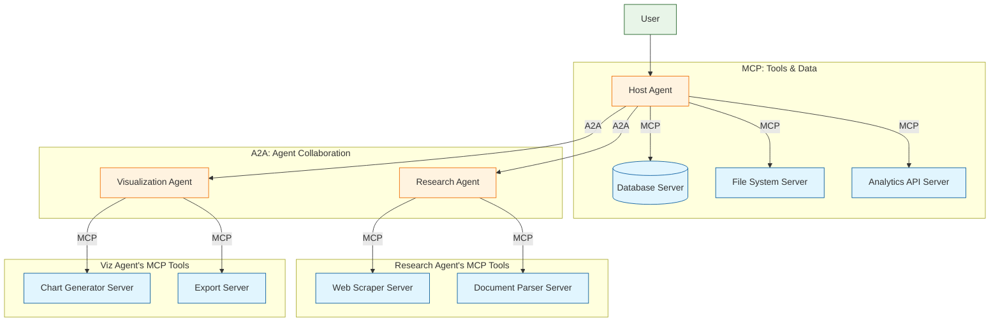
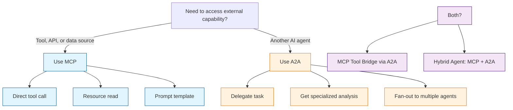

# Chapter 8: MCP + A2A — The Full Agent Ecosystem

MCP and A2A are two halves of the same coin. MCP connects agents to tools and data; A2A connects agents to each other. This chapter shows how to combine them into a unified architecture where agents use MCP for capabilities and A2A for collaboration.

## What Problem Does This Solve?

Consider a real scenario: a user asks an AI assistant to "analyze our Q4 sales data and compare it with competitor public filings." This requires:

- **MCP**: Access the company's database, read spreadsheets, call analytics APIs
- **A2A**: Delegate competitor research to a specialized research agent that has its own MCP tools for web scraping and document analysis

Neither protocol alone covers the full workflow. Together, they create a composable agent ecosystem where any agent can use any tool and collaborate with any other agent.

## The Unified Architecture



## Building an Agent That Uses Both Protocols

Here is a complete agent that uses MCP for tool access and A2A for delegation:

```python
"""Agent that combines MCP tools with A2A delegation."""
from a2a.server import A2AServer, TaskHandler, TaskContext
from a2a.client import A2AClient
from a2a.types import (
    AgentCard, Skill, AgentCapabilities,
    Artifact, TextPart, DataPart, TaskState,
)
from mcp import ClientSession
from mcp.client.stdio import stdio_client, StdioServerParameters

class HybridAnalysisHandler(TaskHandler):
    """
    An agent that:
    1. Uses MCP to query a database (tool access)
    2. Delegates competitor research to another agent via A2A
    3. Combines results into a unified report
    """

    def __init__(
        self,
        db_server_command: list[str],
        research_agent_url: str,
    ):
        self.db_server_command = db_server_command
        self.research_client = A2AClient(url=research_agent_url)

    async def handle_task(self, context: TaskContext) -> None:
        query = self._extract_text(context.message)

        # Step 1: Use MCP to access internal data
        await context.update_status(
            TaskState.WORKING,
            message="Querying internal database via MCP...",
        )
        internal_data = await self._query_database(query)

        # Step 2: Use A2A to delegate competitor research
        await context.update_status(
            TaskState.WORKING,
            message="Delegating competitor research to specialist agent...",
        )
        research_result = await self.research_client.send_task(
            message=f"Research competitor data relevant to: {query}"
        )
        competitor_data = self._artifacts_to_text(research_result.artifacts)

        # Step 3: Combine and analyze
        await context.update_status(
            TaskState.WORKING,
            message="Synthesizing internal and competitor data...",
        )
        report = self._synthesize(internal_data, competitor_data, query)

        await context.add_artifact(
            Artifact(
                name="Combined Analysis Report",
                parts=[TextPart(text=report)],
                metadata={
                    "sources": ["internal_db", "competitor_research"],
                },
            )
        )
        await context.complete("Analysis complete")

    async def _query_database(self, query: str) -> str:
        """Use MCP to call a database tool."""
        server_params = StdioServerParameters(
            command=self.db_server_command[0],
            args=self.db_server_command[1:],
        )

        async with stdio_client(server_params) as (read, write):
            async with ClientSession(read, write) as session:
                await session.initialize()

                # List available tools
                tools = await session.list_tools()
                print(f"Available MCP tools: {[t.name for t in tools.tools]}")

                # Call the query tool
                result = await session.call_tool(
                    "query",
                    arguments={"sql": f"SELECT * FROM sales WHERE quarter = 'Q4'"},
                )
                return result.content[0].text

    def _synthesize(
        self, internal: str, competitor: str, query: str
    ) -> str:
        return (
            f"# Combined Analysis: {query}\n\n"
            f"## Internal Data\n{internal}\n\n"
            f"## Competitor Research\n{competitor}\n\n"
            f"## Synthesis\n(LLM-generated analysis combining both sources)"
        )

    def _extract_text(self, message) -> str:
        return "\n".join(
            p.text for p in message.parts if isinstance(p, TextPart)
        )

    def _artifacts_to_text(self, artifacts) -> str:
        texts = []
        for a in artifacts:
            for p in a.parts:
                if isinstance(p, TextPart):
                    texts.append(p.text)
        return "\n\n".join(texts)
```

## Exposing MCP Tools Through A2A

A powerful pattern: wrap MCP tool servers as A2A agents so that remote agents can use tools they do not have direct access to:

```python
class MCPToolBridgeHandler(TaskHandler):
    """
    Bridge: Expose MCP tools as an A2A agent.

    Remote agents send A2A tasks like "query the database for X"
    and this agent translates them into MCP tool calls.
    """

    def __init__(self, mcp_server_command: list[str]):
        self.mcp_server_command = mcp_server_command

    async def handle_task(self, context: TaskContext) -> None:
        user_text = self._extract_text(context.message)

        await context.update_status(
            TaskState.WORKING, message="Connecting to MCP tool server..."
        )

        server_params = StdioServerParameters(
            command=self.mcp_server_command[0],
            args=self.mcp_server_command[1:],
        )

        async with stdio_client(server_params) as (read, write):
            async with ClientSession(read, write) as session:
                await session.initialize()
                tools = await session.list_tools()

                # Use an LLM to determine which tool to call
                tool_name, arguments = await self._plan_tool_call(
                    user_text, tools.tools
                )

                await context.update_status(
                    TaskState.WORKING,
                    message=f"Calling tool: {tool_name}",
                )

                result = await session.call_tool(tool_name, arguments)

                await context.add_artifact(
                    Artifact(
                        name=f"Tool Result: {tool_name}",
                        parts=[TextPart(text=result.content[0].text)],
                        metadata={"tool": tool_name, "arguments": arguments},
                    )
                )

        await context.complete(f"Tool call complete: {tool_name}")

    async def _plan_tool_call(self, query, tools):
        """Use an LLM to select the right tool and arguments."""
        # Simplified: in production, send tool descriptions to an LLM
        # and parse the response
        tool_name = tools[0].name if tools else "unknown"
        return tool_name, {"input": query}
```

### Agent Card for the Bridge

```json
{
  "name": "Database Access Agent",
  "description": "Provides secure database query access via A2A",
  "url": "https://db-bridge.internal.example.com/a2a",
  "version": "1.0.0",
  "capabilities": { "streaming": true, "pushNotifications": false },
  "skills": [
    {
      "id": "sql-query",
      "name": "SQL Query",
      "description": "Execute read-only SQL queries against the company database",
      "tags": ["database", "sql", "query", "data"],
      "examples": [
        "Get all Q4 sales by region",
        "Count active users in the last 30 days"
      ]
    }
  ],
  "authentication": { "schemes": ["oauth2"] }
}
```

## TypeScript: Combined MCP + A2A Client

```typescript
import { Client } from "@modelcontextprotocol/sdk/client/index.js";
import { StdioClientTransport } from "@modelcontextprotocol/sdk/client/stdio.js";

interface A2ATaskResult {
  status: { state: string };
  artifacts: Array<{ name: string; parts: Array<{ type: string; text?: string }> }>;
}

class HybridAgent {
  private mcpClient: Client;
  private a2aAgentUrl: string;

  constructor(mcpServerCommand: string[], a2aAgentUrl: string) {
    this.mcpClient = new Client({ name: "hybrid-agent", version: "1.0.0" });
    this.a2aAgentUrl = a2aAgentUrl;
  }

  async initialize() {
    const transport = new StdioClientTransport({
      command: "node",
      args: ["mcp-server.js"],
    });
    await this.mcpClient.connect(transport);
  }

  async queryLocalTool(toolName: string, args: Record<string, unknown>) {
    // Use MCP for local tool access
    const result = await this.mcpClient.callTool({
      name: toolName,
      arguments: args,
    });
    return result;
  }

  async delegateToAgent(message: string): Promise<A2ATaskResult> {
    // Use A2A for agent delegation
    const response = await fetch(this.a2aAgentUrl, {
      method: "POST",
      headers: { "Content-Type": "application/json" },
      body: JSON.stringify({
        jsonrpc: "2.0",
        id: crypto.randomUUID(),
        method: "tasks/send",
        params: {
          id: crypto.randomUUID(),
          message: {
            role: "user",
            parts: [{ type: "text", text: message }],
          },
        },
      }),
    });

    const data = await response.json();
    return data.result;
  }

  async analyzeWithBothProtocols(query: string) {
    // Step 1: MCP — get internal data
    const localData = await this.queryLocalTool("query", {
      sql: "SELECT * FROM metrics WHERE quarter = 'Q4'",
    });

    // Step 2: A2A — delegate external research
    const agentResult = await this.delegateToAgent(
      `Research competitors for: ${query}`
    );

    return { localData, agentResult };
  }
}
```

## Architecture Decision Framework

When should you use MCP vs A2A?



| Scenario | Protocol | Reason |
|:---------|:---------|:-------|
| Query a database | MCP | Direct tool access |
| Read a file from disk | MCP | Local resource access |
| Ask a research agent to find papers | A2A | Agent delegation |
| Get a code review from a specialist | A2A | Specialized agent skill |
| Let a remote agent use your database | A2A wrapping MCP | Controlled access bridge |
| Agent uses tools AND delegates sub-tasks | Both | Hybrid architecture |

## Production Architecture Example

A complete production system combining both protocols:

```python
"""Production-grade hybrid agent configuration."""
from dataclasses import dataclass

@dataclass
class AgentConfig:
    """Configuration for a hybrid MCP + A2A agent."""
    # Identity
    name: str
    description: str
    port: int

    # MCP tool servers this agent can use
    mcp_servers: dict[str, list[str]]  # name -> command

    # A2A agents this agent can delegate to
    a2a_agents: dict[str, str]  # name -> URL

    # Authentication
    oauth_client_id: str
    oauth_client_secret: str
    oauth_token_endpoint: str

# Example configuration
config = AgentConfig(
    name="Enterprise Assistant",
    description="Full-service enterprise AI assistant",
    port=8000,
    mcp_servers={
        "database": ["python", "-m", "mcp_postgres_server"],
        "filesystem": ["python", "-m", "mcp_filesystem_server", "/data"],
        "slack": ["node", "mcp-slack-server/index.js"],
    },
    a2a_agents={
        "research": "https://research.internal.example.com",
        "code-review": "https://code-review.internal.example.com",
        "translation": "https://translate.partner.example.com",
    },
    oauth_client_id="enterprise-assistant",
    oauth_client_secret="...",
    oauth_token_endpoint="https://auth.example.com/token",
)
```

## The Emerging Ecosystem

The MCP + A2A combination creates a layered ecosystem:

```
┌─────────────────────────────────────────────┐
│              User / Application              │
├─────────────────────────────────────────────┤
│           Host Agent (Orchestrator)          │
├──────────────────┬──────────────────────────┤
│   MCP Layer      │     A2A Layer            │
│   (Tools)        │     (Agents)             │
│                  │                          │
│  ┌──────────┐   │  ┌───────────────┐       │
│  │ Database  │   │  │ Research Agent │       │
│  │ Server    │   │  │  ├─ MCP tools │       │
│  ├──────────┤   │  ├───────────────┤       │
│  │ File     │   │  │ Review Agent  │       │
│  │ Server   │   │  │  ├─ MCP tools │       │
│  ├──────────┤   │  ├───────────────┤       │
│  │ API      │   │  │ Translation   │       │
│  │ Server   │   │  │ Agent         │       │
│  └──────────┘   │  └───────────────┘       │
└──────────────────┴──────────────────────────┘
```

Each A2A agent in the ecosystem is itself an MCP client with its own tool servers. The protocols compose naturally: A2A handles the agent-to-agent coordination layer, while MCP handles the agent-to-tool execution layer.

## Key Takeaways

1. **MCP is for tools, A2A is for agents** — use each where it fits.
2. **They compose naturally** — an A2A agent can use MCP tools internally.
3. **MCP Tool Bridges** let remote agents access tools they cannot reach directly.
4. **The hybrid pattern** (MCP + A2A in one agent) is the production default.
5. **Both protocols are open standards** — MCP from Anthropic, A2A from Linux Foundation — ensuring broad ecosystem support.

---

**You have completed the A2A Protocol Tutorial.** You now understand how to build interoperable agents that discover, communicate, delegate, and collaborate using the A2A protocol — and how to combine it with MCP for the full agent ecosystem.

[Previous: Chapter 7](07-multi-agent-scenarios.md) | [Back to Tutorial Overview](README.md)

---

## Where to Go Next

- [MCP Specification Tutorial](../mcp-specification-tutorial/) — Deep dive into the MCP protocol specification
- [CrewAI Tutorial](../crewai-tutorial/) — Multi-agent orchestration with a framework approach
- [Composio Tutorial](../composio-tutorial/) — Tool integration platform bridging agent frameworks
- [Taskade Tutorial](../taskade-tutorial/) — AI-native productivity with agent workflows

*Generated by [AI Codebase Knowledge Builder](https://github.com/The-Pocket/Tutorial-Codebase-Knowledge)*
