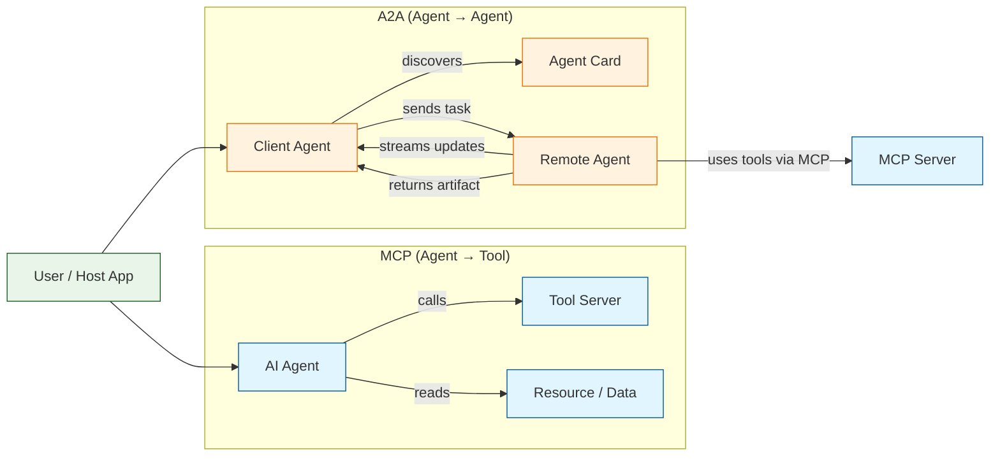

# A2A Protocol Tutorial: Building Interoperable Agent Systems With Google's Agent-to-Agent Standard

> Learn how agents discover, communicate, and delegate tasks to each other using the A2A protocol — the open standard (now Linux Foundation) for agent-to-agent interoperability.

## Why This Track Matters

The AI ecosystem is converging on two complementary standards: **MCP** (Model Context Protocol) for connecting agents to tools and data, and **A2A** (Agent-to-Agent) for connecting agents to each other. Together they form the complete agent interoperability stack.

A2A solves a critical gap: how do independently built agents — potentially from different vendors, frameworks, and platforms — discover each other's capabilities and collaborate on tasks? Without A2A, every multi-agent system invents its own bespoke integration layer.

This track focuses on:

- understanding the A2A protocol specification and its design principles
- building agents that publish discoverable Agent Cards
- implementing task lifecycle management with streaming updates
- securing agent-to-agent communication with OAuth2 and identity verification
- combining A2A with MCP to create the full agent ecosystem architecture

## Current Snapshot (auto-updated)

- repository: [`a2aproject/A2A`](https://github.com/a2aproject/A2A)
- stars: about **23.3k**
- latest release: [`v1.0.0`](https://github.com/a2aproject/A2A/releases/tag/v1.0.0) (published 2026-03-12)

## Mental Model

## Chapter Guide

| Chapter | Key Question | Outcome |
|:--------|:-------------|:--------|
| [01 - Getting Started](01-getting-started.md) | What is A2A and how does it differ from MCP? | Clear mental model of agent interop |
| [02 - Protocol Specification](02-protocol-specification.md) | What are the core protocol primitives? | Understanding of Agent Cards, tasks, and messages |
| [03 - Agent Discovery](03-agent-discovery.md) | How do agents find and evaluate each other? | Ability to publish and consume Agent Cards |
| [04 - Task Management](04-task-management.md) | How does the full task lifecycle work? | Mastery of task creation, streaming, and artifacts |
| [05 - Authentication and Security](05-authentication-and-security.md) | How do agents trust each other? | Secure agent communication patterns |
| [06 - Python SDK](06-python-sdk.md) | How do I build A2A agents in Python? | Working A2A server and client |
| [07 - Multi-Agent Scenarios](07-multi-agent-scenarios.md) | How do agents delegate and compose? | Real-world multi-agent patterns |
| [08 - MCP + A2A](08-mcp-plus-a2a.md) | How do MCP and A2A work together? | Full ecosystem architecture |

## What You Will Learn

- How to read and implement the A2A protocol specification
- How to create Agent Cards that advertise capabilities and skills
- How to manage the full task lifecycle with streaming and push notifications
- How to authenticate and authorize agent-to-agent communication
- How to build A2A servers and clients using the Python SDK
- How to design multi-agent delegation and composition patterns
- How to combine MCP (tools) and A2A (agents) into a unified architecture

## Source References

- [A2A Protocol README](https://github.com/a2aproject/A2A/blob/main/README.md)
- [A2A Specification](https://github.com/a2aproject/A2A/blob/main/spec/)
- [Agent Card Schema](https://github.com/a2aproject/A2A/blob/main/spec/agent-card.md)
- [A2A Python SDK](https://github.com/a2aproject/A2A/tree/main/sdk/python)
- [A2A Samples](https://github.com/a2aproject/A2A/tree/main/samples)
- [A2A Technical Documentation](https://google.github.io/A2A/)

## Related Tutorials

- [MCP Specification Tutorial](../mcp-specification-tutorial/) — The complementary protocol for agent-to-tool communication
- [Composio Tutorial](../composio-tutorial/) — Tool integration platform that bridges agent frameworks
- [CrewAI Tutorial](../crewai-tutorial/) — Multi-agent orchestration framework
- [Taskade Tutorial](../taskade-tutorial/) — AI-native productivity with agent capabilities

---

Start with [Chapter 1: Getting Started](01-getting-started.md).

## Navigation & Backlinks

- [Start Here: Chapter 1: Getting Started](01-getting-started.md)
- [Back to Main Catalog](../../README.md#-tutorial-catalog)
- [Browse A-Z Tutorial Directory](../../discoverability/tutorial-directory.md)
- [Search by Intent](../../discoverability/query-hub.md)
- [Explore Category Hubs](../../README.md#category-hubs)

## Full Chapter Map

1. [Chapter 1: Getting Started](01-getting-started.md)
2. [Chapter 2: Protocol Specification](02-protocol-specification.md)
3. [Chapter 3: Agent Discovery](03-agent-discovery.md)
4. [Chapter 4: Task Management](04-task-management.md)
5. [Chapter 5: Authentication and Security](05-authentication-and-security.md)
6. [Chapter 6: Python SDK](06-python-sdk.md)
7. [Chapter 7: Multi-Agent Scenarios](07-multi-agent-scenarios.md)
8. [Chapter 8: MCP + A2A](08-mcp-plus-a2a.md)

*Generated by [AI Codebase Knowledge Builder](https://github.com/The-Pocket/Tutorial-Codebase-Knowledge)*
