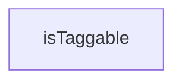

# Chapter 1: Getting Started

Welcome to **Chapter 1: Getting Started**. In this part of **Activepieces Tutorial: Open-Source Automation, Pieces, and AI-Ready Workflow Operations**, you will build an intuitive mental model first, then move into concrete implementation details and practical production tradeoffs.


This chapter provides a fast path to first workflow value with minimal setup overhead.

## Learning Goals

- choose an installation path that matches your current stage
- run the platform locally and validate a first flow
- understand where key operational settings live
- establish a reproducible team onboarding baseline

## Fast Start Workflow

1. start from the [Install Overview](https://github.com/activepieces/activepieces/blob/main/docs/install/overview.mdx)
2. choose Docker or Docker Compose for first-run setup
3. validate platform startup and account access
4. create one simple trigger-action flow
5. capture setup and validation notes in a short team runbook

## Source References

- [Install Overview](https://github.com/activepieces/activepieces/blob/main/docs/install/overview.mdx)
- [Docker Compose Setup](https://github.com/activepieces/activepieces/blob/main/docs/install/options/docker-compose.mdx)

## Summary

You now have a working baseline for expanding Activepieces usage safely.

Next: [Chapter 2: System Architecture: App, Worker, Engine](02-system-architecture-app-worker-engine.md)

## Source Code Walkthrough

### `deploy/pulumi/taggable.ts`

The `isTaggable` function in [`deploy/pulumi/taggable.ts`](https://github.com/activepieces/activepieces/blob/HEAD/deploy/pulumi/taggable.ts) handles a key part of this chapter's functionality:

```ts
/**
 * isTaggable returns true if the given resource type is an AWS resource that supports tags.
 */
 export function isTaggable(t: string): boolean {
    return (taggableResourceTypes.indexOf(t) !== -1);
}

// taggableResourceTypes is a list of known AWS type tokens that are taggable.
const taggableResourceTypes = [
    "aws:accessanalyzer/analyzer:Analyzer",
    "aws:acm/certificate:Certificate",
    "aws:acmpca/certificateAuthority:CertificateAuthority",
    "aws:alb/loadBalancer:LoadBalancer",
    "aws:alb/targetGroup:TargetGroup",
    "aws:apigateway/apiKey:ApiKey",
    "aws:apigateway/clientCertificate:ClientCertificate",
    "aws:apigateway/domainName:DomainName",
    "aws:apigateway/restApi:RestApi",
    "aws:apigateway/stage:Stage",
    "aws:apigateway/usagePlan:UsagePlan",
    "aws:apigateway/vpcLink:VpcLink",
    "aws:applicationloadbalancing/loadBalancer:LoadBalancer",
    "aws:applicationloadbalancing/targetGroup:TargetGroup",
    "aws:appmesh/mesh:Mesh",
    "aws:appmesh/route:Route",
    "aws:appmesh/virtualNode:VirtualNode",
    "aws:appmesh/virtualRouter:VirtualRouter",
    "aws:appmesh/virtualService:VirtualService",
    "aws:appsync/graphQLApi:GraphQLApi",
    "aws:athena/workgroup:Workgroup",
    "aws:autoscaling/group:Group",
```

This function is important because it defines how Activepieces Tutorial: Open-Source Automation, Pieces, and AI-Ready Workflow Operations implements the patterns covered in this chapter.


## How These Components Connect


