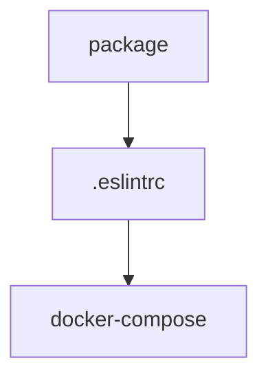

# Chapter 3: Flow Design, Versioning, and Debugging

Welcome to **Chapter 3: Flow Design, Versioning, and Debugging**. In this part of **Activepieces Tutorial: Open-Source Automation, Pieces, and AI-Ready Workflow Operations**, you will build an intuitive mental model first, then move into concrete implementation details and practical production tradeoffs.


This chapter covers practical design and diagnostics patterns for stable automation flows.

## Learning Goals

- design trigger/action chains with clearer failure boundaries
- use run debugging views effectively for incident triage
- apply versioning practices that reduce production regressions
- improve flow maintainability as complexity grows

## Reliability Checklist

| Area | Baseline Practice |
|:-----|:------------------|
| trigger strategy | choose trigger type based on latency and source behavior |
| action composition | keep steps modular and explicitly scoped |
| run diagnostics | review per-step input/output in failed runs |
| versioning discipline | publish controlled versions and avoid ad-hoc hot edits |

## Source References

- [Building Flows](https://github.com/activepieces/activepieces/blob/main/docs/flows/building-flows.mdx)
- [Debugging Runs](https://github.com/activepieces/activepieces/blob/main/docs/flows/debugging-runs.mdx)
- [Versioning](https://github.com/activepieces/activepieces/blob/main/docs/flows/versioning.mdx)

## Summary

You now have practical guardrails for building and troubleshooting higher-confidence flows.

Next: [Chapter 4: Piece Development Framework](04-piece-development-framework.md)

## Source Code Walkthrough

### `package.json`

The `package` module in [`package.json`](https://github.com/activepieces/activepieces/blob/HEAD/package.json) handles a key part of this chapter's functionality:

```json
{
  "name": "activepieces",
  "version": "0.79.2",
  "rcVersion": "0.80.0-rc.0",
  "packageManager": "bun@1.3.3",
  "scripts": {
    "prebuild": "node tools/scripts/install-bun.js",
    "serve:frontend": "turbo run serve --filter=web",
    "serve:backend": "turbo run serve --filter=api",
    "serve:engine": "turbo run serve --filter=@activepieces/engine",
    "serve:worker": "turbo run serve --filter=worker",
    "push": "turbo run lint && git push",
    "dev": "node tools/scripts/install-bun.js && turbo run serve --filter=web --filter=api --filter=@activepieces/engine --filter=worker --ui stream",
    "dev:backend": "turbo run serve --filter=api --filter=@activepieces/engine --ui stream",
    "dev:frontend": "turbo run serve --filter=web --filter=api --filter=@activepieces/engine --ui stream",
    "start": "node tools/setup-dev.js && npm run dev",
    "test:e2e": "npx playwright test --config=packages/tests-e2e/playwright.config.ts",
    "db-migration": "npx turbo run db-migration --filter=api --",
    "check-migrations": "npx turbo run check-migrations --filter=api",
    "lint": "turbo run lint",
    "lint-dev": "turbo run lint --filter='!@activepieces/piece-*' --force -- --fix",
    "cli": "npx ts-node -r tsconfig-paths/register --project packages/cli/tsconfig.json  packages/cli/src/index.ts",
    "create-piece": "npx ts-node -r tsconfig-paths/register --project packages/cli/tsconfig.json  packages/cli/src/index.ts pieces create",
    "create-action": "npx ts-node -r tsconfig-paths/register --project packages/cli/tsconfig.json  packages/cli/src/index.ts actions create",
    "create-trigger": "npx ts-node -r tsconfig-paths/register --project packages/cli/tsconfig.json packages/cli/src/index.ts triggers create",
    "sync-pieces": "npx ts-node -r tsconfig-paths/register --project packages/cli/tsconfig.json packages/cli/src/index.ts pieces sync",
    "build-piece": "npx ts-node -r tsconfig-paths/register --project packages/cli/tsconfig.json packages/cli/src/index.ts pieces build",
    "publish-piece-to-api": "npx ts-node -r tsconfig-paths/register --project packages/cli/tsconfig.json packages/cli/src/index.ts pieces publish piece",
    "publish-piece": "npx ts-node -r tsconfig-paths/register --project tools/tsconfig.tools.json tools/scripts/pieces/publish-piece.ts",
    "workers": "npx ts-node -r tsconfig-paths/register --project packages/cli/tsconfig.json packages/cli/src/index.ts workers",
    "pull-i18n": "crowdin pull --config crowdin.yml",
    "push-i18n": "crowdin upload sources",
    "i18n:extract": "i18next --config packages/web/i18next-parser.config.js",
    "bump-translated-pieces": "npx ts-node --project tools/tsconfig.tools.json tools/scripts/pieces/bump-translated-pieces.ts",
    "bump-all-pieces-patch-version": "npx ts-node --project tools/tsconfig.tools.json tools/scripts/pieces/bump-all-pieces-patch-version.ts"
```

This module is important because it defines how Activepieces Tutorial: Open-Source Automation, Pieces, and AI-Ready Workflow Operations implements the patterns covered in this chapter.

### `.eslintrc.json`

The `.eslintrc` module in [`.eslintrc.json`](https://github.com/activepieces/activepieces/blob/HEAD/.eslintrc.json) handles a key part of this chapter's functionality:

```json
{
  "root": true,
  "ignorePatterns": ["**/*", "deploy/**/*"],
  "overrides": [
    {
      "files": ["*.ts", "*.tsx", "*.js", "*.jsx"],
      "rules": {
        "no-restricted-imports": [
          "error",
          {
            "patterns": ["lodash", "lodash/*"]
          }
        ]
      }
    },
    {
      "files": ["*.ts", "*.tsx"],
      "extends": ["plugin:@typescript-eslint/recommended"],
      "rules": {
        "@typescript-eslint/no-extra-semi": "error",
        "@typescript-eslint/no-unused-vars": "warn",
        "@typescript-eslint/no-explicit-any": "warn",
        "no-extra-semi": "off"
      }
    },
    {
      "files": ["*.js", "*.jsx"],
      "rules": {
        "@typescript-eslint/no-extra-semi": "error",
        "no-extra-semi": "off"
      }
    },
    {
      "files": ["*.spec.ts", "*.spec.tsx", "*.spec.js", "*.spec.jsx"],
      "env": {
```

This module is important because it defines how Activepieces Tutorial: Open-Source Automation, Pieces, and AI-Ready Workflow Operations implements the patterns covered in this chapter.

### `docker-compose.yml`

The `docker-compose` module in [`docker-compose.yml`](https://github.com/activepieces/activepieces/blob/HEAD/docker-compose.yml) handles a key part of this chapter's functionality:

```yml
services:
  app:
    image: ghcr.io/activepieces/activepieces:0.79.0
    container_name: activepieces-app
    restart: unless-stopped
    ports:
      - '8080:80'
    depends_on:
      - postgres
      - redis
    env_file: .env
    environment:
      - AP_CONTAINER_TYPE=APP
    volumes:
      - ./cache:/usr/src/app/cache
    networks:
      - activepieces
  worker:
    image: ghcr.io/activepieces/activepieces:0.79.0
    restart: unless-stopped
    depends_on:
      - app
    env_file: .env
    environment:
      - AP_CONTAINER_TYPE=WORKER
    deploy:
      replicas: 5
    volumes:
      - ./cache:/usr/src/app/cache
    networks:
      - activepieces
  postgres:
    image: 'postgres:14.4'
    container_name: postgres
    restart: unless-stopped
```

This module is important because it defines how Activepieces Tutorial: Open-Source Automation, Pieces, and AI-Ready Workflow Operations implements the patterns covered in this chapter.


## How These Components Connect


