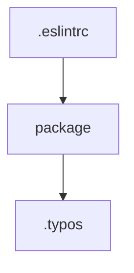

# Chapter 4: Piece Development Framework

Welcome to **Chapter 4: Piece Development Framework**. In this part of **Activepieces Tutorial: Open-Source Automation, Pieces, and AI-Ready Workflow Operations**, you will build an intuitive mental model first, then move into concrete implementation details and practical production tradeoffs.


This chapter explains how to extend Activepieces through custom TypeScript pieces.

## Learning Goals

- understand piece lifecycle: definition, auth, action, trigger
- set up local piece development efficiently
- apply piece versioning rules for backward compatibility
- contribute pieces without destabilizing existing flows

## Piece Development Path

1. set up local dev environment and start the platform
2. define piece metadata and authentication
3. add actions and triggers incrementally
4. test behavior in local flow runs
5. version and publish with explicit compatibility intent

## Source References

- [Build Pieces Overview](https://github.com/activepieces/activepieces/blob/main/docs/build-pieces/building-pieces/overview.mdx)
- [Development Setup](https://github.com/activepieces/activepieces/blob/main/docs/build-pieces/building-pieces/development-setup.mdx)
- [Start Building](https://github.com/activepieces/activepieces/blob/main/docs/build-pieces/building-pieces/start-building.mdx)
- [Piece Versioning](https://github.com/activepieces/activepieces/blob/main/docs/build-pieces/piece-reference/piece-versioning.mdx)

## Summary

You now have an extensibility workflow that balances speed with compatibility discipline.

Next: [Chapter 5: Installation and Environment Configuration](05-installation-and-environment-configuration.md)

## Depth Expansion Playbook

## Source Code Walkthrough

### `.eslintrc.json`

The `.eslintrc` module in [`.eslintrc.json`](https://github.com/activepieces/activepieces/blob/HEAD/.eslintrc.json) handles a key part of this chapter's functionality:

```json
{
  "root": true,
  "ignorePatterns": ["**/*", "deploy/**/*"],
  "overrides": [
    {
      "files": ["*.ts", "*.tsx", "*.js", "*.jsx"],
      "rules": {
        "no-restricted-imports": [
          "error",
          {
            "patterns": ["lodash", "lodash/*"]
          }
        ]
      }
    },
    {
      "files": ["*.ts", "*.tsx"],
      "extends": ["plugin:@typescript-eslint/recommended"],
      "rules": {
        "@typescript-eslint/no-extra-semi": "error",
        "@typescript-eslint/no-unused-vars": "warn",
        "@typescript-eslint/no-explicit-any": "warn",
        "no-extra-semi": "off"
      }
    },
    {
      "files": ["*.js", "*.jsx"],
      "rules": {
        "@typescript-eslint/no-extra-semi": "error",
        "no-extra-semi": "off"
      }
    },
    {
      "files": ["*.spec.ts", "*.spec.tsx", "*.spec.js", "*.spec.jsx"],
      "env": {
```

This module is important because it defines how Activepieces Tutorial: Open-Source Automation, Pieces, and AI-Ready Workflow Operations implements the patterns covered in this chapter.

### `package.json`

The `package` module in [`package.json`](https://github.com/activepieces/activepieces/blob/HEAD/package.json) handles a key part of this chapter's functionality:

```json
{
  "name": "activepieces",
  "version": "0.79.2",
  "rcVersion": "0.80.0-rc.0",
  "packageManager": "bun@1.3.3",
  "scripts": {
    "prebuild": "node tools/scripts/install-bun.js",
    "serve:frontend": "turbo run serve --filter=web",
    "serve:backend": "turbo run serve --filter=api",
    "serve:engine": "turbo run serve --filter=@activepieces/engine",
    "serve:worker": "turbo run serve --filter=worker",
    "push": "turbo run lint && git push",
    "dev": "node tools/scripts/install-bun.js && turbo run serve --filter=web --filter=api --filter=@activepieces/engine --filter=worker --ui stream",
    "dev:backend": "turbo run serve --filter=api --filter=@activepieces/engine --ui stream",
    "dev:frontend": "turbo run serve --filter=web --filter=api --filter=@activepieces/engine --ui stream",
    "start": "node tools/setup-dev.js && npm run dev",
    "test:e2e": "npx playwright test --config=packages/tests-e2e/playwright.config.ts",
    "db-migration": "npx turbo run db-migration --filter=api --",
    "check-migrations": "npx turbo run check-migrations --filter=api",
    "lint": "turbo run lint",
    "lint-dev": "turbo run lint --filter='!@activepieces/piece-*' --force -- --fix",
    "cli": "npx ts-node -r tsconfig-paths/register --project packages/cli/tsconfig.json  packages/cli/src/index.ts",
    "create-piece": "npx ts-node -r tsconfig-paths/register --project packages/cli/tsconfig.json  packages/cli/src/index.ts pieces create",
    "create-action": "npx ts-node -r tsconfig-paths/register --project packages/cli/tsconfig.json  packages/cli/src/index.ts actions create",
    "create-trigger": "npx ts-node -r tsconfig-paths/register --project packages/cli/tsconfig.json packages/cli/src/index.ts triggers create",
    "sync-pieces": "npx ts-node -r tsconfig-paths/register --project packages/cli/tsconfig.json packages/cli/src/index.ts pieces sync",
    "build-piece": "npx ts-node -r tsconfig-paths/register --project packages/cli/tsconfig.json packages/cli/src/index.ts pieces build",
    "publish-piece-to-api": "npx ts-node -r tsconfig-paths/register --project packages/cli/tsconfig.json packages/cli/src/index.ts pieces publish piece",
    "publish-piece": "npx ts-node -r tsconfig-paths/register --project tools/tsconfig.tools.json tools/scripts/pieces/publish-piece.ts",
    "workers": "npx ts-node -r tsconfig-paths/register --project packages/cli/tsconfig.json packages/cli/src/index.ts workers",
    "pull-i18n": "crowdin pull --config crowdin.yml",
    "push-i18n": "crowdin upload sources",
    "i18n:extract": "i18next --config packages/web/i18next-parser.config.js",
    "bump-translated-pieces": "npx ts-node --project tools/tsconfig.tools.json tools/scripts/pieces/bump-translated-pieces.ts",
    "bump-all-pieces-patch-version": "npx ts-node --project tools/tsconfig.tools.json tools/scripts/pieces/bump-all-pieces-patch-version.ts"
```

This module is important because it defines how Activepieces Tutorial: Open-Source Automation, Pieces, and AI-Ready Workflow Operations implements the patterns covered in this chapter.

### `.typos.toml`

The `.typos` module in [`.typos.toml`](https://github.com/activepieces/activepieces/blob/HEAD/.typos.toml) handles a key part of this chapter's functionality:

```toml
[files]
extend-exclude = [
    ".git/",
    "**/database/**",
    "packages/ui/core/src/locale/",
    # French
    "packages/pieces/community/wedof/src/",
]
ignore-hidden = false

[default]
extend-ignore-re = [
    "[0-9A-Za-z]{34}",
    "name: 'referal'",
    "getRepository\\('referal'\\)",
    "label: 'FO Language', value: 'fo'",
    "649c83111c9cbe6ba1d4cabe",
    "hYy9pRFVxpDsO1FB05SunFWUe9JZY",
    "lod6JEdKyPlvrnErdnrGa",
]

[default.extend-identifiers]
"crazyTweek" = "crazyTweek"
"optin_ip" = "optin_ip"

# Typos
"Github" = "GitHub"

```

This module is important because it defines how Activepieces Tutorial: Open-Source Automation, Pieces, and AI-Ready Workflow Operations implements the patterns covered in this chapter.


## How These Components Connect


