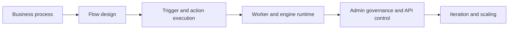

# Activepieces Tutorial: Open-Source Automation, Pieces, and AI-Ready Workflow Operations

> Learn how to use `activepieces/activepieces` to build, run, and govern production automation workflows with open-source extensibility, piece development, API control, and self-hosted operations.

## Why This Track Matters

Activepieces is one of the highest-signal open-source automation platforms and increasingly relevant for teams that need Zapier-class orchestration with source-level control, piece extensibility, and MCP-aware integration surfaces.

This track focuses on:

- understanding core runtime architecture (app, worker, engine, queue)
- designing maintainable flows and debugging run behavior
- building and versioning custom pieces in TypeScript
- operating self-hosted environments with stronger governance and reliability

## Current Snapshot (Verified February 12, 2026)

- repository: [`activepieces/activepieces`](https://github.com/activepieces/activepieces)
- stars: about **20.8k**
- latest release: [`0.78.1`](https://github.com/activepieces/activepieces/releases/tag/0.78.1) (**February 9, 2026**)
- recent activity: updates on **February 12, 2026**
- licensing model: MIT for Community Edition plus commercial license for enterprise package areas
- project positioning: open-source automation platform with no-code builder + TypeScript extension framework

## Mental Model

## Chapter Guide

| Chapter | Key Question | Outcome |
|:--------|:-------------|:--------|
| [01 - Getting Started](01-getting-started.md) | How do I get a first automation running quickly? | Fast onboarding baseline |
| [02 - System Architecture: App, Worker, Engine](02-system-architecture-app-worker-engine.md) | How does Activepieces execute flows under load? | Better architecture understanding |
| [03 - Flow Design, Versioning, and Debugging](03-flow-design-versioning-and-debugging.md) | How do I build reliable and diagnosable flows? | Stronger workflow quality |
| [04 - Piece Development Framework](04-piece-development-framework.md) | How do I create and maintain custom pieces safely? | Extensibility readiness |
| [05 - Installation and Environment Configuration](05-installation-and-environment-configuration.md) | How should self-hosted setup be standardized? | Cleaner deployment baseline |
| [06 - Admin Governance and AI Provider Control](06-admin-governance-and-ai-provider-control.md) | How do platform admins control risk and usage? | Better governance model |
| [07 - API Automation and Embedding Patterns](07-api-automation-and-embedding-patterns.md) | How do I integrate Activepieces programmatically? | API integration fluency |
| [08 - Production Operations, Security, and Contribution](08-production-operations-security-and-contribution.md) | How do teams keep operations stable as they scale? | Long-term operations playbook |

## What You Will Learn

- how Activepieces runtime components collaborate during flow execution
- how to design and debug flow systems with better reliability
- how to build, version, and ship custom pieces with reduced regression risk
- how to govern and operate Activepieces in production environments

## Source References

- [Activepieces Repository](https://github.com/activepieces/activepieces)
- [README](https://github.com/activepieces/activepieces/blob/main/README.md)
- [Welcome Docs](https://github.com/activepieces/activepieces/blob/main/docs/overview/welcome.mdx)
- [Install Overview](https://github.com/activepieces/activepieces/blob/main/docs/install/overview.mdx)
- [Architecture Overview](https://github.com/activepieces/activepieces/blob/main/docs/install/architecture/overview.mdx)
- [Building Flows](https://github.com/activepieces/activepieces/blob/main/docs/flows/building-flows.mdx)
- [Build Pieces Overview](https://github.com/activepieces/activepieces/blob/main/docs/build-pieces/building-pieces/overview.mdx)
- [Admin Overview](https://github.com/activepieces/activepieces/blob/main/docs/admin-guide/overview.mdx)
- [API Endpoints Overview](https://github.com/activepieces/activepieces/blob/main/docs/endpoints/overview.mdx)

## Related Tutorials

- [n8n AI Tutorial](../n8n-ai-tutorial/)
- [n8n MCP Tutorial](../n8n-mcp-tutorial/)
- [Composio Tutorial](../composio-tutorial/)
- [Vercel AI Tutorial](../vercel-ai-tutorial/)

---

Start with [Chapter 1: Getting Started](01-getting-started.md).
