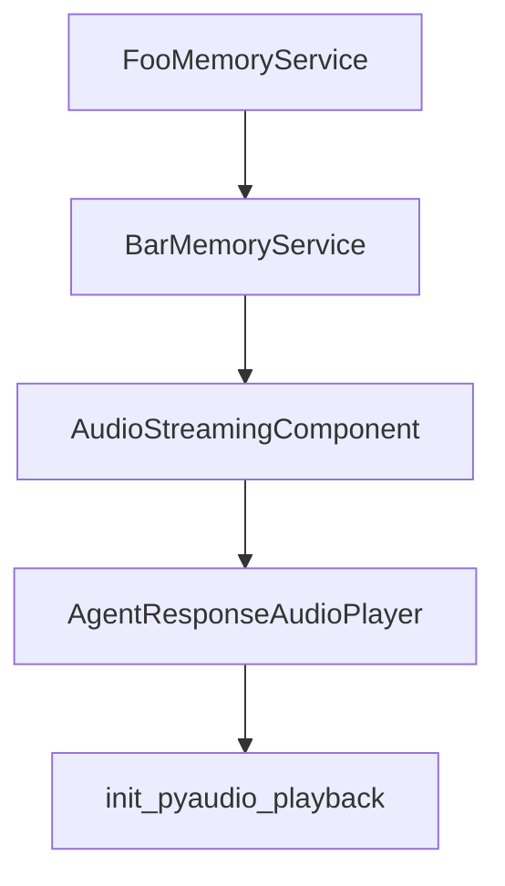

# Chapter 1: Getting Started

Welcome to **Chapter 1: Getting Started**. In this part of **ADK Python Tutorial: Production-Grade Agent Engineering with Google's ADK**, you will build an intuitive mental model first, then move into concrete implementation details and practical production tradeoffs.


This chapter gets ADK running locally so you can validate the core developer loop quickly.

## Learning Goals

- install ADK in a clean Python environment
- create a minimal agent project structure
- run with ADK CLI and web tools
- avoid first-run setup pitfalls

## Quick Setup Pattern

```bash
python -m venv .venv
source .venv/bin/activate
pip install google-adk
```

Then create a minimal agent module and run:

```bash
adk web path/to/agents_dir
```

## First-Use Checklist

1. confirm Python and environment are healthy
2. install `google-adk` and launch the UI
3. run one user turn through your root agent
4. verify tool calls and events appear as expected

## Source References

- [ADK README: Installation](https://github.com/google/adk-python/blob/main/README.md#-installation)
- [ADK Quickstart](https://google.github.io/adk-docs/get-started/quickstart/)
- [ADK CLI Documentation](https://google.github.io/adk-docs/)

## Summary

You now have ADK installed and a working baseline invocation flow.

Next: [Chapter 2: Architecture and Runner Lifecycle](02-architecture-and-runner-lifecycle.md)

## Depth Expansion Playbook

## Source Code Walkthrough

### `contributing/samples/dummy_services.py`

The `FooMemoryService` class in [`contributing/samples/dummy_services.py`](https://github.com/google/adk-python/blob/HEAD/contributing/samples/dummy_services.py) handles a key part of this chapter's functionality:

```py


class FooMemoryService(BaseMemoryService):
  """A dummy memory service that returns a fixed response."""

  def __init__(self, uri: str | None = None, **kwargs):
    """Initializes the foo memory service.

    Args:
      uri: The service URI.
      **kwargs: Additional keyword arguments.
    """
    del uri, kwargs  # Unused in this dummy implementation.

  @override
  async def add_session_to_memory(self, session: Session):
    print('FooMemoryService.add_session_to_memory')

  @override
  async def search_memory(
      self, *, app_name: str, user_id: str, query: str
  ) -> SearchMemoryResponse:
    print('FooMemoryService.search_memory')
    return SearchMemoryResponse(
        memories=[
            MemoryEntry(
                content=types.Content(
                    parts=[types.Part(text='I love ADK from Foo')]
                ),
                author='bot',
                timestamp=datetime.now().isoformat(),
            )
```

This class is important because it defines how ADK Python Tutorial: Production-Grade Agent Engineering with Google's ADK implements the patterns covered in this chapter.

### `contributing/samples/dummy_services.py`

The `BarMemoryService` class in [`contributing/samples/dummy_services.py`](https://github.com/google/adk-python/blob/HEAD/contributing/samples/dummy_services.py) handles a key part of this chapter's functionality:

```py


class BarMemoryService(BaseMemoryService):
  """A dummy memory service that returns a fixed response."""

  def __init__(self, uri: str | None = None, **kwargs):
    """Initializes the bar memory service.

    Args:
      uri: The service URI.
      **kwargs: Additional keyword arguments.
    """
    del uri, kwargs  # Unused in this dummy implementation.

  @override
  async def add_session_to_memory(self, session: Session):
    print('BarMemoryService.add_session_to_memory')

  @override
  async def search_memory(
      self, *, app_name: str, user_id: str, query: str
  ) -> SearchMemoryResponse:
    print('BarMemoryService.search_memory')
    return SearchMemoryResponse(
        memories=[
            MemoryEntry(
                content=types.Content(
                    parts=[types.Part(text='I love ADK from Bar')]
                ),
                author='bot',
                timestamp=datetime.now().isoformat(),
            )
```

This class is important because it defines how ADK Python Tutorial: Production-Grade Agent Engineering with Google's ADK implements the patterns covered in this chapter.

### `contributing/samples/live_agent_api_server_example/live_agent_example.py`

The `AudioStreamingComponent` class in [`contributing/samples/live_agent_api_server_example/live_agent_example.py`](https://github.com/google/adk-python/blob/HEAD/contributing/samples/live_agent_api_server_example/live_agent_example.py) handles a key part of this chapter's functionality:

```py


class AudioStreamingComponent:

  async def stop_audio_streaming(self):
    global is_streaming_audio
    if is_streaming_audio:
      logging.info("Requesting to stop audio streaming (flag set).")
      is_streaming_audio = False
    else:
      logging.info("Audio streaming is not currently active.")

  async def start_audio_streaming(
      self,
      websocket: websockets.WebSocketClientProtocol,
  ):
    print("Starting continuous audio streaming...")
    global is_streaming_audio, global_input_stream, debug_audio_save_count

    # IMPORTANT: Reinstate this check
    if not AUDIO_RECORDING_ENABLED:
      logging.warning("Audio recording disabled. Cannot start stream.")
      is_streaming_audio = (
          False  # Ensure flag is correctly set if we bail early
      )
      return

    is_streaming_audio = True
    debug_audio_save_count = 0  # Reset counter for each stream start
    logging.info("Starting continuous audio streaming...")

    global pya_interface_instance
```

This class is important because it defines how ADK Python Tutorial: Production-Grade Agent Engineering with Google's ADK implements the patterns covered in this chapter.

### `contributing/samples/live_agent_api_server_example/live_agent_example.py`

The `AgentResponseAudioPlayer` class in [`contributing/samples/live_agent_api_server_example/live_agent_example.py`](https://github.com/google/adk-python/blob/HEAD/contributing/samples/live_agent_api_server_example/live_agent_example.py) handles a key part of this chapter's functionality:

```py


class AgentResponseAudioPlayer:

  def cleanup_pyaudio_playback(self):
    global pya_interface_instance, pya_output_stream_instance
    logging.info("Attempting PyAudio cleanup...")
    if pya_output_stream_instance:
      try:
        if pya_output_stream_instance.is_active():  # Check if stream is active
          pya_output_stream_instance.stop_stream()
        pya_output_stream_instance.close()
        logging.info("PyAudio output stream stopped and closed.")
      except Exception as e:
        logging.error(f"Error closing PyAudio stream: {e}", exc_info=True)
      finally:
        pya_output_stream_instance = None
    if pya_interface_instance:
      try:
        pya_interface_instance.terminate()
        logging.info("PyAudio interface terminated.")
      except Exception as e:
        logging.error(
            f"Error terminating PyAudio interface: {e}", exc_info=True
        )
      finally:
        pya_interface_instance = None
    logging.info("PyAudio cleanup process finished.")

  # --- Audio Playback Handler (using PyAudio) ---
  def _play_audio_pyaudio_handler(
      self, audio_bytes: bytes, mime_type_full: str
```

This class is important because it defines how ADK Python Tutorial: Production-Grade Agent Engineering with Google's ADK implements the patterns covered in this chapter.


## How These Components Connect


