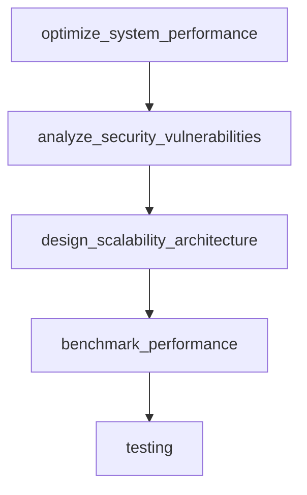

# Chapter 2: Architecture and Runner Lifecycle

Welcome to **Chapter 2: Architecture and Runner Lifecycle**. In this part of **ADK Python Tutorial: Production-Grade Agent Engineering with Google's ADK**, you will build an intuitive mental model first, then move into concrete implementation details and practical production tradeoffs.


This chapter explains ADK's execution model so you can reason about behavior under load and during failures.

## Learning Goals

- understand the stateless runner model
- map invocation lifecycle steps end-to-end
- see where sessions, artifacts, and memory fit
- design around event persistence and compaction

## Runner Lifecycle (Mental Model)

1. retrieve session state from session service
2. build invocation context for current turn
3. run agent reason-act loop
4. stream and persist events
5. optionally compact historical events

## Design Implications

- keep agent code deterministic per invocation
- treat persistence services as system boundaries
- design event schemas for observability and replay

## Source References

- [ADK AGENTS Context](https://github.com/google/adk-python/blob/main/AGENTS.md)
- [ADK Architecture Overview](https://github.com/google/adk-python/blob/main/contributing/adk_project_overview_and_architecture.md)
- [ADK Agents Docs](https://google.github.io/adk-docs/agents/)

## Summary

You now understand why ADK runner behavior is reliable when state is externalized and lifecycle boundaries are explicit.

Next: [Chapter 3: Agent Design and Multi-Agent Composition](03-agent-design-and-multi-agent-composition.md)

## Depth Expansion Playbook

## Source Code Walkthrough

### `contributing/samples/cache_analysis/agent.py`

The `optimize_system_performance` function in [`contributing/samples/cache_analysis/agent.py`](https://github.com/google/adk-python/blob/HEAD/contributing/samples/cache_analysis/agent.py) handles a key part of this chapter's functionality:

```py


def optimize_system_performance(
    system_type: str,
    current_metrics: Dict[str, Any],
    target_improvements: Dict[str, Any],
    constraints: Optional[Dict[str, Any]] = None,
) -> Dict[str, Any]:
  """Analyze system performance and provide detailed optimization recommendations.

  This tool performs comprehensive system performance analysis including bottleneck
  identification, resource utilization assessment, scalability planning, and provides
  specific optimization strategies tailored to the system type and constraints.

  Args:
      system_type: Type of system to optimize:
                  - "web_application": Frontend and backend web services
                  - "database": Relational, NoSQL, or distributed databases
                  - "ml_pipeline": Machine learning training and inference systems
                  - "distributed_cache": Caching layers and distributed memory systems
                  - "microservices": Service-oriented architectures
                  - "data_processing": ETL, stream processing, batch systems
                  - "api_gateway": Request routing and API management systems
      current_metrics: Current performance metrics including:
                      {
                          "response_time_p95": "95th percentile response time in ms",
                          "throughput_rps": "Requests per second",
                          "cpu_utilization": "Average CPU usage percentage",
                          "memory_usage": "Memory consumption in GB",
                          "error_rate": "Error percentage",
                          "availability": "System uptime percentage"
                      }
```

This function is important because it defines how ADK Python Tutorial: Production-Grade Agent Engineering with Google's ADK implements the patterns covered in this chapter.

### `contributing/samples/cache_analysis/agent.py`

The `analyze_security_vulnerabilities` function in [`contributing/samples/cache_analysis/agent.py`](https://github.com/google/adk-python/blob/HEAD/contributing/samples/cache_analysis/agent.py) handles a key part of this chapter's functionality:

```py


def analyze_security_vulnerabilities(
    system_components: List[str],
    security_scope: str = "comprehensive",
    compliance_frameworks: Optional[List[str]] = None,
    threat_model: str = "enterprise",
) -> Dict[str, Any]:
  """Perform comprehensive security vulnerability analysis and risk assessment.

  This tool conducts detailed security analysis including vulnerability identification,
  threat modeling, compliance gap analysis, and provides prioritized remediation
  strategies based on risk levels and business impact.

  Args:
      system_components: List of system components to analyze:
                        - "web_frontend": User interfaces, SPAs, mobile apps
                        - "api_endpoints": REST/GraphQL APIs, microservices
                        - "database_layer": Data storage and access systems
                        - "authentication": User auth, SSO, identity management
                        - "data_processing": ETL, analytics, ML pipelines
                        - "infrastructure": Servers, containers, cloud services
                        - "network_layer": Load balancers, firewalls, CDNs
      security_scope: Analysis depth:
                     - "basic": Standard vulnerability scanning
                     - "comprehensive": Full security assessment
                     - "compliance_focused": Regulatory compliance analysis
                     - "threat_modeling": Advanced threat analysis
      compliance_frameworks: Required compliance standards:
                            ["SOC2", "GDPR", "HIPAA", "PCI-DSS", "ISO27001"]
      threat_model: Threat landscape consideration:
                   - "startup": Basic threat model for early-stage companies
```

This function is important because it defines how ADK Python Tutorial: Production-Grade Agent Engineering with Google's ADK implements the patterns covered in this chapter.

### `contributing/samples/cache_analysis/agent.py`

The `design_scalability_architecture` function in [`contributing/samples/cache_analysis/agent.py`](https://github.com/google/adk-python/blob/HEAD/contributing/samples/cache_analysis/agent.py) handles a key part of this chapter's functionality:

```py


def design_scalability_architecture(
    current_architecture: str,
    expected_growth: Dict[str, Any],
    scalability_requirements: Dict[str, Any],
    technology_preferences: Optional[List[str]] = None,
) -> Dict[str, Any]:
  """Design comprehensive scalability architecture for anticipated growth.

  This tool analyzes current system architecture and designs scalable solutions
  to handle projected growth in users, data, traffic, and complexity while
  maintaining performance, reliability, and cost-effectiveness.

  Args:
      current_architecture: Current system architecture type:
                           - "monolith": Single-tier monolithic application
                           - "service_oriented": SOA with multiple services
                           - "microservices": Containerized microservice architecture
                           - "serverless": Function-as-a-Service architecture
                           - "hybrid": Mixed architecture patterns
      expected_growth: Projected growth metrics:
                      {
                          "user_growth_multiplier": "Expected increase in users",
                          "data_volume_growth": "Projected data storage needs",
                          "traffic_increase": "Expected traffic growth percentage",
                          "geographic_expansion": "New regions/markets",
                          "feature_complexity": "Additional functionality scope"
                      }
      scalability_requirements: Scalability constraints and targets:
                               {
                                   "performance_sla": "Response time requirements",
```

This function is important because it defines how ADK Python Tutorial: Production-Grade Agent Engineering with Google's ADK implements the patterns covered in this chapter.

### `contributing/samples/cache_analysis/agent.py`

The `benchmark_performance` function in [`contributing/samples/cache_analysis/agent.py`](https://github.com/google/adk-python/blob/HEAD/contributing/samples/cache_analysis/agent.py) handles a key part of this chapter's functionality:

```py


def benchmark_performance(
    system_name: str,
    metrics: Optional[List[str]] = None,
    duration: str = "standard",
    load_profile: str = "realistic",
) -> Dict[str, Any]:
  """Perform comprehensive performance benchmarking and analysis.

  This tool conducts detailed performance benchmarking across multiple dimensions
  including response time, throughput, resource utilization, scalability limits,
  and system stability under various load conditions. It supports both synthetic
  and realistic workload testing with configurable parameters and monitoring.

  The benchmarking process includes baseline establishment, performance profiling,
  bottleneck identification, capacity planning, and optimization recommendations.
  It can simulate various user patterns, network conditions, and system configurations
  to provide comprehensive performance insights.

  Args:
      system_name: Name or identifier of the system to benchmark. Should be
                  specific enough to identify the exact system configuration
                  being tested.
      metrics: List of performance metrics to measure:
              - "latency": Response time and request processing delays
              - "throughput": Requests per second and data processing rates
              - "cpu": CPU utilization and processing efficiency
              - "memory": Memory usage and allocation patterns
              - "disk": Disk I/O performance and storage operations
              - "network": Network bandwidth and communication overhead
              - "scalability": System behavior under increasing load
```

This function is important because it defines how ADK Python Tutorial: Production-Grade Agent Engineering with Google's ADK implements the patterns covered in this chapter.


## How These Components Connect


