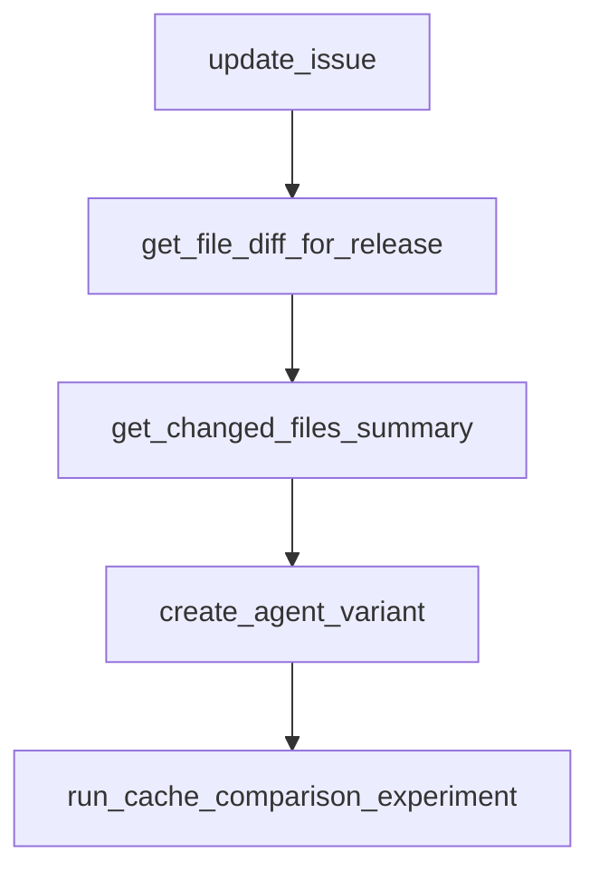

# Chapter 3: Agent Design and Multi-Agent Composition

Welcome to **Chapter 3: Agent Design and Multi-Agent Composition**. In this part of **ADK Python Tutorial: Production-Grade Agent Engineering with Google's ADK**, you will build an intuitive mental model first, then move into concrete implementation details and practical production tradeoffs.


This chapter covers how to structure ADK agents for maintainability and collaboration.

## Learning Goals

- define clean single-agent boundaries
- compose sub-agents with clear responsibilities
- choose `Agent` vs app pattern intentionally
- design instructions and tool scope for reliability

## Composition Strategies

- use specialist sub-agents for narrow tasks
- keep a coordinator agent focused on routing decisions
- limit tool sets per agent to reduce accidental behavior
- enforce stable directory conventions for discoverability

## Recommended Structure

- `my_agent/__init__.py` exports the agent entry
- `my_agent/agent.py` defines `root_agent` or `app`
- instructions and tool contracts stay modular and testable

## Source References

- [ADK README: Multi-Agent Example](https://github.com/google/adk-python/blob/main/README.md#define-a-multi-agent-system)
- [ADK Multi-Agent Docs](https://google.github.io/adk-docs/agents/multi-agents/)
- [ADK AGENTS.md Structure Convention](https://github.com/google/adk-python/blob/main/AGENTS.md)

## Summary

You can now build multi-agent ADK systems with clearer separation of concerns.

Next: [Chapter 4: Tools, MCP, and Confirmation Flows](04-tools-mcp-and-confirmation-flows.md)

## Depth Expansion Playbook

## Source Code Walkthrough

### `contributing/samples/adk_documentation/tools.py`

The `update_issue` function in [`contributing/samples/adk_documentation/tools.py`](https://github.com/google/adk-python/blob/HEAD/contributing/samples/adk_documentation/tools.py) handles a key part of this chapter's functionality:

```py


def update_issue(
    repo_owner: str,
    repo_name: str,
    issue_number: int,
    title: str,
    body: str,
) -> Dict[str, Any]:
  """Update an existing issue in the specified repository.

  Args:
      repo_owner: The name of the repository owner.
      repo_name: The name of the repository.
      issue_number: The number of the issue to update.
      title: The title of the issue.
      body: The body of the issue.

  Returns:
      The status of this request, with the issue details when successful.
  """
  url = (
      f"{GITHUB_BASE_URL}/repos/{repo_owner}/{repo_name}/issues/{issue_number}"
  )
  payload = {"title": title, "body": body}
  try:
    response = patch_request(url, payload)
  except requests.exceptions.RequestException as e:
    return error_response(f"Error: {e}")
  return {"status": "success", "issue": response}


```

This function is important because it defines how ADK Python Tutorial: Production-Grade Agent Engineering with Google's ADK implements the patterns covered in this chapter.

### `contributing/samples/adk_documentation/tools.py`

The `get_file_diff_for_release` function in [`contributing/samples/adk_documentation/tools.py`](https://github.com/google/adk-python/blob/HEAD/contributing/samples/adk_documentation/tools.py) handles a key part of this chapter's functionality:

```py


def get_file_diff_for_release(
    repo_owner: str,
    repo_name: str,
    start_tag: str,
    end_tag: str,
    file_path: str,
) -> Dict[str, Any]:
  """Gets the diff/patch for a specific file between two release tags.

  This is useful for incremental processing where you want to analyze
  one file at a time instead of loading all changes at once.

  Args:
      repo_owner: The name of the repository owner.
      repo_name: The name of the repository.
      start_tag: The older tag (base) for the comparison.
      end_tag: The newer tag (head) for the comparison.
      file_path: The relative path of the file to get the diff for.

  Returns:
      A dictionary containing the status and the file diff details.
  """
  url = f"{GITHUB_BASE_URL}/repos/{repo_owner}/{repo_name}/compare/{start_tag}...{end_tag}"

  try:
    comparison_data = get_request(url)
    changed_files = comparison_data.get("files", [])

    for file_data in changed_files:
      if file_data.get("filename") == file_path:
```

This function is important because it defines how ADK Python Tutorial: Production-Grade Agent Engineering with Google's ADK implements the patterns covered in this chapter.

### `contributing/samples/adk_documentation/tools.py`

The `get_changed_files_summary` function in [`contributing/samples/adk_documentation/tools.py`](https://github.com/google/adk-python/blob/HEAD/contributing/samples/adk_documentation/tools.py) handles a key part of this chapter's functionality:

```py


def get_changed_files_summary(
    repo_owner: str,
    repo_name: str,
    start_tag: str,
    end_tag: str,
    local_repo_path: Optional[str] = None,
    path_filter: Optional[str] = None,
) -> Dict[str, Any]:
  """Gets a summary of changed files between two releases without patches.

  This function uses local git commands when local_repo_path is provided,
  which avoids the GitHub API's 300-file limit for large comparisons.
  Falls back to GitHub API if local_repo_path is not provided or invalid.

  Args:
      repo_owner: The name of the repository owner.
      repo_name: The name of the repository.
      start_tag: The older tag (base) for the comparison.
      end_tag: The newer tag (head) for the comparison.
      local_repo_path: Optional absolute path to local git repo. If provided
          and valid, uses git diff instead of GitHub API to get complete
          file list (avoids 300-file limit).
      path_filter: Optional path prefix to filter files. Only files whose
          path starts with this prefix will be included. Example:
          "src/google/adk/" to only include ADK source files.

  Returns:
      A dictionary containing the status and a summary of changed files.
  """
  # Use local git if valid path is provided (avoids GitHub API 300-file limit)
```

This function is important because it defines how ADK Python Tutorial: Production-Grade Agent Engineering with Google's ADK implements the patterns covered in this chapter.

### `contributing/samples/cache_analysis/run_cache_experiments.py`

The `create_agent_variant` function in [`contributing/samples/cache_analysis/run_cache_experiments.py`](https://github.com/google/adk-python/blob/HEAD/contributing/samples/cache_analysis/run_cache_experiments.py) handles a key part of this chapter's functionality:

```py


def create_agent_variant(base_app, model_name: str, cache_enabled: bool):
  """Create an app variant with specified model and cache settings."""
  import datetime

  from google.adk.agents.context_cache_config import ContextCacheConfig
  from google.adk.apps.app import App

  # Extract the root agent and modify its model
  agent_copy = copy.deepcopy(base_app.root_agent)
  agent_copy.model = model_name

  # Prepend dynamic timestamp to instruction to avoid implicit cache reuse across runs
  current_timestamp = datetime.datetime.now().strftime("%Y-%m-%d %H:%M:%S")
  dynamic_prefix = f"Current session started at: {current_timestamp}\n\n"
  agent_copy.instruction = dynamic_prefix + agent_copy.instruction

  # Update agent name to reflect configuration
  cache_status = "cached" if cache_enabled else "no_cache"
  agent_copy.name = (
      f"cache_analysis_{model_name.replace('.', '_').replace('-', '_')}_{cache_status}"
  )

  if cache_enabled:
    # Use standardized cache config
    cache_config = ContextCacheConfig(
        min_tokens=4096,
        ttl_seconds=600,  # 10 mins for research sessions
        cache_intervals=3,  # Maximum invocations before cache refresh
    )
  else:
```

This function is important because it defines how ADK Python Tutorial: Production-Grade Agent Engineering with Google's ADK implements the patterns covered in this chapter.


## How These Components Connect


