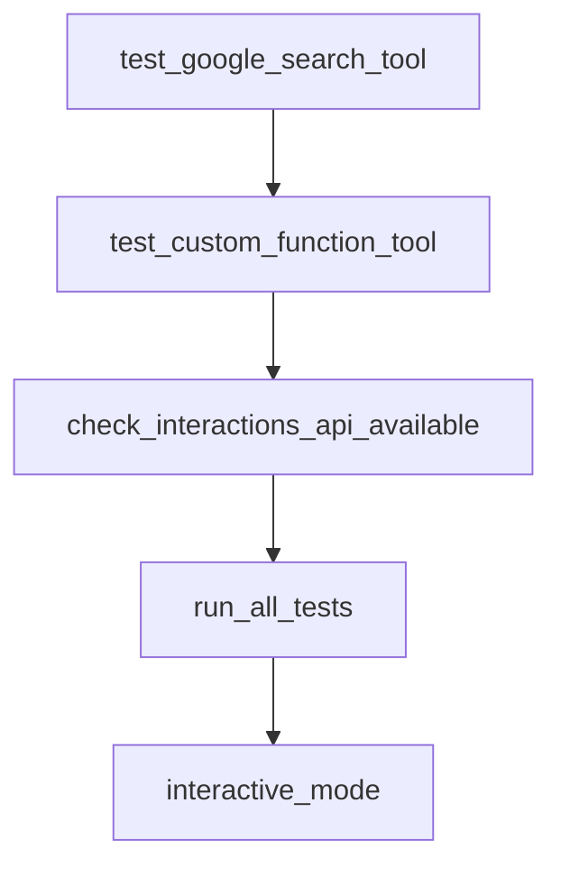

# Chapter 4: Tools, MCP, and Confirmation Flows

Welcome to **Chapter 4: Tools, MCP, and Confirmation Flows**. In this part of **ADK Python Tutorial: Production-Grade Agent Engineering with Google's ADK**, you will build an intuitive mental model first, then move into concrete implementation details and practical production tradeoffs.


This chapter explains how to safely expose external capabilities to ADK agents.

## Learning Goals

- use Python tools and OpenAPI/MCP integrations
- gate risky tool actions with confirmation flows
- build safer human-in-the-loop controls
- reduce runtime surprises from tool misuse

## Tooling Categories in ADK

- Python function tools
- OpenAPI-based tools
- MCP-based tools
- Google ecosystem connectors

## Confirmation Strategy

For tools with side effects, add explicit confirmation requirements before execution. This keeps the agent useful while reducing accidental writes or external operations.

## Source References

- [ADK Tools Docs](https://google.github.io/adk-docs/tools/)
- [ADK MCP Tools Docs](https://google.github.io/adk-docs/tools/mcp-tools/)
- [ADK Tool Confirmation Docs](https://google.github.io/adk-docs/tools/confirmation/)

## Summary

You now have a practical pattern for shipping tool-enabled ADK agents with stronger safety defaults.

Next: [Chapter 5: Sessions, Memory, and Context Management](05-sessions-memory-and-context-management.md)

## Depth Expansion Playbook

## Source Code Walkthrough

### `contributing/samples/interactions_api/main.py`

The `test_google_search_tool` function in [`contributing/samples/interactions_api/main.py`](https://github.com/google/adk-python/blob/HEAD/contributing/samples/interactions_api/main.py) handles a key part of this chapter's functionality:

```py


async def test_google_search_tool(runner: Runner, session_id: str):
  """Test the google_search built-in tool."""
  print("\n" + "=" * 60)
  print("TEST 4: Google Search Tool (Additional)")
  print("=" * 60)

  response, interaction_id = await call_agent_async(
      runner,
      USER_ID,
      session_id,
      "Use google search to find out who wrote the novel '1984'.",
  )

  assert response, "Expected a non-empty response"
  assert (
      "orwell" in response.lower() or "george" in response.lower()
  ), f"Expected George Orwell in response: {response}"
  print("PASSED: Google search built-in tool works")


async def test_custom_function_tool(runner: Runner, session_id: str):
  """Test the custom function tool alongside google_search.

  The root_agent has both GoogleSearchTool (with bypass_multi_tools_limit=True)
  and get_current_weather. This tests that function calling tools work with
  the Interactions API when all tools are function calling types.
  """
  print("\n" + "=" * 60)
  print("TEST 5: Custom Function Tool (get_current_weather)")
  print("=" * 60)
```

This function is important because it defines how ADK Python Tutorial: Production-Grade Agent Engineering with Google's ADK implements the patterns covered in this chapter.

### `contributing/samples/interactions_api/main.py`

The `test_custom_function_tool` function in [`contributing/samples/interactions_api/main.py`](https://github.com/google/adk-python/blob/HEAD/contributing/samples/interactions_api/main.py) handles a key part of this chapter's functionality:

```py


async def test_custom_function_tool(runner: Runner, session_id: str):
  """Test the custom function tool alongside google_search.

  The root_agent has both GoogleSearchTool (with bypass_multi_tools_limit=True)
  and get_current_weather. This tests that function calling tools work with
  the Interactions API when all tools are function calling types.
  """
  print("\n" + "=" * 60)
  print("TEST 5: Custom Function Tool (get_current_weather)")
  print("=" * 60)

  response, interaction_id = await call_agent_async(
      runner,
      USER_ID,
      session_id,
      "What's the weather like in Tokyo?",
  )

  assert response, "Expected a non-empty response"
  # The mock weather data for Tokyo has temperature 68, condition "Partly Cloudy"
  assert (
      "68" in response
      or "partly" in response.lower()
      or "tokyo" in response.lower()
  ), f"Expected weather info for Tokyo in response: {response}"
  print("PASSED: Custom function tool works with bypass_multi_tools_limit")
  return interaction_id


def check_interactions_api_available() -> bool:
```

This function is important because it defines how ADK Python Tutorial: Production-Grade Agent Engineering with Google's ADK implements the patterns covered in this chapter.

### `contributing/samples/interactions_api/main.py`

The `check_interactions_api_available` function in [`contributing/samples/interactions_api/main.py`](https://github.com/google/adk-python/blob/HEAD/contributing/samples/interactions_api/main.py) handles a key part of this chapter's functionality:

```py


def check_interactions_api_available() -> bool:
  """Check if the interactions API is available in the SDK."""
  try:
    from google.genai import Client

    client = Client()
    # Check if interactions attribute exists
    return hasattr(client.aio, "interactions")
  except Exception:
    return False


async def run_all_tests():
  """Run all tests with the Interactions API."""
  print("\n" + "#" * 70)
  print("# Running tests with Interactions API")
  print("#" * 70)

  # Check if interactions API is available
  if not check_interactions_api_available():
    print("\nERROR: Interactions API is not available in the current SDK.")
    print("The interactions API requires a SDK version with this feature.")
    print("To use the interactions API, ensure you have the SDK with")
    print("interactions support installed (e.g., from private-python-genai).")
    return False

  test_agent = root_agent

  runner = InMemoryRunner(
      agent=test_agent,
```

This function is important because it defines how ADK Python Tutorial: Production-Grade Agent Engineering with Google's ADK implements the patterns covered in this chapter.

### `contributing/samples/interactions_api/main.py`

The `run_all_tests` function in [`contributing/samples/interactions_api/main.py`](https://github.com/google/adk-python/blob/HEAD/contributing/samples/interactions_api/main.py) handles a key part of this chapter's functionality:

```py


async def run_all_tests():
  """Run all tests with the Interactions API."""
  print("\n" + "#" * 70)
  print("# Running tests with Interactions API")
  print("#" * 70)

  # Check if interactions API is available
  if not check_interactions_api_available():
    print("\nERROR: Interactions API is not available in the current SDK.")
    print("The interactions API requires a SDK version with this feature.")
    print("To use the interactions API, ensure you have the SDK with")
    print("interactions support installed (e.g., from private-python-genai).")
    return False

  test_agent = root_agent

  runner = InMemoryRunner(
      agent=test_agent,
      app_name=APP_NAME,
  )

  # Create a new session
  session = await runner.session_service.create_session(
      user_id=USER_ID,
      app_name=APP_NAME,
  )
  print(f"\nSession created: {session.id}")

  try:
    # Run all tests
```

This function is important because it defines how ADK Python Tutorial: Production-Grade Agent Engineering with Google's ADK implements the patterns covered in this chapter.


## How These Components Connect


