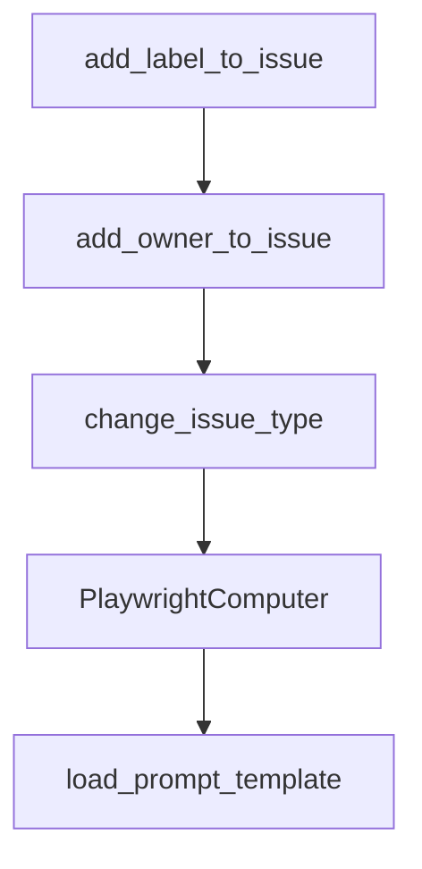

# Chapter 5: Sessions, Memory, and Context Management

Welcome to **Chapter 5: Sessions, Memory, and Context Management**. In this part of **ADK Python Tutorial: Production-Grade Agent Engineering with Google's ADK**, you will build an intuitive mental model first, then move into concrete implementation details and practical production tradeoffs.


This chapter focuses on context durability and state boundaries.

## Learning Goals

- separate session state from long-term memory
- choose storage services based on workload needs
- control context growth with compaction patterns
- design memory usage for predictable outcomes

## Practical Guidance

- use session services for per-conversation event history
- use memory services for cross-session recall
- monitor compaction behavior to preserve critical facts
- define retention and governance policies early

## Source References

- [ADK AGENTS.md: Sessions and Memory](https://github.com/google/adk-python/blob/main/AGENTS.md)
- [ADK Documentation](https://google.github.io/adk-docs/)
- [ADK Deploy Docs](https://google.github.io/adk-docs/deploy/)

## Summary

You can now reason about short-term context and long-term recall without mixing concerns.

Next: [Chapter 6: Evaluation, Debugging, and Quality Gates](06-evaluation-debugging-and-quality-gates.md)

## Depth Expansion Playbook

## Source Code Walkthrough

### `contributing/samples/adk_triaging_agent/agent.py`

The `add_label_to_issue` function in [`contributing/samples/adk_triaging_agent/agent.py`](https://github.com/google/adk-python/blob/HEAD/contributing/samples/adk_triaging_agent/agent.py) handles a key part of this chapter's functionality:

```py


def add_label_to_issue(issue_number: int, label: str) -> dict[str, Any]:
  """Add the specified component label to the given issue number.

  Args:
    issue_number: issue number of the GitHub issue.
    label: label to assign

  Returns:
    The status of this request, with the applied label when successful.
  """
  print(f"Attempting to add label '{label}' to issue #{issue_number}")
  if label not in LABEL_TO_OWNER:
    return error_response(
        f"Error: Label '{label}' is not an allowed label. Will not apply."
    )

  label_url = (
      f"{GITHUB_BASE_URL}/repos/{OWNER}/{REPO}/issues/{issue_number}/labels"
  )
  label_payload = [label]

  try:
    response = post_request(label_url, label_payload)
  except requests.exceptions.RequestException as e:
    return error_response(f"Error: {e}")

  return {
      "status": "success",
      "message": response,
      "applied_label": label,
```

This function is important because it defines how ADK Python Tutorial: Production-Grade Agent Engineering with Google's ADK implements the patterns covered in this chapter.

### `contributing/samples/adk_triaging_agent/agent.py`

The `add_owner_to_issue` function in [`contributing/samples/adk_triaging_agent/agent.py`](https://github.com/google/adk-python/blob/HEAD/contributing/samples/adk_triaging_agent/agent.py) handles a key part of this chapter's functionality:

```py


def add_owner_to_issue(issue_number: int, label: str) -> dict[str, Any]:
  """Assign an owner to the issue based on the component label.

  This should only be called for issues that have the 'planned' label.

  Args:
    issue_number: issue number of the GitHub issue.
    label: component label that determines the owner to assign

  Returns:
    The status of this request, with the assigned owner when successful.
  """
  print(
      f"Attempting to assign owner for label '{label}' to issue #{issue_number}"
  )
  if label not in LABEL_TO_OWNER:
    return error_response(
        f"Error: Label '{label}' is not a valid component label."
    )

  owner = LABEL_TO_OWNER.get(label, None)
  if not owner:
    return {
        "status": "warning",
        "message": f"Label '{label}' does not have an owner. Will not assign.",
    }

  assignee_url = (
      f"{GITHUB_BASE_URL}/repos/{OWNER}/{REPO}/issues/{issue_number}/assignees"
  )
```

This function is important because it defines how ADK Python Tutorial: Production-Grade Agent Engineering with Google's ADK implements the patterns covered in this chapter.

### `contributing/samples/adk_triaging_agent/agent.py`

The `change_issue_type` function in [`contributing/samples/adk_triaging_agent/agent.py`](https://github.com/google/adk-python/blob/HEAD/contributing/samples/adk_triaging_agent/agent.py) handles a key part of this chapter's functionality:

```py


def change_issue_type(issue_number: int, issue_type: str) -> dict[str, Any]:
  """Change the issue type of the given issue number.

  Args:
    issue_number: issue number of the GitHub issue, in string format.
    issue_type: issue type to assign

  Returns:
    The status of this request, with the applied issue type when successful.
  """
  print(
      f"Attempting to change issue type '{issue_type}' to issue #{issue_number}"
  )
  url = f"{GITHUB_BASE_URL}/repos/{OWNER}/{REPO}/issues/{issue_number}"
  payload = {"type": issue_type}

  try:
    response = patch_request(url, payload)
  except requests.exceptions.RequestException as e:
    return error_response(f"Error: {e}")

  return {"status": "success", "message": response, "issue_type": issue_type}


root_agent = Agent(
    model="gemini-2.5-pro",
    name="adk_triaging_assistant",
    description="Triage ADK issues.",
    instruction=f"""
      You are a triaging bot for the GitHub {REPO} repo with the owner {OWNER}. You will help get issues, and recommend a label.
```

This function is important because it defines how ADK Python Tutorial: Production-Grade Agent Engineering with Google's ADK implements the patterns covered in this chapter.

### `contributing/samples/computer_use/playwright.py`

The `PlaywrightComputer` class in [`contributing/samples/computer_use/playwright.py`](https://github.com/google/adk-python/blob/HEAD/contributing/samples/computer_use/playwright.py) handles a key part of this chapter's functionality:

```py


class PlaywrightComputer(BaseComputer):
  """Computer that controls Chromium via Playwright."""

  def __init__(
      self,
      screen_size: tuple[int, int],
      initial_url: str = "https://www.google.com",
      search_engine_url: str = "https://www.google.com",
      highlight_mouse: bool = False,
      user_data_dir: Optional[str] = None,
  ):
    self._initial_url = initial_url
    self._screen_size = screen_size
    self._search_engine_url = search_engine_url
    self._highlight_mouse = highlight_mouse
    self._user_data_dir = user_data_dir

  @override
  async def initialize(self):
    print("Creating session...")
    self._playwright = await async_playwright().start()

    # Define common arguments for both launch types
    browser_args = [
        "--disable-blink-features=AutomationControlled",
        "--disable-gpu",
    ]

    if self._user_data_dir:
      termcolor.cprint(
```

This class is important because it defines how ADK Python Tutorial: Production-Grade Agent Engineering with Google's ADK implements the patterns covered in this chapter.


## How These Components Connect


