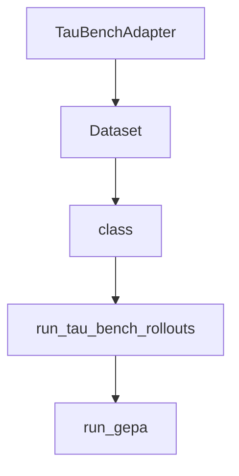

# Chapter 6: Evaluation, Debugging, and Quality Gates

Welcome to **Chapter 6: Evaluation, Debugging, and Quality Gates**. In this part of **ADK Python Tutorial: Production-Grade Agent Engineering with Google's ADK**, you will build an intuitive mental model first, then move into concrete implementation details and practical production tradeoffs.


This chapter shows how to harden ADK behavior with repeatable evaluation workflows.

## Learning Goals

- run ADK evaluation commands against test sets
- instrument debugging in runner and tool paths
- detect regressions before release
- define release gates for agent quality

## Evaluation Workflow

1. create representative evaluation sets
2. run `adk eval` in CI and locally
3. inspect failures by event trace and tool outputs
4. block release when quality thresholds fail

## Source References

- [ADK README: Evaluate Agents](https://github.com/google/adk-python/blob/main/README.md#--evaluate-agents)
- [ADK Evaluate Docs](https://google.github.io/adk-docs/evaluate/)
- [ADK Testing Guidance](https://github.com/google/adk-python/blob/main/CONTRIBUTING.md)

## Summary

You now have a quality loop that makes ADK systems safer to evolve.

Next: [Chapter 7: Deployment and Production Operations](07-deployment-and-production-operations.md)

## Depth Expansion Playbook

## Source Code Walkthrough

### `contributing/samples/gepa/experiment.py`

The `TauBenchAdapter` class in [`contributing/samples/gepa/experiment.py`](https://github.com/google/adk-python/blob/HEAD/contributing/samples/gepa/experiment.py) handles a key part of this chapter's functionality:

```py


class TauBenchAdapter(
    GEPAAdapter[
        TauBenchDataInst,
        TauBenchTrajectory,
        TauBenchRolloutOutput,
    ]
):
  """A GEPA adapter for evaluating agent performance on tau-bench benchmark."""

  def __init__(
      self,
      env_name: str,
      agent_model: str = 'gemini-2.5-flash',
      agent_model_provider: str = 'vertex_ai',
      user_model: str = 'gemini-2.5-pro',
      user_model_provider: str = 'vertex_ai',
      agent_strategy: str = 'tool-calling',
      user_strategy: str = 'llm',
      system_instruction_name: str = 'system_instruction',
      max_concurrency: int = 4,
      rater: rater_lib.Rater | None = None,
      log_dir: str | None = None,
  ):
    """Initializes the TauBenchAdapter.

    Args:
      env_name: environment
      agent_model: The model to use for the agent.
      agent_model_provider: The provider for the agent model.
      user_model: The model to use for simulating the user.
```

This class is important because it defines how ADK Python Tutorial: Production-Grade Agent Engineering with Google's ADK implements the patterns covered in this chapter.

### `contributing/samples/gepa/experiment.py`

The `Dataset` class in [`contributing/samples/gepa/experiment.py`](https://github.com/google/adk-python/blob/HEAD/contributing/samples/gepa/experiment.py) handles a key part of this chapter's functionality:

```py


def _get_dataset(ds: Dataset) -> list[TauBenchDataInst]:
  task_ids = ds.indexes or list(range(len(_DATASET_SPLITS[ds.split])))
  if ds.max_size is not None:
    task_ids = task_ids[: ds.max_size]
  random.shuffle(task_ids)
  return task_ids


def _get_datasets(
    config: ExperimentConfig,
) -> dict[str, list[int]]:
  """Returns Tau-bench dataset splits."""
  random.seed(config.rnd_seed)
  train_task_ids = _get_dataset(config.feedback_dataset)
  eval_task_ids = _get_dataset(config.pareto_dataset)
  test_task_ids = _get_dataset(config.eval_dataset)
  logging.info(
      'Using datasets of size: train=%d, eval=%d, test=%d',
      len(train_task_ids),
      len(eval_task_ids),
      len(test_task_ids),
  )
  return dict(
      train=train_task_ids,
      dev=eval_task_ids,
      test=test_task_ids,
  )


SEED_SYSTEM_INSTRUCTION = (
```

This class is important because it defines how ADK Python Tutorial: Production-Grade Agent Engineering with Google's ADK implements the patterns covered in this chapter.

### `contributing/samples/gepa/experiment.py`

The `class` class in [`contributing/samples/gepa/experiment.py`](https://github.com/google/adk-python/blob/HEAD/contributing/samples/gepa/experiment.py) handles a key part of this chapter's functionality:

```py

from concurrent.futures import ThreadPoolExecutor
import dataclasses
from datetime import datetime
import json
import logging
import multiprocessing
import os
import random
import traceback
from typing import Any
from typing import TypedDict

import gepa
from gepa.core.adapter import EvaluationBatch
from gepa.core.adapter import GEPAAdapter
from litellm import provider_list
import rater_lib
from retry import retry
from tau_bench.envs import get_env
from tau_bench.envs.retail import tasks_dev
from tau_bench.envs.retail import tasks_test
from tau_bench.envs.retail import tasks_train
from tau_bench.envs.user import UserStrategy
from tau_bench.run import display_metrics
from tau_bench.types import EnvRunResult
from tau_bench.types import RunConfig
import tau_bench_agent as tau_bench_agent_lib

import utils


```

This class is important because it defines how ADK Python Tutorial: Production-Grade Agent Engineering with Google's ADK implements the patterns covered in this chapter.

### `contributing/samples/gepa/experiment.py`

The `run_tau_bench_rollouts` function in [`contributing/samples/gepa/experiment.py`](https://github.com/google/adk-python/blob/HEAD/contributing/samples/gepa/experiment.py) handles a key part of this chapter's functionality:

```py


def run_tau_bench_rollouts(
    config: RunConfig,
    print_results: bool = False,
    system_instruction: str | None = None,
    rater: rater_lib.Rater | None = None,
) -> list[EnvRunResult]:
  """Runs a set of tau-bench tasks with a given agent configuration.

  This is a customized version of the standard tau-bench run function, adapted
  for this experiment's needs. It handles environment setup, agent creation,
  task execution in parallel, and result aggregation.

  Args:
    config: A RunConfig object specifying the environment, models, and other
      parameters for the run.
    print_results: If True, prints the result of each task as it completes.
    system_instruction: An optional system instruction to use for the agent,
      overriding the default.
    rater: An optional rater to evaluate the agent's performance.

  Returns:
    A list of EnvRunResult objects, one for each completed task.
  """
  if config.env not in ['retail', 'airline']:
    raise ValueError('Only retail and airline envs are supported')
  if config.model_provider not in provider_list:
    raise ValueError('Invalid model provider')
  if config.user_model_provider not in provider_list:
    raise ValueError('Invalid user model provider')
  if config.agent_strategy not in ['tool-calling', 'act', 'react', 'few-shot']:
```

This function is important because it defines how ADK Python Tutorial: Production-Grade Agent Engineering with Google's ADK implements the patterns covered in this chapter.


## How These Components Connect


