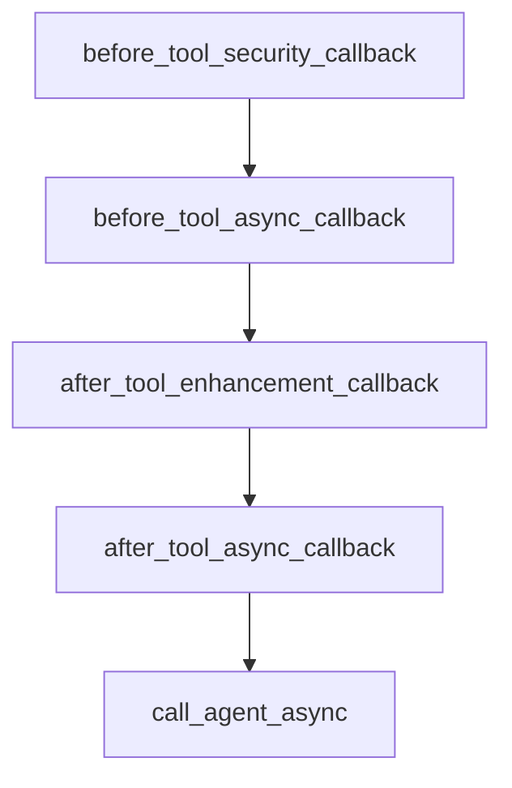

# Chapter 7: Deployment and Production Operations

Welcome to **Chapter 7: Deployment and Production Operations**. In this part of **ADK Python Tutorial: Production-Grade Agent Engineering with Google's ADK**, you will build an intuitive mental model first, then move into concrete implementation details and practical production tradeoffs.


This chapter covers production packaging and run operations for ADK projects.

## Learning Goals

- choose deployment targets by workload profile
- package and version agent services cleanly
- add observability and rollback practices
- operate with security and governance controls

## Deployment Paths

- local or containerized services for team workflows
- Cloud Run style deployments for managed scaling
- Vertex AI Agent Engine paths for enterprise integration

## Operational Checklist

- pin dependency and model configuration
- capture invocation and tool telemetry
- define rollback and incident response runbooks
- enforce change approval for risky tool actions

## Source References

- [ADK README: Deploy Anywhere](https://github.com/google/adk-python/blob/main/README.md#-key-features)
- [ADK Deploy Docs](https://google.github.io/adk-docs/deploy/)
- [ADK Web Repository](https://github.com/google/adk-web)

## Summary

You can now move ADK agents from prototype into production operations with clearer controls.

Next: [Chapter 8: Contribution Workflow and Ecosystem Strategy](08-contribution-workflow-and-ecosystem-strategy.md)

## Depth Expansion Playbook

## Source Code Walkthrough

### `contributing/samples/live_tool_callbacks_agent/agent.py`

The `before_tool_security_callback` function in [`contributing/samples/live_tool_callbacks_agent/agent.py`](https://github.com/google/adk-python/blob/HEAD/contributing/samples/live_tool_callbacks_agent/agent.py) handles a key part of this chapter's functionality:

```py


def before_tool_security_callback(
    tool, args: Dict[str, Any], tool_context: ToolContext
) -> Optional[Dict[str, Any]]:
  """Security callback that can block certain tool calls."""
  # Example: Block weather requests for restricted locations
  if tool.name == "get_weather" and args.get("location", "").lower() in [
      "classified",
      "secret",
  ]:
    print(
        "🚫 SECURITY: Blocked weather request for restricted location:"
        f" {args.get('location')}"
    )
    return {
        "error": "Access denied",
        "reason": "Location access is restricted",
        "requested_location": args.get("location"),
    }

  # Allow other calls to proceed
  return None


async def before_tool_async_callback(
    tool, args: Dict[str, Any], tool_context: ToolContext
) -> Optional[Dict[str, Any]]:
  """Async before callback that can add preprocessing."""
  print(f"⚡ ASYNC BEFORE: Processing tool '{tool.name}' asynchronously")

  # Simulate some async preprocessing
```

This function is important because it defines how ADK Python Tutorial: Production-Grade Agent Engineering with Google's ADK implements the patterns covered in this chapter.

### `contributing/samples/live_tool_callbacks_agent/agent.py`

The `before_tool_async_callback` function in [`contributing/samples/live_tool_callbacks_agent/agent.py`](https://github.com/google/adk-python/blob/HEAD/contributing/samples/live_tool_callbacks_agent/agent.py) handles a key part of this chapter's functionality:

```py


async def before_tool_async_callback(
    tool, args: Dict[str, Any], tool_context: ToolContext
) -> Optional[Dict[str, Any]]:
  """Async before callback that can add preprocessing."""
  print(f"⚡ ASYNC BEFORE: Processing tool '{tool.name}' asynchronously")

  # Simulate some async preprocessing
  await asyncio.sleep(0.05)

  # For calculation tool, we could add validation
  if (
      tool.name == "calculate_async"
      and args.get("operation") == "divide"
      and args.get("y") == 0
  ):
    print("🚫 VALIDATION: Prevented division by zero")
    return {
        "error": "Division by zero",
        "operation": args.get("operation"),
        "x": args.get("x"),
        "y": args.get("y"),
    }

  return None


# After tool callbacks
def after_tool_enhancement_callback(
    tool,
    args: Dict[str, Any],
```

This function is important because it defines how ADK Python Tutorial: Production-Grade Agent Engineering with Google's ADK implements the patterns covered in this chapter.

### `contributing/samples/live_tool_callbacks_agent/agent.py`

The `after_tool_enhancement_callback` function in [`contributing/samples/live_tool_callbacks_agent/agent.py`](https://github.com/google/adk-python/blob/HEAD/contributing/samples/live_tool_callbacks_agent/agent.py) handles a key part of this chapter's functionality:

```py

# After tool callbacks
def after_tool_enhancement_callback(
    tool,
    args: Dict[str, Any],
    tool_context: ToolContext,
    tool_response: Dict[str, Any],
) -> Optional[Dict[str, Any]]:
  """Enhance tool responses with additional metadata."""
  print(f"✨ ENHANCE: Adding metadata to response from '{tool.name}'")

  # Add enhancement metadata
  enhanced_response = tool_response.copy()
  enhanced_response.update({
      "enhanced": True,
      "enhancement_timestamp": datetime.now().isoformat(),
      "tool_name": tool.name,
      "execution_context": "live_streaming",
  })

  return enhanced_response


async def after_tool_async_callback(
    tool,
    args: Dict[str, Any],
    tool_context: ToolContext,
    tool_response: Dict[str, Any],
) -> Optional[Dict[str, Any]]:
  """Async after callback for post-processing."""
  print(
      f"🔄 ASYNC AFTER: Post-processing response from '{tool.name}'"
```

This function is important because it defines how ADK Python Tutorial: Production-Grade Agent Engineering with Google's ADK implements the patterns covered in this chapter.

### `contributing/samples/live_tool_callbacks_agent/agent.py`

The `after_tool_async_callback` function in [`contributing/samples/live_tool_callbacks_agent/agent.py`](https://github.com/google/adk-python/blob/HEAD/contributing/samples/live_tool_callbacks_agent/agent.py) handles a key part of this chapter's functionality:

```py


async def after_tool_async_callback(
    tool,
    args: Dict[str, Any],
    tool_context: ToolContext,
    tool_response: Dict[str, Any],
) -> Optional[Dict[str, Any]]:
  """Async after callback for post-processing."""
  print(
      f"🔄 ASYNC AFTER: Post-processing response from '{tool.name}'"
      " asynchronously"
  )

  # Simulate async post-processing
  await asyncio.sleep(0.05)

  # Add async processing metadata
  processed_response = tool_response.copy()
  processed_response.update({
      "async_processed": True,
      "processing_time": "0.05s",
      "processor": "async_after_callback",
  })

  return processed_response


import asyncio

# Create the agent with tool callbacks
root_agent = Agent(
```

This function is important because it defines how ADK Python Tutorial: Production-Grade Agent Engineering with Google's ADK implements the patterns covered in this chapter.


## How These Components Connect


