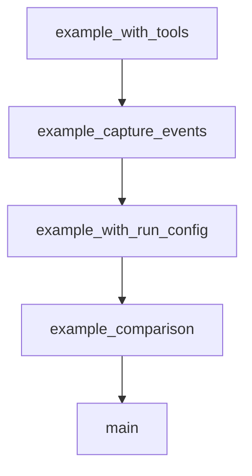

# Chapter 8: Contribution Workflow and Ecosystem Strategy

Welcome to **Chapter 8: Contribution Workflow and Ecosystem Strategy**. In this part of **ADK Python Tutorial: Production-Grade Agent Engineering with Google's ADK**, you will build an intuitive mental model first, then move into concrete implementation details and practical production tradeoffs.


This chapter maps how to contribute effectively to ADK and leverage its broader ecosystem.

## Learning Goals

- follow ADK contribution and test requirements
- align docs and code updates across repos
- use community resources for faster delivery
- plan ecosystem integration without lock-in

## Contribution Priorities

- keep PRs focused and test-backed
- include issue context for non-trivial changes
- update docs when behavior changes
- validate with unit and end-to-end test evidence

## Ecosystem Surfaces

- `google/adk-samples` for implementation patterns
- `google/adk-python-community` for community integrations
- A2A integrations for remote agent-to-agent workflows

## Source References

- [ADK Contributing Guide](https://github.com/google/adk-python/blob/main/CONTRIBUTING.md)
- [ADK Docs Contribution Guide](https://google.github.io/adk-docs/contributing-guide/)
- [ADK Samples](https://github.com/google/adk-samples)
- [ADK Python Community](https://github.com/google/adk-python-community)

## Summary

You now have a full ADK production learning path from first run to ecosystem-level contribution.

Next tutorial: [Strands Agents Tutorial](../strands-agents-tutorial/)

## Depth Expansion Playbook

## Source Code Walkthrough

### `contributing/samples/runner_debug_example/main.py`

The `example_with_tools` function in [`contributing/samples/runner_debug_example/main.py`](https://github.com/google/adk-python/blob/HEAD/contributing/samples/runner_debug_example/main.py) handles a key part of this chapter's functionality:

```py


async def example_with_tools():
  """Demonstrate tool calls and responses with verbose flag."""
  print("\n------------------------------------")
  print("Example 5: Tool Calls (verbose flag)")
  print("------------------------------------")

  runner = InMemoryRunner(agent=agent.root_agent)

  print("\n-- Default (verbose=False) - Clean output --")
  # Without verbose: Only shows final agent responses
  await runner.run_debug([
      "What's the weather in Tokyo?",
      "Calculate (42 * 3.14) + 10",
  ])

  print("\n-- With verbose=True - Detailed output --")
  # With verbose: Shows tool calls as [Calling tool: ...] and [Tool result: ...]
  await runner.run_debug(
      [
          "What's the weather in Paris?",
          "Calculate 100 / 5",
      ],
      verbose=True,
  )


async def example_capture_events():
  """Capture events for inspection during debugging."""
  print("\n------------------------------------")
  print("Example 6: Capture Events (No Print)")
```

This function is important because it defines how ADK Python Tutorial: Production-Grade Agent Engineering with Google's ADK implements the patterns covered in this chapter.

### `contributing/samples/runner_debug_example/main.py`

The `example_capture_events` function in [`contributing/samples/runner_debug_example/main.py`](https://github.com/google/adk-python/blob/HEAD/contributing/samples/runner_debug_example/main.py) handles a key part of this chapter's functionality:

```py


async def example_capture_events():
  """Capture events for inspection during debugging."""
  print("\n------------------------------------")
  print("Example 6: Capture Events (No Print)")
  print("------------------------------------")

  runner = InMemoryRunner(agent=agent.root_agent)

  # Capture events without printing for inspection
  events = await runner.run_debug(
      ["Get weather for London", "Calculate 42 * 3.14"],
      quiet=True,
  )

  # Inspect the captured events
  print(f"Captured {len(events)} events")
  for i, event in enumerate(events):
    if event.content and event.content.parts:
      for part in event.content.parts:
        if part.text:
          print(f"  Event {i+1}: {event.author} - Text: {len(part.text)} chars")
        elif part.function_call:
          print(
              f"  Event {i+1}: {event.author} - Tool call:"
              f" {part.function_call.name}"
          )
        elif part.function_response:
          print(f"  Event {i+1}: {event.author} - Tool response received")


```

This function is important because it defines how ADK Python Tutorial: Production-Grade Agent Engineering with Google's ADK implements the patterns covered in this chapter.

### `contributing/samples/runner_debug_example/main.py`

The `example_with_run_config` function in [`contributing/samples/runner_debug_example/main.py`](https://github.com/google/adk-python/blob/HEAD/contributing/samples/runner_debug_example/main.py) handles a key part of this chapter's functionality:

```py


async def example_with_run_config():
  """Demonstrate using RunConfig for advanced settings."""
  print("\n------------------------------------")
  print("Example 7: Advanced Configuration")
  print("------------------------------------")

  from google.adk.agents.run_config import RunConfig

  runner = InMemoryRunner(agent=agent.root_agent)

  # Custom configuration - RunConfig supports:
  # - support_cfc: Control function calling behavior
  # - response_modalities: Output modalities (for LIVE API)
  # - speech_config: Speech settings (for LIVE API)
  config = RunConfig(
      support_cfc=False,  # Disable controlled function calling
  )

  await runner.run_debug(
      "Explain what tools you have available", run_config=config
  )


async def example_comparison():
  """Show before/after comparison of boilerplate reduction."""
  print("\n------------------------------------")
  print("Example 8: Before vs After Comparison")
  print("------------------------------------")

  print("\nBefore (7-8 lines of boilerplate):")
```

This function is important because it defines how ADK Python Tutorial: Production-Grade Agent Engineering with Google's ADK implements the patterns covered in this chapter.

### `contributing/samples/runner_debug_example/main.py`

The `example_comparison` function in [`contributing/samples/runner_debug_example/main.py`](https://github.com/google/adk-python/blob/HEAD/contributing/samples/runner_debug_example/main.py) handles a key part of this chapter's functionality:

```py


async def example_comparison():
  """Show before/after comparison of boilerplate reduction."""
  print("\n------------------------------------")
  print("Example 8: Before vs After Comparison")
  print("------------------------------------")

  print("\nBefore (7-8 lines of boilerplate):")
  print("""
  from google.adk.sessions import InMemorySessionService
  from google.genai import types

  APP_NAME = "default"
  USER_ID = "default"
  session_service = InMemorySessionService()
  runner = Runner(agent=agent, app_name=APP_NAME, session_service=session_service)
  session = await session_service.create_session(
      app_name=APP_NAME, user_id=USER_ID, session_id="default"
  )
  content = types.Content(role="user", parts=[types.Part.from_text("Hi")])
  async for event in runner.run_async(
      user_id=USER_ID, session_id=session.id, new_message=content
  ):
      if event.content and event.content.parts:
          print(event.content.parts[0].text)
  """)

  print("\nAfter (just 2 lines):")
  print("""
  runner = InMemoryRunner(agent=agent)
  await runner.run_debug("Hi")
```

This function is important because it defines how ADK Python Tutorial: Production-Grade Agent Engineering with Google's ADK implements the patterns covered in this chapter.


## How These Components Connect


