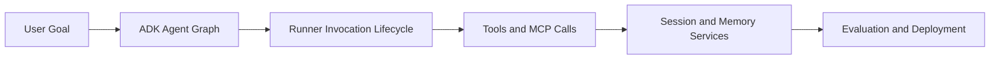

# ADK Python Tutorial: Production-Grade Agent Engineering with Google's ADK

> Learn how to use `google/adk-python` to build, evaluate, and deploy modular AI agent systems with strong tooling, session controls, and production rollouts.

## Why This Track Matters

ADK is one of the most complete open-source agent frameworks for teams that need code-first flexibility plus disciplined operations.

This track focuses on:

- shipping your first ADK agent quickly
- designing multi-agent systems with predictable runner behavior
- integrating tools, MCP, and confirmation gates safely
- evaluating and deploying ADK projects in production settings

## Current Snapshot (auto-updated)

- repository: [`google/adk-python`](https://github.com/google/adk-python)
- stars: about **17.6k**
- latest release: [`v1.25.0`](https://github.com/google/adk-python/releases/tag/v1.25.0)
- recent activity: updates on **February 12, 2026**
- project positioning: code-first, model-agnostic framework for agent development and deployment

## Mental Model

## Chapter Guide

| Chapter | Key Question | Outcome |
|:--------|:-------------|:--------|
| [01 - Getting Started](01-getting-started.md) | How do I install ADK and run my first agent quickly? | Working baseline |
| [02 - Architecture and Runner Lifecycle](02-architecture-and-runner-lifecycle.md) | How does ADK execute invocations and persist state? | Reliable mental model |
| [03 - Agent Design and Multi-Agent Composition](03-agent-design-and-multi-agent-composition.md) | How do I structure scalable agent systems? | Strong composition patterns |
| [04 - Tools, MCP, and Confirmation Flows](04-tools-mcp-and-confirmation-flows.md) | How do I add external capabilities safely? | Safe integration baseline |
| [05 - Sessions, Memory, and Context Management](05-sessions-memory-and-context-management.md) | How do I manage short-term and long-term context? | Better state design |
| [06 - Evaluation, Debugging, and Quality Gates](06-evaluation-debugging-and-quality-gates.md) | How do I measure agent quality and catch regressions? | Evaluation workflow |
| [07 - Deployment and Production Operations](07-deployment-and-production-operations.md) | How do I ship ADK agents to production? | Production rollout plan |
| [08 - Contribution Workflow and Ecosystem Strategy](08-contribution-workflow-and-ecosystem-strategy.md) | How do I contribute and extend ADK responsibly? | Contributor readiness |

## What You Will Learn

- how to design ADK agent projects from local dev to production
- how to build reliable tool/MCP workflows with confirmation controls
- how to run evaluation loops and enforce quality gates
- how to align with ADK's contribution and ecosystem patterns

## Source References

- [ADK Repository](https://github.com/google/adk-python)
- [ADK README](https://github.com/google/adk-python/blob/main/README.md)
- [ADK Documentation](https://google.github.io/adk-docs/)
- [ADK Quickstart](https://google.github.io/adk-docs/get-started/quickstart/)
- [ADK Contributing Guide](https://google.github.io/adk-docs/contributing-guide/)
- [ADK Samples](https://github.com/google/adk-samples)

## Related Tutorials

- [Mastra Tutorial](../mastra-tutorial/)
- [Agno Tutorial](../agno-tutorial/)
- [MCP Servers Tutorial](../mcp-servers-tutorial/)
- [AutoGen Tutorial](../autogen-tutorial/)

---

Start with [Chapter 1: Getting Started](01-getting-started.md).

## Navigation & Backlinks

- [Start Here: Chapter 1: Getting Started](01-getting-started.md)
- [Back to Main Catalog](../../README.md#-tutorial-catalog)
- [Browse A-Z Tutorial Directory](../../discoverability/tutorial-directory.md)
- [Search by Intent](../../discoverability/query-hub.md)
- [Explore Category Hubs](../../README.md#category-hubs)

## Full Chapter Map

1. [Chapter 1: Getting Started](01-getting-started.md)
2. [Chapter 2: Architecture and Runner Lifecycle](02-architecture-and-runner-lifecycle.md)
3. [Chapter 3: Agent Design and Multi-Agent Composition](03-agent-design-and-multi-agent-composition.md)
4. [Chapter 4: Tools, MCP, and Confirmation Flows](04-tools-mcp-and-confirmation-flows.md)
5. [Chapter 5: Sessions, Memory, and Context Management](05-sessions-memory-and-context-management.md)
6. [Chapter 6: Evaluation, Debugging, and Quality Gates](06-evaluation-debugging-and-quality-gates.md)
7. [Chapter 7: Deployment and Production Operations](07-deployment-and-production-operations.md)
8. [Chapter 8: Contribution Workflow and Ecosystem Strategy](08-contribution-workflow-and-ecosystem-strategy.md)

*Generated by [AI Codebase Knowledge Builder](https://github.com/The-Pocket/Tutorial-Codebase-Knowledge)*
