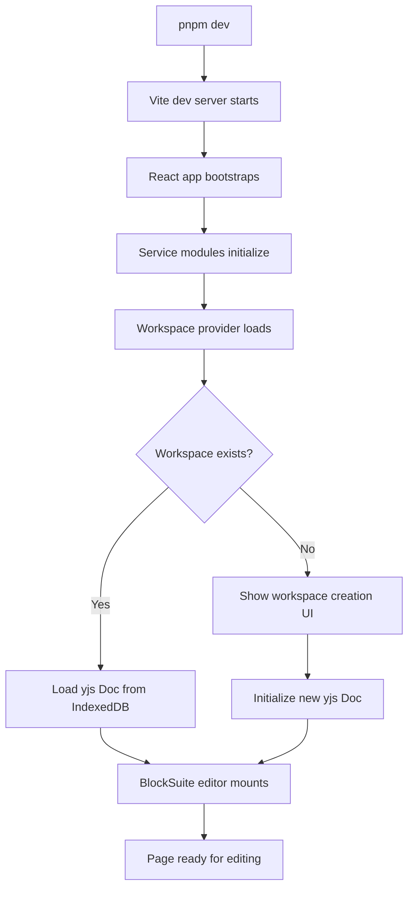

# Chapter 1: Getting Started

Welcome to **Chapter 1: Getting Started**. In this part of **AFFiNE Tutorial: Open-Source AI Workspace with Docs, Whiteboards, and Databases**, you will set up your local development environment, understand the monorepo structure, and create your first AFFiNE workspace.

AFFiNE is a next-generation knowledge base that combines documents, whiteboards, and databases into a unified workspace. Before diving into the architecture and internals, you need a working local setup to explore the codebase and experiment with features hands-on.

## What Problem Does This Solve?

Getting started with a large monorepo like AFFiNE can be overwhelming. The project spans multiple packages — BlockSuite for the editor framework, OctoBase for CRDT storage, a Node.js server, and an Electron desktop app. This chapter gives you a clear, repeatable path from cloning the repo to running the full application locally.

## Learning Goals

- clone the AFFiNE monorepo and install dependencies
- understand the workspace structure and key packages
- run the development server for web and desktop targets
- create your first workspace with pages and edgeless canvases
- navigate the codebase to find key entry points

## Prerequisites

Before starting, ensure you have these tools installed:

- **Node.js** >= 18.x (LTS recommended)
- **pnpm** >= 9.x (AFFiNE uses pnpm workspaces)
- **Git** for cloning the repository
- **Docker** (optional, for running backend services locally)

## Step 1: Clone and Install

```bash
# Clone the AFFiNE repository
git clone https://github.com/toeverything/AFFiNE.git
cd AFFiNE

# Install dependencies using pnpm
pnpm install
```

The repository uses pnpm workspaces to manage its monorepo structure. After installation, the key packages are organized as follows:

```
AFFiNE/
├── packages/
│   ├── frontend/        # Web and desktop frontend apps
│   │   ├── core/        # Main AFFiNE application
│   │   ├── electron/    # Desktop wrapper
│   │   └── web/         # Web entry point
│   ├── backend/
│   │   └── server/      # Node.js API server
│   └── common/          # Shared utilities and types
├── blocksuite/          # Block editor framework (git submodule or linked)
├── tools/               # Build and development tooling
└── docker/              # Docker configuration files
```

## Step 2: Understand the Monorepo Structure

AFFiNE is organized as a monorepo with several key domains:

```typescript
// Key package entry points to understand:

// 1. Frontend core - the main application shell
// packages/frontend/core/src/app.tsx
// This is where the React application bootstraps

// 2. BlockSuite integration - the editor framework
// packages/frontend/core/src/blocksuite/
// Block definitions and editor configuration

// 3. Backend server - API and sync services
// packages/backend/server/src/index.ts
// Express/Nest.js server for auth, sync, AI features

// 4. Workspace management
// packages/frontend/core/src/modules/workspace/
// Workspace creation, switching, and persistence
```

## Step 3: Run the Development Server

```bash
# Start the web development server
pnpm dev

# Or start with the full backend stack
pnpm dev:full

# For desktop development (Electron)
pnpm dev:electron
```

The web dev server typically starts on `http://localhost:8080`. The first load may take a moment as Vite bundles the application.

## Step 4: Create Your First Workspace

Once the application loads, you will see the workspace creation flow:

1. **Create a local workspace** — data is stored in your browser's IndexedDB
2. **Create a new page** — this opens the page editor (document mode)
3. **Switch to edgeless mode** — toggle the mode switcher to access the whiteboard canvas
4. **Add blocks** — type `/` to open the slash command menu and insert different block types

```typescript
// The workspace initialization flow in code:
// packages/frontend/core/src/modules/workspace/services/workspace.ts

interface WorkspaceMetadata {
  id: string;
  flavour: WorkspaceFlavour; // 'local' | 'affine-cloud'
  version: number;
}

// When you create a workspace, AFFiNE initializes a yjs Doc
// that serves as the root CRDT document for all content
```

## Step 5: Explore the Codebase Entry Points

Here are the key files to bookmark as you explore:

```typescript
// Application bootstrap
// packages/frontend/core/src/bootstrap/index.ts
// Sets up service providers, initializes modules

// Workspace provider - manages workspace lifecycle
// packages/frontend/core/src/modules/workspace/

// Editor integration - connects BlockSuite to AFFiNE
// packages/frontend/core/src/blocksuite/

// Page management - CRUD operations on pages
// packages/frontend/core/src/modules/doc/

// AI copilot features
// packages/frontend/core/src/modules/ai/
```

## How It Works Under the Hood

When you start AFFiNE locally, several systems initialize in sequence:



The critical insight is that AFFiNE uses **yjs documents** as the foundational data layer. Every workspace is a collection of yjs documents, and every page within a workspace is represented as a yjs subdocument. This means:

- All content is CRDT-native from the start
- Local persistence uses IndexedDB with yjs encoding
- Cloud sync simply transmits yjs updates between peers
- Undo/redo is handled at the yjs document level

## Development Tips

### Environment Variables

```bash
# .env file in project root
# Configure the backend API URL
AFFINE_SERVER_URL=http://localhost:3010

# Enable debug logging
DEBUG=affine:*

# Configure AI features (requires API key)
COPILOT_OPENAI_API_KEY=sk-...
```

### Useful Commands

```bash
# Run tests
pnpm test

# Build for production
pnpm build

# Lint and format
pnpm lint
pnpm format

# Generate GraphQL types (for backend development)
pnpm codegen
```

### Common Issues

1. **Node version mismatch** — use `nvm` or `fnm` to switch to the correct Node.js version
2. **pnpm version** — check `.npmrc` or `package.json` for the required pnpm version
3. **Port conflicts** — the dev server defaults to 8080; check if another process is using it
4. **Memory issues** — large monorepo builds may need `NODE_OPTIONS=--max-old-space-size=8192`

## Source References

- [AFFiNE Repository](https://github.com/toeverything/AFFiNE)
- [Contributing Guide](https://github.com/toeverything/AFFiNE/blob/canary/CONTRIBUTING.md)
- [Development Setup](https://docs.affine.pro/docs/developing)

## Summary

You now have a working AFFiNE development environment with a local workspace. You understand the monorepo layout, know how to start the dev server, and have identified the key entry points in the codebase.

Next: [Chapter 2: System Architecture](02-system-architecture.md) — where we explore how BlockSuite, OctoBase, and yjs fit together to form the full AFFiNE stack.

---

[Back to Tutorial Index](README.md) | [Next: Chapter 2 - System Architecture](02-system-architecture.md)

*Generated by [AI Codebase Knowledge Builder](https://github.com/The-Pocket/Tutorial-Codebase-Knowledge)*
