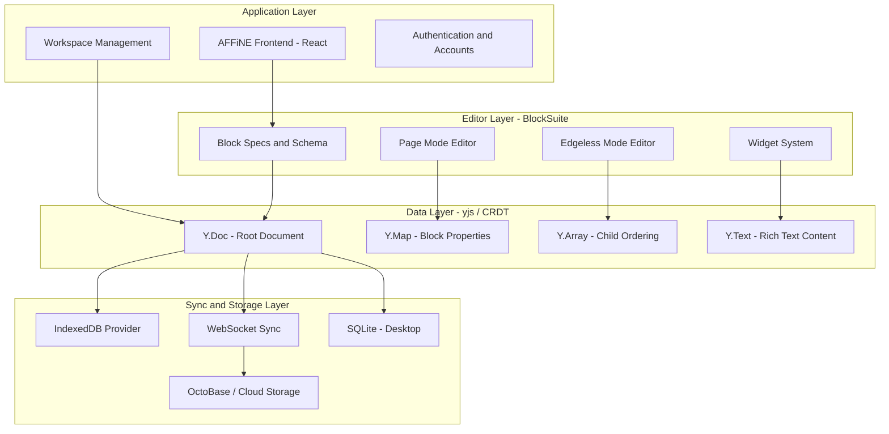
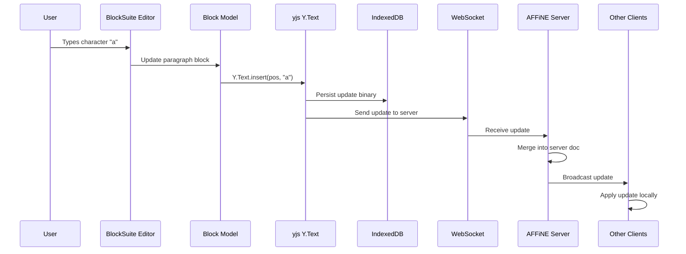

# Chapter 2: System Architecture

Welcome to **Chapter 2: System Architecture**. In this part of **AFFiNE Tutorial**, you will build a deep understanding of how BlockSuite, OctoBase, yjs, and the AFFiNE application layer connect to form a cohesive workspace platform.

AFFiNE is not a monolithic application. It is a layered system where each layer has a clear responsibility: BlockSuite handles the editor and block model, yjs provides the CRDT foundation, OctoBase manages storage and sync, and the AFFiNE shell orchestrates everything into a user-facing workspace.

## What Problem Does This Solve?

Understanding the architecture is essential before you modify any part of the system. Without knowing how the layers connect, you risk breaking sync, corrupting block trees, or misunderstanding where a feature should be implemented. This chapter gives you the architectural map.

## Learning Goals

- understand the four-layer architecture of AFFiNE
- learn how BlockSuite provides the editor framework and block model
- understand yjs as the CRDT foundation for all content
- learn how OctoBase bridges local and cloud storage
- trace a user action from UI click to persisted CRDT update

## The Four-Layer Architecture



## Layer 1: The Application Shell

The AFFiNE frontend is a React application that provides the workspace chrome — sidebar navigation, workspace switching, settings, authentication, and the container for the BlockSuite editor.

```typescript
// packages/frontend/core/src/modules/workspace/services/workspace.ts
// Simplified workspace initialization

export class WorkspaceService {
  private workspaceList: WorkspaceMetadata[] = [];

  async openWorkspace(id: string): Promise<Workspace> {
    // 1. Load workspace metadata
    const meta = await this.getWorkspaceMeta(id);

    // 2. Initialize the yjs Doc for this workspace
    const doc = new Y.Doc({ guid: id });

    // 3. Connect storage providers (IndexedDB, WebSocket)
    await this.connectProviders(doc, meta.flavour);

    // 4. Initialize the BlockSuite workspace on top of the doc
    const workspace = new Workspace({
      id,
      doc,
      schema: this.blockSchema,
    });

    return workspace;
  }
}
```

Key responsibilities:
- **Workspace lifecycle** — create, open, delete, and switch workspaces
- **Authentication** — local and cloud account management
- **Module system** — dependency injection for services across the app
- **Routing** — URL-based navigation between pages and views

## Layer 2: BlockSuite — The Editor Framework

BlockSuite is the heart of AFFiNE's editing experience. It is a framework for building block-based editors, developed as a separate project by the same team.

```typescript
// BlockSuite defines blocks using a schema system
// Each block type has a model (data), a view (rendering), and a service (behavior)

import { defineBlockSchema } from '@blocksuite/store';

// Example: The paragraph block schema
export const ParagraphBlockSchema = defineBlockSchema({
  flavour: 'affine:paragraph',
  metadata: {
    version: 1,
    role: 'content',
    parent: ['affine:note'],
    children: ['affine:paragraph', 'affine:list', 'affine:code'],
  },
  props: (internal) => ({
    type: 'text' as ParagraphType,
    text: internal.Text(),
  }),
});

// Block types form a tree:
// Page (root)
//   └── Note (container)
//       ├── Paragraph
//       ├── Heading
//       ├── List
//       ├── Code
//       ├── Image
//       └── Database
```

BlockSuite provides two distinct editing modes on the same data:

- **Page Mode** — a linear document editor, similar to Notion
- **Edgeless Mode** — a freeform canvas/whiteboard, similar to Miro

Both modes read and write to the same yjs document, meaning you can create content in one mode and view or edit it in the other.

## Layer 3: yjs — The CRDT Foundation

Every piece of content in AFFiNE is stored as a yjs CRDT structure. This is the single most important architectural decision in the system.

```typescript
// How blocks map to yjs data structures:

import * as Y from 'yjs';

// A workspace is a Y.Doc
const workspaceDoc = new Y.Doc();

// Each page is a subdocument
const pageDoc = new Y.Doc();
workspaceDoc.getMap('spaces').set('page:abc123', pageDoc);

// Within a page, blocks are stored in a Y.Map
const blocks = pageDoc.getMap('blocks');

// Each block is a Y.Map with properties
const paragraphBlock = new Y.Map();
paragraphBlock.set('sys:id', 'block:xyz');
paragraphBlock.set('sys:flavour', 'affine:paragraph');
paragraphBlock.set('sys:children', new Y.Array()); // child block IDs
paragraphBlock.set('prop:text', new Y.Text('Hello, AFFiNE!'));
paragraphBlock.set('prop:type', 'text');

blocks.set('block:xyz', paragraphBlock);
```

The yjs document model provides:
- **Conflict-free merging** — multiple users can edit simultaneously without coordination
- **Offline support** — changes are captured locally and merged when reconnected
- **Undo/redo** — yjs tracks operations for reversible editing
- **Compact binary encoding** — efficient storage and network transfer

## Layer 4: Sync and Storage

AFFiNE supports multiple storage backends, all built on top of yjs providers:

```typescript
// Storage provider abstraction
// packages/frontend/core/src/modules/workspace/providers/

// IndexedDB — browser-local persistence
import { IndexeddbPersistence } from 'y-indexeddb';
const idbProvider = new IndexeddbPersistence(workspaceId, doc);

// WebSocket — real-time cloud sync
import { WebsocketProvider } from 'y-websocket';
const wsProvider = new WebsocketProvider(
  'wss://sync.affine.pro',
  workspaceId,
  doc
);

// The providers compose transparently:
// - Local changes go to IndexedDB immediately
// - WebSocket provider sends updates to the server
// - Server broadcasts to other connected clients
// - OctoBase on the server persists the merged state
```

## How It Works Under the Hood: Tracing a Keystroke

When a user types a character in a paragraph block, here is the full path:



Each step is designed to be fast and non-blocking:
1. The editor captures the input event
2. BlockSuite translates it to a block model operation
3. The block model writes to the yjs document
4. yjs generates a compact binary update
5. The update is written to IndexedDB (local persistence)
6. The same update is sent over WebSocket (cloud sync)
7. The server merges the update and broadcasts to peers

## The Module and Service Pattern

AFFiNE uses a dependency injection pattern for organizing services:

```typescript
// packages/frontend/core/src/modules/
// Each module encapsulates a feature domain

// Module definition pattern:
export class WorkspaceModule {
  static readonly id = 'workspace';

  // Services are injected and lazily initialized
  constructor(
    private readonly docService: DocService,
    private readonly syncService: SyncService,
    private readonly storageService: StorageService,
  ) {}

  // Public API for the rest of the application
  async openDoc(docId: string): Promise<Doc> {
    const doc = await this.docService.loadDoc(docId);
    await this.syncService.connect(doc);
    return doc;
  }
}
```

Key modules include:
- **workspace** — workspace CRUD and lifecycle
- **doc** — page/document management
- **editor** — BlockSuite integration and configuration
- **sync** — cloud synchronization
- **ai** — copilot and AI feature integration
- **collection** — saved filters and views

## Source References

- [BlockSuite Repository](https://github.com/toeverything/blocksuite)
- [yjs Documentation](https://docs.yjs.dev/)
- [AFFiNE Architecture](https://github.com/toeverything/AFFiNE/blob/canary/README.md)
- [OctoBase Overview](https://github.com/toeverything/OctoBase)

## Summary

AFFiNE's architecture is a four-layer stack: React application shell, BlockSuite editor framework, yjs CRDT data layer, and composable storage providers. Every piece of content flows through yjs, making collaboration and offline support intrinsic rather than bolted on.

Next: [Chapter 3: Block System](03-block-system.md) — where we explore block types, the block tree, and how page and edgeless modes share the same data model.

---

[Back to Tutorial Index](README.md) | [Previous: Chapter 1](01-getting-started.md) | [Next: Chapter 3](03-block-system.md)

*Generated by [AI Codebase Knowledge Builder](https://github.com/The-Pocket/Tutorial-Codebase-Knowledge)*
