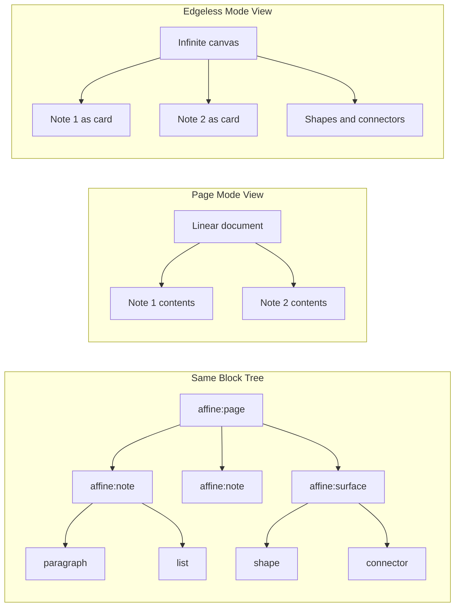
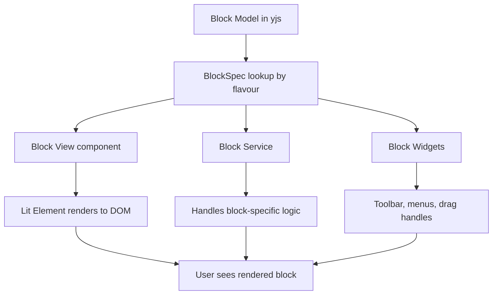

# Chapter 3: Block System

Welcome to **Chapter 3: Block System**. In this part of **AFFiNE Tutorial**, you will learn how AFFiNE's block-based content model works, how blocks form trees, and how the same block data powers both page mode (documents) and edgeless mode (whiteboards).

The block system is the fundamental content abstraction in AFFiNE. Every paragraph, heading, image, code block, and database is a block. Understanding how blocks work is essential for customizing the editor, building plugins, or debugging content issues.

## What Problem Does This Solve?

Traditional document editors store content as a flat stream of formatted text. This makes it difficult to support rich content types like embedded databases, interactive widgets, or freeform canvas layouts. AFFiNE's block system solves this by representing all content as a tree of typed, composable blocks — each with its own schema, properties, and rendering logic.

## Learning Goals

- understand the block tree structure and how blocks nest
- learn the core block flavours (types) available in AFFiNE
- understand how page mode and edgeless mode share the same block data
- learn how block schemas define structure, props, and parent-child relationships
- trace how a block is created, rendered, and persisted

## The Block Tree

Every AFFiNE page is a tree of blocks rooted at a `page` block:

```
affine:page (root)
├── affine:surface (edgeless canvas layer)
│   ├── affine:frame
│   │   └── affine:note
│   │       └── affine:paragraph
│   └── affine:shape (whiteboard elements)
└── affine:note (document container)
    ├── affine:paragraph { type: "h1", text: "My Title" }
    ├── affine:paragraph { type: "text", text: "Some content..." }
    ├── affine:list { type: "bulleted", text: "Item one" }
    ├── affine:list { type: "bulleted", text: "Item two" }
    ├── affine:code { language: "typescript", text: "const x = 1;" }
    ├── affine:image { sourceId: "blob:abc123" }
    └── affine:database { title: "Task Tracker" }
        ├── affine:paragraph { text: "Row 1 content" }
        └── affine:paragraph { text: "Row 2 content" }
```

## Core Block Flavours

AFFiNE defines blocks using a `flavour` identifier. Each flavour has a schema that describes its properties and valid parent-child relationships:

```typescript
// Block flavours and their roles:

// Root block — every page has exactly one
// flavour: 'affine:page'
// Contains metadata like title and version

// Note block — primary container for document content
// flavour: 'affine:note'
// Groups content blocks in page mode; acts as a moveable frame in edgeless mode

// Surface block — the edgeless canvas layer
// flavour: 'affine:surface'
// Contains shapes, connectors, frames, and positioned elements

// Content blocks — the building blocks of documents:
const contentFlavours = {
  'affine:paragraph': 'Text, headings (h1-h6), and quotes',
  'affine:list':      'Bulleted, numbered, todo, and toggle lists',
  'affine:code':      'Code blocks with syntax highlighting',
  'affine:image':     'Embedded images with captions',
  'affine:divider':   'Horizontal divider lines',
  'affine:bookmark':  'URL bookmarks with preview cards',
  'affine:attachment': 'File attachments',
  'affine:database':  'Inline databases with table/kanban views',
  'affine:embed':     'Embedded content (YouTube, Figma, etc.)',
};
```

## Defining a Block Schema

Each block type is defined using the `defineBlockSchema` function from BlockSuite:

```typescript
import { defineBlockSchema } from '@blocksuite/store';

// The list block schema demonstrates parent-child constraints
export const ListBlockSchema = defineBlockSchema({
  flavour: 'affine:list',
  metadata: {
    version: 1,
    role: 'content',
    // Which blocks can contain this block
    parent: ['affine:note', 'affine:list', 'affine:database'],
    // Which blocks can be children of this block
    children: [
      'affine:paragraph',
      'affine:list',
      'affine:code',
      'affine:image',
    ],
  },
  props: (internal) => ({
    // The type of list: bulleted, numbered, todo, toggle
    type: 'bulleted' as ListType,
    // Rich text content using yjs Y.Text
    text: internal.Text(),
    // For todo lists: checked state
    checked: false,
    // For toggle lists: collapsed state
    collapsed: false,
  }),
});
```

The `metadata.parent` and `metadata.children` arrays enforce structural validity. BlockSuite prevents invalid nesting at the schema level — you cannot drop an image block inside a code block, for example.

## Page Mode vs Edgeless Mode

The key insight is that both modes operate on the **same block tree**. They simply render different subtrees with different layouts:

```typescript
// Page mode renders the note blocks linearly:
// affine:page → affine:note → [content blocks in order]
//
// Edgeless mode renders the surface block as a canvas:
// affine:page → affine:surface → [positioned elements]
//                → affine:note (as a movable card on canvas)

// The mode switch does NOT change the data — it changes the view:
interface EditorMode {
  mode: 'page' | 'edgeless';

  // In page mode: note blocks render as a vertical document
  // In edgeless mode: note blocks render as positioned cards
  //                   surface elements render as shapes/connectors
}
```



## Block Operations

BlockSuite provides a transaction-based API for modifying blocks:

```typescript
// Adding a new block
const doc = workspace.getDoc('page:abc123');

doc.addBlock(
  'affine:paragraph',           // flavour
  {                              // props
    type: 'text',
    text: new Y.Text('Hello!'),
  },
  noteBlockId,                   // parent block ID
  insertIndex                    // position among siblings
);

// Moving a block
doc.moveBlocks(
  [blockToMove],                 // blocks to move
  targetParentBlock,             // new parent
  targetSiblingBlock,            // insert before this sibling
  'before'                       // 'before' or 'after'
);

// Deleting a block
doc.deleteBlock(block);

// Updating block props
doc.updateBlock(block, {
  type: 'h1',  // change paragraph to heading
});
```

All block operations are atomic within a yjs transaction, ensuring consistency even during concurrent edits (see [Chapter 4: Collaborative Editing](04-collaborative-editing.md)).

## How It Works Under the Hood: Block Rendering Pipeline

When a block is rendered, BlockSuite follows a spec-driven pipeline:



The BlockSpec system ties together three concerns:

```typescript
// A BlockSpec binds model, view, and service for a flavour:

import { BlockSpec } from '@blocksuite/block-std';

export const ParagraphBlockSpec: BlockSpec = {
  schema: ParagraphBlockSchema,
  view: {
    // Lit web component for rendering
    component: literal`affine-paragraph`,
  },
  service: ParagraphBlockService,
  widgets: {
    // Optional toolbar and interaction widgets
    slashMenu: literal`affine-slash-menu-widget`,
    dragHandle: literal`affine-drag-handle-widget`,
  },
};
```

BlockSuite uses **Lit** (web components) for block rendering, not React. The AFFiNE React shell hosts the Lit-based editor in a container element. This separation allows BlockSuite to be framework-agnostic.

## The Slash Command Menu

The slash command (`/`) menu is the primary way users insert new blocks:

```typescript
// The slash menu is a widget that listens for "/" input
// and presents a filtered list of block types to insert

// Each menu item maps to a block creation action:
const slashMenuItems = [
  {
    name: 'Text',
    action: ({ doc, model }) => {
      doc.addBlock('affine:paragraph', { type: 'text' }, model.id);
    },
  },
  {
    name: 'Heading 1',
    action: ({ doc, model }) => {
      doc.addBlock('affine:paragraph', { type: 'h1' }, model.id);
    },
  },
  {
    name: 'To-do List',
    action: ({ doc, model }) => {
      doc.addBlock('affine:list', { type: 'todo' }, model.id);
    },
  },
  {
    name: 'Code Block',
    action: ({ doc, model }) => {
      doc.addBlock('affine:code', {}, model.id);
    },
  },
  {
    name: 'Database',
    action: ({ doc, model }) => {
      doc.addBlock('affine:database', { title: 'Untitled' }, model.id);
    },
  },
];
```

## Source References

- [BlockSuite Store](https://github.com/toeverything/blocksuite/tree/master/packages/store)
- [AFFiNE Block Specs](https://github.com/toeverything/AFFiNE/tree/canary/packages/frontend/core/src/blocksuite)
- [BlockSuite Documentation](https://blocksuite.io)

## Summary

AFFiNE's block system represents all content as a tree of typed, schema-validated blocks stored in yjs CRDT structures. The same block tree powers both page mode (linear documents) and edgeless mode (infinite canvas). BlockSpecs bind each flavour to its model, view, and service, creating a composable and extensible content system.

Next: [Chapter 4: Collaborative Editing](04-collaborative-editing.md) — where we dive deep into how yjs CRDTs enable real-time multi-user editing without conflicts.

---

[Back to Tutorial Index](README.md) | [Previous: Chapter 2](02-system-architecture.md) | [Next: Chapter 4](04-collaborative-editing.md)

*Generated by [AI Codebase Knowledge Builder](https://github.com/The-Pocket/Tutorial-Codebase-Knowledge)*
