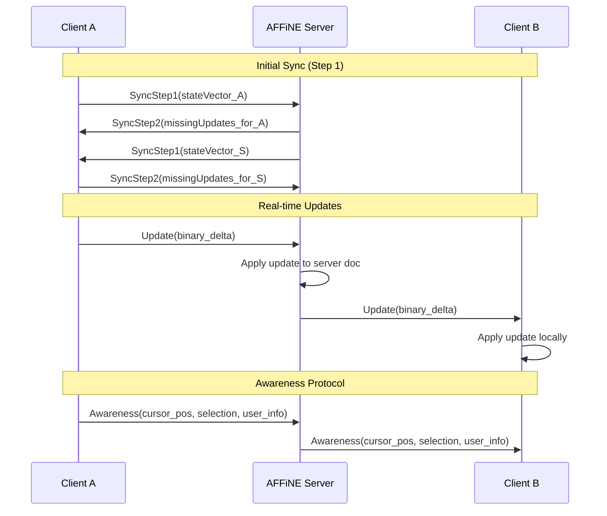
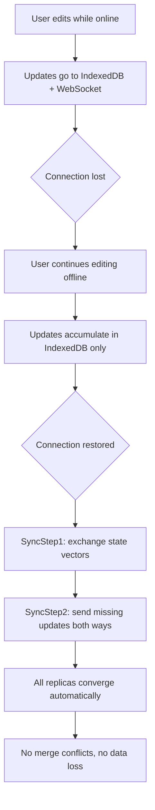

# Chapter 4: Collaborative Editing

Welcome to **Chapter 4: Collaborative Editing**. In this part of **AFFiNE Tutorial**, you will learn how AFFiNE achieves real-time multi-user collaboration using yjs CRDTs, how conflicts are resolved automatically, and how the sync protocol works across local and cloud storage.

Real-time collaboration is not an add-on feature in AFFiNE — it is the foundational design choice. Because all content is stored as yjs CRDT documents (as introduced in [Chapter 2: System Architecture](02-system-architecture.md)), every operation is inherently collaborative and conflict-free.

## What Problem Does This Solve?

When multiple users edit the same document simultaneously, traditional systems face the challenge of conflict resolution. Operational Transformation (OT) — used by Google Docs — requires a central server to order operations. CRDTs (Conflict-free Replicated Data Types) take a different approach: they guarantee that any two replicas that have received the same set of updates will converge to the same state, regardless of the order updates were applied.

AFFiNE uses yjs, one of the most battle-tested CRDT implementations, to make collaboration work seamlessly — including offline scenarios where users edit without connectivity and merge later.

## Learning Goals

- understand how yjs CRDTs guarantee conflict-free merging
- learn the sync protocol between AFFiNE clients and server
- understand how awareness (cursors, selections) works in real-time
- learn how offline editing and reconnection are handled
- trace a collaborative editing session through the full stack

## yjs CRDT Fundamentals

yjs provides several CRDT types that map to content needs:

```typescript
import * as Y from 'yjs';

const doc = new Y.Doc();

// Y.Text — for rich text content (paragraphs, headings, code)
// Supports concurrent character insertions at any position
const text = doc.getText('content');
text.insert(0, 'Hello');
text.insert(5, ' World');
// Result: "Hello World"

// Y.Map — for block properties (key-value pairs)
// Supports concurrent property updates; last-writer-wins per key
const blockProps = doc.getMap('block:abc');
blockProps.set('type', 'h1');
blockProps.set('collapsed', false);

// Y.Array — for ordered collections (child block IDs)
// Supports concurrent insertions at any position
const children = doc.getArray('children');
children.push(['block:1', 'block:2']);
children.insert(1, ['block:3']); // Insert between block:1 and block:2

// Y.XmlFragment / Y.XmlText — for rich text with formatting
// Used internally by BlockSuite for inline formatting (bold, italic, etc.)
```

### How Conflicts Are Resolved

```typescript
// Scenario: Two users edit the same text simultaneously

// User A's document state: "Hello"
// User B's document state: "Hello"

// User A inserts " World" at position 5
// User B inserts " AFFiNE" at position 5

// Without CRDT: CONFLICT — which insertion wins?
// With yjs: Both insertions are preserved

// yjs uses unique client IDs and logical clocks to order
// concurrent insertions deterministically:
// Result: "Hello World AFFiNE" or "Hello AFFiNE World"
// (order depends on client IDs, but BOTH replicas converge
//  to the exact same result — that is the CRDT guarantee)
```

## The Sync Protocol

AFFiNE uses the yjs sync protocol (y-protocols) to exchange updates between clients and the server:



The sync protocol has two phases:

1. **Initial sync** — exchange state vectors to determine which updates each side is missing, then send only the missing updates
2. **Live updates** — each local change generates a compact binary update that is broadcast to all connected peers

```typescript
// packages/backend/server/src/modules/sync/
// Simplified WebSocket sync handler on the server

import { applyUpdate, encodeStateAsUpdate, encodeStateVector } from 'yjs';

class SyncHandler {
  private docs: Map<string, Y.Doc> = new Map();

  handleConnection(ws: WebSocket, docId: string) {
    const doc = this.getOrCreateDoc(docId);

    // Send current state vector to client
    const sv = encodeStateVector(doc);
    ws.send(createSyncStep1Message(sv));

    ws.on('message', (data: Uint8Array) => {
      const messageType = readMessageType(data);

      switch (messageType) {
        case MessageType.SYNC_STEP_1:
          // Client sent their state vector; respond with missing updates
          const clientSV = readStateVector(data);
          const update = encodeStateAsUpdate(doc, clientSV);
          ws.send(createSyncStep2Message(update));
          break;

        case MessageType.SYNC_STEP_2:
        case MessageType.UPDATE:
          // Apply client update to server doc
          const clientUpdate = readUpdate(data);
          applyUpdate(doc, clientUpdate);
          // Broadcast to all other connected clients
          this.broadcast(docId, data, ws);
          break;
      }
    });
  }
}
```

## Awareness Protocol

Beyond document content, AFFiNE synchronizes **awareness** information — cursor positions, selections, and user presence:

```typescript
import { Awareness } from 'y-protocols/awareness';

// Each client maintains an awareness instance
const awareness = new Awareness(doc);

// Set local awareness state
awareness.setLocalState({
  user: {
    name: 'Alice',
    color: '#ff5733',
    avatar: 'https://...',
  },
  cursor: {
    blockId: 'block:abc',
    offset: 42,
  },
  selection: {
    type: 'block',
    blockIds: ['block:abc', 'block:def'],
  },
});

// Listen for remote awareness changes
awareness.on('change', ({ added, updated, removed }) => {
  // Render remote cursors and selections in the editor
  for (const clientId of [...added, ...updated]) {
    const state = awareness.getStates().get(clientId);
    renderRemoteCursor(state);
  }
  for (const clientId of removed) {
    removeRemoteCursor(clientId);
  }
});
```

The awareness protocol uses a lightweight heartbeat mechanism — if a client does not send an awareness update within 30 seconds, it is considered disconnected and removed from the presence list.

## Offline Editing and Reconnection

One of yjs's strongest features is offline support. AFFiNE leverages this for seamless offline editing:



```typescript
// The IndexedDB provider persists all yjs updates locally
// packages/frontend/core/src/modules/workspace/providers/

class LocalSyncProvider {
  private idbProvider: IndexeddbPersistence;

  constructor(workspaceId: string, doc: Y.Doc) {
    // IndexedDB stores every update, maintaining full history
    this.idbProvider = new IndexeddbPersistence(workspaceId, doc);

    // When loaded from IndexedDB, doc has full local state
    this.idbProvider.on('synced', () => {
      console.log('Local state loaded from IndexedDB');
    });
  }
}

class CloudSyncProvider {
  private wsProvider: WebsocketProvider | null = null;

  connect(workspaceId: string, doc: Y.Doc) {
    this.wsProvider = new WebsocketProvider(
      'wss://sync.affine.pro',
      workspaceId,
      doc,
      {
        // Automatically reconnect with exponential backoff
        connect: true,
        maxBackoffTime: 10000,
      }
    );

    this.wsProvider.on('status', ({ status }) => {
      if (status === 'connected') {
        // yjs sync protocol automatically exchanges
        // missing updates upon reconnection
        console.log('Connected — syncing...');
      }
    });
  }
}
```

## Sub-Document Sync

AFFiNE workspaces use yjs sub-documents to manage page-level granularity:

```typescript
// A workspace is a root Y.Doc
// Each page is a sub-document (Y.Doc nested inside the root)

const workspaceDoc = new Y.Doc();
const pages = workspaceDoc.getMap('spaces');

// Sub-documents are loaded on demand
// This means opening a workspace does NOT load all page content
// Only metadata (titles, IDs) is in the root doc

const pageDoc = new Y.Doc({ guid: 'page:abc123' });
pages.set('page:abc123', pageDoc);

// When a user opens a specific page:
// 1. The sub-document is loaded from IndexedDB
// 2. A sync connection is established for just that sub-doc
// 3. Other pages remain unloaded until accessed

// This is critical for performance in large workspaces
// with hundreds or thousands of pages
```

## Conflict Resolution Examples

### Concurrent Text Editing

```typescript
// Alice and Bob both type in the same paragraph simultaneously

// Alice types "cat" at position 10
// Bob types "dog" at position 10

// yjs resolves this deterministically:
// Both "cat" and "dog" appear in the text
// Order is determined by client ID comparison
// Both Alice and Bob see identical final text
```

### Concurrent Block Reordering

```typescript
// Alice moves block X above block Y
// Bob moves block X below block Z

// yjs Y.Array handles this:
// The move is implemented as delete + insert
// Both operations are applied; the result depends on
// yjs's internal ordering, but both replicas converge
```

### Concurrent Property Updates

```typescript
// Alice changes block background to "blue"
// Bob changes block background to "red"

// Y.Map uses last-writer-wins per key
// The client with the higher timestamp "wins"
// Both replicas converge to the same color
// This is acceptable because property conflicts
// are rare and low-stakes in practice
```

## Source References

- [yjs GitHub](https://github.com/yjs/yjs)
- [y-protocols](https://github.com/yjs/y-protocols)
- [y-indexeddb](https://github.com/yjs/y-indexeddb)
- [y-websocket](https://github.com/yjs/y-websocket)
- [CRDT Resources](https://crdt.tech/)

## Summary

AFFiNE's collaborative editing is built on yjs CRDTs, which guarantee that all replicas converge to the same state regardless of operation ordering. The sync protocol efficiently exchanges only missing updates, the awareness protocol shares cursor and presence information, and offline editing works seamlessly because yjs documents can be merged at any time without conflicts.

Next: [Chapter 5: AI Copilot](05-ai-copilot.md) — where we explore how AFFiNE integrates AI features for writing assistance, summarization, and content generation.

---

[Back to Tutorial Index](README.md) | [Previous: Chapter 3](03-block-system.md) | [Next: Chapter 5](05-ai-copilot.md)

*Generated by [AI Codebase Knowledge Builder](https://github.com/The-Pocket/Tutorial-Codebase-Knowledge)*
