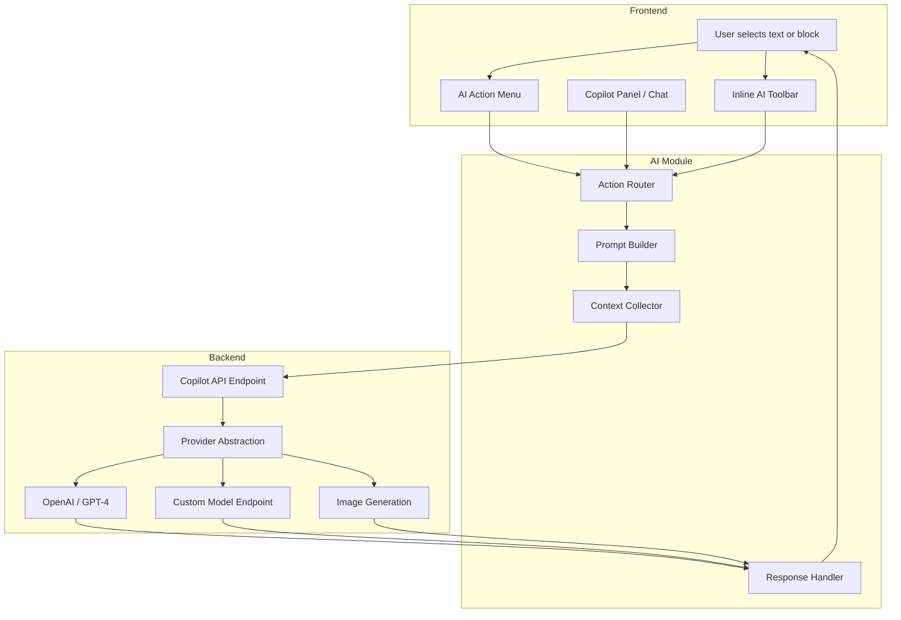
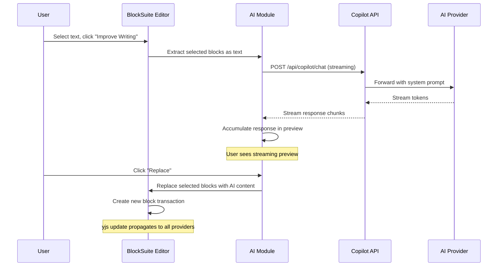

# Chapter 5: AI Copilot

Welcome to **Chapter 5: AI Copilot**. In this part of **AFFiNE Tutorial**, you will learn how AFFiNE integrates AI capabilities directly into the workspace — enabling writing assistance, content summarization, translation, image generation, and conversational interactions with your documents.

AFFiNE's AI copilot is not a separate product bolted onto the editor. It is deeply integrated into the block system (see [Chapter 3: Block System](03-block-system.md)) and operates on the same content model, meaning AI actions can read, create, and modify blocks directly.

## What Problem Does This Solve?

Modern knowledge workers need AI assistance embedded in their workflow — not in a separate chat window. AFFiNE's copilot solves this by providing AI actions that operate directly on selected blocks, entire pages, or the workspace context. The architecture supports multiple AI providers and allows self-hosted users to bring their own API keys.

## Learning Goals

- understand the copilot architecture and how it connects to the editor
- learn the available AI actions and how they transform content
- understand the provider abstraction for OpenAI, local models, and custom backends
- learn how AI chat sessions maintain context with document content
- trace an AI action from user trigger to content modification

## Copilot Architecture Overview



## AI Actions

AFFiNE provides several categories of AI actions that operate on document content:

```typescript
// packages/frontend/core/src/modules/ai/actions/

// Writing assistance actions
const writingActions = {
  'improve-writing': {
    description: 'Improve the writing quality of selected text',
    input: 'selected text blocks',
    output: 'improved text replacement',
  },
  'fix-spelling-grammar': {
    description: 'Fix spelling and grammar errors',
    input: 'selected text blocks',
    output: 'corrected text replacement',
  },
  'make-shorter': {
    description: 'Condense the selected text',
    input: 'selected text blocks',
    output: 'shortened text replacement',
  },
  'make-longer': {
    description: 'Expand the selected text with more detail',
    input: 'selected text blocks',
    output: 'expanded text replacement',
  },
  'change-tone': {
    description: 'Rewrite in a specified tone (professional, casual, etc.)',
    input: 'selected text blocks + tone parameter',
    output: 'rewritten text replacement',
  },
};

// Content generation actions
const generationActions = {
  'summarize': {
    description: 'Summarize selected content or entire page',
    input: 'selected blocks or full page',
    output: 'summary paragraph',
  },
  'translate': {
    description: 'Translate content to a target language',
    input: 'selected text + target language',
    output: 'translated text',
  },
  'explain': {
    description: 'Explain selected content in simpler terms',
    input: 'selected blocks',
    output: 'explanation paragraph',
  },
  'continue-writing': {
    description: 'Generate continuation of the current content',
    input: 'preceding content context',
    output: 'new paragraphs appended',
  },
  'generate-outline': {
    description: 'Create a document outline from a topic',
    input: 'topic string',
    output: 'heading and list blocks',
  },
};

// Image actions
const imageActions = {
  'create-image': {
    description: 'Generate an image from a text prompt',
    input: 'text prompt',
    output: 'image block',
  },
  'explain-image': {
    description: 'Describe the contents of an image',
    input: 'image block',
    output: 'description paragraph',
  },
};
```

## How AI Actions Work

When a user triggers an AI action, the system follows a structured pipeline:

```typescript
// Simplified AI action execution flow

interface AIActionContext {
  // The selected blocks or text that the action operates on
  selectedBlocks: BlockModel[];
  selectedText?: string;

  // The full page content for context
  pageContent: string;

  // Action-specific parameters
  params: Record<string, unknown>;
}

class AIActionExecutor {
  async execute(
    actionId: string,
    context: AIActionContext
  ): Promise<AIActionResult> {
    // 1. Build the prompt from the action template and context
    const prompt = this.promptBuilder.build(actionId, context);

    // 2. Collect additional context (page title, surrounding blocks)
    const enrichedPrompt = this.contextCollector.enrich(prompt, context);

    // 3. Send to the AI provider (streaming response)
    const stream = await this.provider.chat({
      messages: enrichedPrompt.messages,
      model: enrichedPrompt.model,
      stream: true,
    });

    // 4. Handle the response — either replace or insert blocks
    return this.responseHandler.handle(actionId, stream, context);
  }
}
```

### Prompt Building

```typescript
// The prompt builder constructs messages for the AI provider
// Each action has a system prompt template

const actionPrompts: Record<string, string> = {
  'improve-writing': `You are a writing assistant integrated into a document editor.
The user has selected the following text and wants you to improve its quality.
Maintain the original meaning and tone while improving clarity, flow, and grammar.
Return ONLY the improved text without explanations.`,

  'summarize': `You are a summarization assistant integrated into a document editor.
The user wants a concise summary of the following content.
Provide a clear, well-structured summary that captures the key points.`,

  'translate': `You are a translation assistant integrated into a document editor.
Translate the following text to {{targetLanguage}}.
Maintain the original formatting and structure.
Return ONLY the translated text.`,

  'continue-writing': `You are a writing assistant integrated into a document editor.
Based on the existing content, continue writing in the same style and tone.
Generate 2-3 paragraphs that naturally follow from the context.`,
};
```

## The Copilot Chat Panel

Beyond inline actions, AFFiNE provides a chat panel for conversational AI interactions:

```typescript
// packages/frontend/core/src/modules/ai/chat/

interface CopilotChatSession {
  id: string;
  messages: ChatMessage[];
  // The chat has access to the current page context
  pageContext: {
    docId: string;
    title: string;
    // Blocks can be attached as context
    attachedBlocks: BlockModel[];
  };
}

interface ChatMessage {
  role: 'user' | 'assistant' | 'system';
  content: string;
  // AI responses can include actionable blocks
  attachments?: {
    type: 'text' | 'image' | 'code';
    content: string;
  }[];
  // Users can insert AI responses directly into the document
  actions?: {
    insertToPage: () => void;
    replaceSelection: () => void;
    copyToClipboard: () => void;
  };
}
```

The chat panel supports:

- **Document-aware conversations** — the AI has access to the current page content
- **Block references** — users can attach specific blocks as context for questions
- **Actionable responses** — AI responses can be inserted directly into the document as blocks
- **Session history** — conversations are persisted per workspace

## Provider Abstraction

AFFiNE's copilot supports multiple AI providers through a backend abstraction:

```typescript
// packages/backend/server/src/modules/copilot/providers/

interface CopilotProvider {
  // Text generation (streaming)
  chatStream(params: ChatParams): AsyncIterable<string>;

  // Text generation (non-streaming)
  chat(params: ChatParams): Promise<string>;

  // Image generation
  generateImage(params: ImageParams): Promise<Uint8Array>;

  // Text embedding (for search and retrieval)
  embed(text: string): Promise<number[]>;
}

interface ChatParams {
  messages: Array<{
    role: 'system' | 'user' | 'assistant';
    content: string;
  }>;
  model: string;
  temperature?: number;
  maxTokens?: number;
}

// Provider implementations:
// - OpenAI (GPT-4, GPT-4o, DALL-E)
// - Custom endpoint (any OpenAI-compatible API)
// - Future: local models, Anthropic, etc.
```

### Configuring AI Providers

```typescript
// For self-hosted instances, configure providers via environment:

// .env configuration
// COPILOT_OPENAI_API_KEY=sk-...
// COPILOT_OPENAI_MODEL=gpt-4o
// COPILOT_OPENAI_BASE_URL=https://api.openai.com/v1

// Or use a custom OpenAI-compatible endpoint (e.g., Ollama, vLLM):
// COPILOT_OPENAI_BASE_URL=http://localhost:11434/v1
// COPILOT_OPENAI_API_KEY=ollama
// COPILOT_OPENAI_MODEL=llama3
```

## How It Works Under the Hood: AI-to-Block Pipeline

When an AI action generates content, the response must be converted back into blocks:



The response handling includes a critical step: converting AI-generated text (often markdown) back into AFFiNE blocks:

```typescript
// AI response to block conversion

class AIResponseHandler {
  async insertAsBlocks(
    response: string,
    targetDoc: Doc,
    parentBlockId: string,
    position: number
  ) {
    // Parse the AI response (typically markdown)
    const parsedBlocks = this.markdownParser.parse(response);

    // Insert each parsed element as a new block
    for (const parsed of parsedBlocks) {
      switch (parsed.type) {
        case 'paragraph':
          targetDoc.addBlock('affine:paragraph', {
            type: 'text',
            text: new Y.Text(parsed.content),
          }, parentBlockId, position++);
          break;

        case 'heading':
          targetDoc.addBlock('affine:paragraph', {
            type: `h${parsed.level}`,
            text: new Y.Text(parsed.content),
          }, parentBlockId, position++);
          break;

        case 'code':
          targetDoc.addBlock('affine:code', {
            language: parsed.language,
            text: new Y.Text(parsed.content),
          }, parentBlockId, position++);
          break;

        case 'list':
          targetDoc.addBlock('affine:list', {
            type: parsed.ordered ? 'numbered' : 'bulleted',
            text: new Y.Text(parsed.content),
          }, parentBlockId, position++);
          break;
      }
    }
  }
}
```

## Edgeless AI Features

In edgeless (whiteboard) mode, the copilot has additional capabilities:

- **Mind map generation** — generate a mind map from a topic, creating connected shape blocks on the canvas
- **Presentation generation** — create slide-like frames from a document outline
- **Image generation** — create images from prompts and place them on the canvas
- **Content expansion** — select a note on the canvas and ask AI to expand it

## Source References

- [AFFiNE AI Module](https://github.com/toeverything/AFFiNE/tree/canary/packages/frontend/core/src/modules/ai)
- [Copilot Backend](https://github.com/toeverything/AFFiNE/tree/canary/packages/backend/server/src/modules/copilot)
- [AFFiNE AI Documentation](https://docs.affine.pro/docs/affine-ai)

## Summary

AFFiNE's AI copilot is deeply integrated into the block-based content model, providing inline writing actions, conversational chat with document context, and provider-agnostic backend support. AI responses are converted back into native blocks, making the output fully editable and collaborative through the same yjs CRDT system.

Next: [Chapter 6: Database and Views](06-database-and-views.md) — where we explore how AFFiNE implements inline databases with table, kanban, and filtered views.

---

[Back to Tutorial Index](README.md) | [Previous: Chapter 4](04-collaborative-editing.md) | [Next: Chapter 6](06-database-and-views.md)

*Generated by [AI Codebase Knowledge Builder](https://github.com/The-Pocket/Tutorial-Codebase-Knowledge)*
