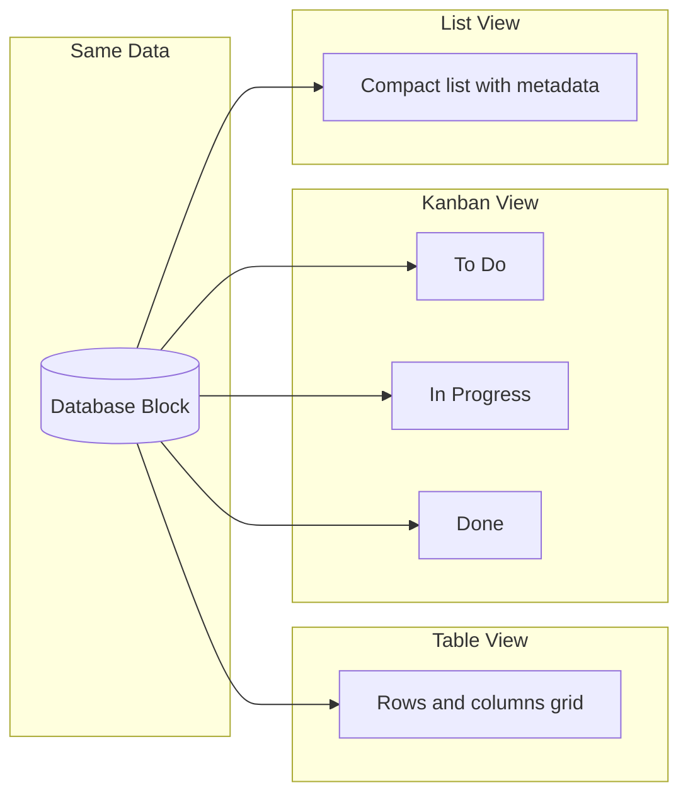
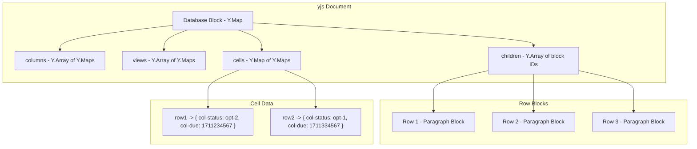

# Chapter 6: Database and Views

Welcome to **Chapter 6: Database and Views**. In this part of **AFFiNE Tutorial**, you will learn how AFFiNE implements inline databases — structured data blocks that live inside documents and support multiple view types including table, kanban, and filtered views.

Unlike traditional databases that exist separately from documents, AFFiNE's database blocks are part of the block tree (see [Chapter 3: Block System](03-block-system.md)). They are embedded directly in pages, share the same yjs CRDT layer for collaboration (see [Chapter 4: Collaborative Editing](04-collaborative-editing.md)), and can be viewed and edited in both page and edgeless modes.

## What Problem Does This Solve?

Knowledge workers need to mix structured and unstructured data in the same workspace. A project page might contain a description, a task database, meeting notes, and a timeline — all in one document. AFFiNE's database blocks solve this by treating structured data as first-class blocks that support multiple view types, column definitions, filtering, sorting, and grouping.

## Learning Goals

- understand the database block model and how it stores structured data
- learn the available view types: table, kanban, and list
- understand column types and how they define data schemas
- learn how filtering, sorting, and grouping work on database views
- trace how a database block is stored and synced via yjs

## Database Block Model

A database block in AFFiNE is a container block that has child blocks (rows) and a column definition schema:

```typescript
// The database block schema
import { defineBlockSchema } from '@blocksuite/store';

export const DatabaseBlockSchema = defineBlockSchema({
  flavour: 'affine:database',
  metadata: {
    version: 1,
    role: 'content',
    parent: ['affine:note'],
    // Each child block represents a row
    children: ['affine:paragraph', 'affine:list', 'affine:image'],
  },
  props: (internal) => ({
    // The title of the database
    title: internal.Text('Untitled Database'),

    // Column definitions
    columns: [] as Column[],

    // View configurations (table, kanban, etc.)
    views: [] as DatabaseView[],

    // Cell data: maps rowId -> columnId -> cell value
    cells: {} as Record<string, Record<string, CellValue>>,
  }),
});
```

### Column Types

Columns define the schema of a database. Each column has a type that determines what data it can hold and how it is rendered:

```typescript
interface Column {
  id: string;
  name: string;
  type: ColumnType;
  data: ColumnData; // Type-specific configuration
  width?: number;
}

type ColumnType =
  | 'title'        // The primary title column (always present)
  | 'rich-text'    // Rich text content
  | 'number'       // Numeric values
  | 'select'       // Single-select from options
  | 'multi-select' // Multi-select from options
  | 'date'         // Date/datetime values
  | 'checkbox'     // Boolean toggle
  | 'link'         // URL links
  | 'progress'     // Progress bar (0-100)
  | 'image';       // Image attachment

// Example column definitions for a project tracker:
const projectColumns: Column[] = [
  {
    id: 'col-title',
    name: 'Task',
    type: 'title',
    data: {},
  },
  {
    id: 'col-status',
    name: 'Status',
    type: 'select',
    data: {
      options: [
        { id: 'opt-1', value: 'To Do', color: 'grey' },
        { id: 'opt-2', value: 'In Progress', color: 'blue' },
        { id: 'opt-3', value: 'Done', color: 'green' },
      ],
    },
  },
  {
    id: 'col-assignee',
    name: 'Assignee',
    type: 'rich-text',
    data: {},
  },
  {
    id: 'col-due',
    name: 'Due Date',
    type: 'date',
    data: {},
  },
  {
    id: 'col-priority',
    name: 'Priority',
    type: 'select',
    data: {
      options: [
        { id: 'opt-high', value: 'High', color: 'red' },
        { id: 'opt-med', value: 'Medium', color: 'orange' },
        { id: 'opt-low', value: 'Low', color: 'blue' },
      ],
    },
  },
  {
    id: 'col-progress',
    name: 'Progress',
    type: 'progress',
    data: {},
  },
];
```

## View Types

Each database block can have multiple views that present the same data in different layouts:

### Table View

```typescript
interface TableView {
  id: string;
  name: string;
  mode: 'table';

  // Which columns are visible and in what order
  columns: Array<{
    id: string;       // references Column.id
    width: number;    // column width in pixels
    hide: boolean;    // whether the column is hidden
  }>;

  // Filtering rules
  filter: FilterGroup;

  // Sort configuration
  sort: SortRule[];

  // Row grouping (optional)
  groupBy?: GroupByConfig;
}
```

### Kanban View

The kanban view groups rows into columns based on a select-type property:

```typescript
interface KanbanView {
  id: string;
  name: string;
  mode: 'kanban';

  // The column used for grouping (must be select/multi-select type)
  groupBy: {
    columnId: string;
    // Each select option becomes a kanban column
  };

  // Card configuration — what columns to show on each card
  cardProperties: Array<{
    columnId: string;
    visible: boolean;
  }>;

  // Filtering and sorting still apply
  filter: FilterGroup;
  sort: SortRule[];
}
```



## Filtering and Sorting

Database views support composable filter rules:

```typescript
interface FilterGroup {
  type: 'group';
  op: 'and' | 'or';
  conditions: Array<FilterCondition | FilterGroup>;
}

interface FilterCondition {
  type: 'condition';
  columnId: string;
  operator: FilterOperator;
  value: unknown;
}

type FilterOperator =
  | 'equals'
  | 'not-equals'
  | 'contains'
  | 'not-contains'
  | 'is-empty'
  | 'is-not-empty'
  | 'greater-than'
  | 'less-than'
  | 'before'       // for dates
  | 'after'        // for dates
  | 'is-checked'   // for checkboxes
  | 'is-unchecked'; // for checkboxes

// Example: Show only high-priority tasks that are not done
const exampleFilter: FilterGroup = {
  type: 'group',
  op: 'and',
  conditions: [
    {
      type: 'condition',
      columnId: 'col-priority',
      operator: 'equals',
      value: 'opt-high',
    },
    {
      type: 'condition',
      columnId: 'col-status',
      operator: 'not-equals',
      value: 'opt-3', // "Done"
    },
  ],
};

// Sorting
interface SortRule {
  columnId: string;
  direction: 'asc' | 'desc';
}

// Example: Sort by due date ascending, then by priority descending
const exampleSort: SortRule[] = [
  { columnId: 'col-due', direction: 'asc' },
  { columnId: 'col-priority', direction: 'desc' },
];
```

## How It Works Under the Hood: yjs Storage

Database data is stored in yjs structures within the block model:



```typescript
// How cells are read and written via yjs

class DatabaseBlockModel {
  // Read a cell value
  getCell(rowId: string, columnId: string): CellValue | undefined {
    const cells = this.yMap.get('cells') as Y.Map<Y.Map<CellValue>>;
    const rowCells = cells.get(rowId);
    return rowCells?.get(columnId);
  }

  // Write a cell value (triggers yjs update -> sync)
  setCell(rowId: string, columnId: string, value: CellValue) {
    const cells = this.yMap.get('cells') as Y.Map<Y.Map<CellValue>>;
    let rowCells = cells.get(rowId);
    if (!rowCells) {
      rowCells = new Y.Map();
      cells.set(rowId, rowCells);
    }
    rowCells.set(columnId, value);
    // This yjs transaction automatically:
    // 1. Persists to IndexedDB
    // 2. Syncs to other clients via WebSocket
    // 3. Updates any views observing this data
  }

  // Add a new row
  addRow(position?: number): string {
    const newBlock = this.doc.addBlock(
      'affine:paragraph',
      { type: 'text', text: new Y.Text('') },
      this.id,
      position
    );
    return newBlock;
  }

  // Add a new column
  addColumn(column: Column, position?: number) {
    const columns = this.yMap.get('columns') as Y.Array<Column>;
    if (position !== undefined) {
      columns.insert(position, [column]);
    } else {
      columns.push([column]);
    }
  }
}
```

## Creating a Database Programmatically

```typescript
// Create a database block with initial schema and data

const noteBlockId = 'note:main';

// 1. Add the database block
const dbBlockId = doc.addBlock('affine:database', {
  title: new Y.Text('Project Tasks'),
  columns: projectColumns,
  views: [
    {
      id: 'view-table',
      name: 'All Tasks',
      mode: 'table',
      columns: projectColumns.map(col => ({
        id: col.id,
        width: 200,
        hide: false,
      })),
      filter: { type: 'group', op: 'and', conditions: [] },
      sort: [],
    },
    {
      id: 'view-kanban',
      name: 'Board',
      mode: 'kanban',
      groupBy: { columnId: 'col-status' },
      cardProperties: [
        { columnId: 'col-assignee', visible: true },
        { columnId: 'col-due', visible: true },
        { columnId: 'col-priority', visible: true },
      ],
      filter: { type: 'group', op: 'and', conditions: [] },
      sort: [],
    },
  ],
  cells: {},
}, noteBlockId);

// 2. Add rows (child blocks)
const row1Id = doc.addBlock('affine:paragraph', {
  type: 'text',
  text: new Y.Text('Design landing page'),
}, dbBlockId);

const row2Id = doc.addBlock('affine:paragraph', {
  type: 'text',
  text: new Y.Text('Implement auth flow'),
}, dbBlockId);

// 3. Set cell values for each row
const dbModel = doc.getBlockById(dbBlockId);
dbModel.setCell(row1Id, 'col-status', 'opt-2');  // In Progress
dbModel.setCell(row1Id, 'col-priority', 'opt-high');
dbModel.setCell(row1Id, 'col-due', Date.now());

dbModel.setCell(row2Id, 'col-status', 'opt-1');  // To Do
dbModel.setCell(row2Id, 'col-priority', 'opt-med');
```

## Source References

- [BlockSuite Database Block](https://github.com/toeverything/blocksuite/tree/master/packages/blocks/src/database-block)
- [AFFiNE Database Views](https://github.com/toeverything/AFFiNE/tree/canary/packages/frontend/core/src/components/database)
- [BlockSuite Documentation](https://blocksuite.io)

## Summary

AFFiNE's database blocks bring structured data into the document canvas as first-class blocks. Columns define the schema, views (table, kanban, list) provide different presentations of the same data, and all state is stored in yjs CRDTs for seamless collaboration. Filtering, sorting, and grouping operate on the view level, so the same data can be sliced differently across views.

Next: [Chapter 7: Plugin System](07-plugin-system.md) — where we explore how to extend AFFiNE with custom blocks, plugins, and integrations.

---

[Back to Tutorial Index](README.md) | [Previous: Chapter 5](05-ai-copilot.md) | [Next: Chapter 7](07-plugin-system.md)

*Generated by [AI Codebase Knowledge Builder](https://github.com/The-Pocket/Tutorial-Codebase-Knowledge)*
