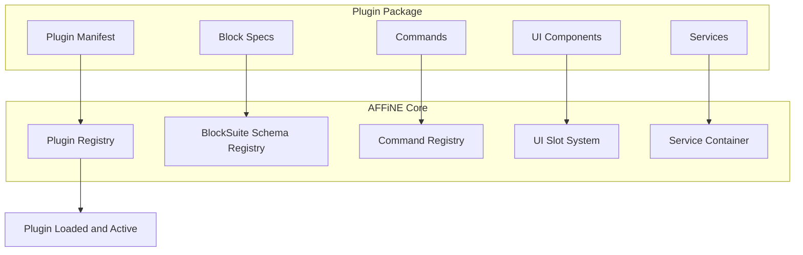
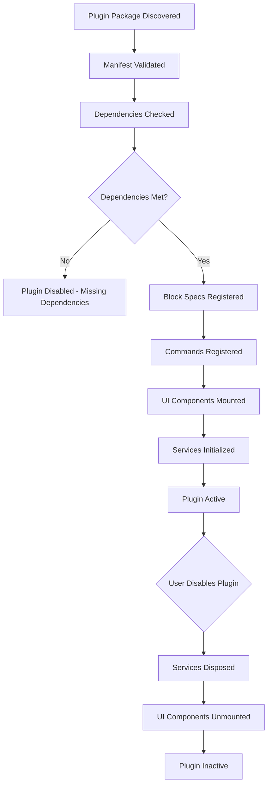

# Chapter 7: Plugin System

Welcome to **Chapter 7: Plugin System**. In this part of **AFFiNE Tutorial**, you will learn how to extend AFFiNE with custom blocks, plugins, and integrations using the extension architecture built on top of BlockSuite.

AFFiNE's extensibility comes from two levels: the BlockSuite block specification system (see [Chapter 3: Block System](03-block-system.md)) for creating new block types, and the AFFiNE module system (see [Chapter 2: System Architecture](02-system-architecture.md)) for adding application-level features like sidebar panels, commands, and integrations.

## What Problem Does This Solve?

Every team has unique workflow needs. Out-of-the-box block types cover common cases, but organizations often need custom blocks (e.g., a CRM contact card, a CI/CD status widget, an API response viewer) or integrations (e.g., syncing with external tools). The plugin system provides a structured way to extend AFFiNE without forking the core codebase.

## Learning Goals

- understand the extension architecture and how plugins register with the system
- learn how to create a custom block type with schema, view, and service
- understand how to add commands, keyboard shortcuts, and toolbar items
- learn how to build sidebar panel extensions
- understand the plugin lifecycle and how plugins are loaded

## Extension Architecture Overview



## Creating a Custom Block

The most common extension pattern is creating a new block type. Here is a complete example of a custom "callout" block:

### Step 1: Define the Block Schema

```typescript
// plugins/callout-block/schema.ts

import { defineBlockSchema } from '@blocksuite/store';

export type CalloutType = 'info' | 'warning' | 'error' | 'success' | 'tip';

export const CalloutBlockSchema = defineBlockSchema({
  flavour: 'custom:callout',
  metadata: {
    version: 1,
    role: 'content',
    // Can be placed inside note blocks
    parent: ['affine:note'],
    // Can contain text-based child blocks
    children: ['affine:paragraph', 'affine:list', 'affine:code'],
  },
  props: (internal) => ({
    // The callout type determines the icon and color
    type: 'info' as CalloutType,
    // Rich text content
    text: internal.Text(),
    // Optional custom title
    title: '',
    // Collapsed state
    collapsed: false,
  }),
});
```

### Step 2: Create the Block View

BlockSuite uses Lit web components for block rendering:

```typescript
// plugins/callout-block/view.ts

import { BlockElement } from '@blocksuite/block-std';
import { html, css } from 'lit';
import { customElement, property } from 'lit/decorators.js';

@customElement('custom-callout-block')
export class CalloutBlockElement extends BlockElement {
  static override styles = css`
    :host {
      display: block;
      margin: 8px 0;
    }

    .callout-container {
      display: flex;
      border-radius: 8px;
      padding: 16px;
      gap: 12px;
    }

    .callout-container[data-type='info'] {
      background-color: #e8f4fd;
      border-left: 4px solid #1890ff;
    }

    .callout-container[data-type='warning'] {
      background-color: #fff7e6;
      border-left: 4px solid #fa8c16;
    }

    .callout-container[data-type='error'] {
      background-color: #fff1f0;
      border-left: 4px solid #f5222d;
    }

    .callout-container[data-type='success'] {
      background-color: #f6ffed;
      border-left: 4px solid #52c41a;
    }

    .callout-container[data-type='tip'] {
      background-color: #f9f0ff;
      border-left: 4px solid #722ed1;
    }

    .callout-icon {
      font-size: 20px;
      flex-shrink: 0;
    }

    .callout-content {
      flex: 1;
      min-width: 0;
    }

    .callout-title {
      font-weight: 600;
      margin-bottom: 4px;
    }
  `;

  private _getIcon(type: string): string {
    const icons: Record<string, string> = {
      info: 'i',
      warning: '!',
      error: 'x',
      success: '✓',
      tip: '★',
    };
    return icons[type] || 'i';
  }

  override render() {
    const model = this.model;
    const type = model.props.type;

    return html`
      <div class="callout-container" data-type=${type}>
        <div class="callout-icon">${this._getIcon(type)}</div>
        <div class="callout-content">
          ${model.props.title
            ? html`<div class="callout-title">${model.props.title}</div>`
            : null}
          <rich-text .model=${model} .attribute=${'text'}></rich-text>
          <div class="callout-children">
            ${this.renderChildren(model)}
          </div>
        </div>
      </div>
    `;
  }
}
```

### Step 3: Create the Block Service

```typescript
// plugins/callout-block/service.ts

import { BlockService } from '@blocksuite/block-std';

export class CalloutBlockService extends BlockService {
  override mounted() {
    super.mounted();

    // Register keyboard shortcuts for this block type
    this.handleEvent('keyDown', (ctx) => {
      const event = ctx.get('keyboardState').raw;

      // Cmd+Shift+C toggles callout type
      if (event.metaKey && event.shiftKey && event.key === 'c') {
        this.cycleCalloutType();
        event.preventDefault();
      }
    });
  }

  private cycleCalloutType() {
    const model = this.std.doc.getBlock(this.blockId)?.model;
    if (!model) return;

    const types = ['info', 'warning', 'error', 'success', 'tip'];
    const currentIndex = types.indexOf(model.props.type);
    const nextType = types[(currentIndex + 1) % types.length];

    this.std.doc.updateBlock(model, { type: nextType });
  }
}
```

### Step 4: Register the Block Spec

```typescript
// plugins/callout-block/index.ts

import { BlockSpec } from '@blocksuite/block-std';
import { literal } from 'lit/static-html.js';
import { CalloutBlockSchema } from './schema';
import { CalloutBlockService } from './service';

export const CalloutBlockSpec: BlockSpec = {
  schema: CalloutBlockSchema,
  view: {
    component: literal`custom-callout-block`,
  },
  service: CalloutBlockService,
};

// Register in the editor configuration:
// packages/frontend/core/src/blocksuite/block-specs.ts

import { CalloutBlockSpec } from '../plugins/callout-block';

export function getBlockSpecs() {
  return [
    // ... built-in block specs
    CalloutBlockSpec,
  ];
}
```

## Adding Commands and Keyboard Shortcuts

AFFiNE uses a command system for registering actions:

```typescript
// plugins/callout-block/commands.ts

import { Command } from '@blocksuite/block-std';

// Command to insert a callout block
export const insertCalloutCommand: Command = {
  id: 'insert-callout',
  // Command runs in the block std context
  run(ctx) {
    const { std } = ctx;
    const doc = std.doc;

    // Find the current selection to determine insertion point
    const selection = std.selection;
    const currentBlock = selection.getSelectedBlocks()[0];

    if (!currentBlock) return;

    const parentId = currentBlock.model.parent?.id;
    if (!parentId) return;

    // Insert the callout block after the current block
    const index = currentBlock.model.parent.children.indexOf(
      currentBlock.model
    );

    doc.addBlock(
      'custom:callout',
      { type: 'info', text: new Y.Text('') },
      parentId,
      index + 1
    );
  },
};

// Register the command
std.command.add('insert-callout', insertCalloutCommand);
```

### Adding to the Slash Menu

```typescript
// Register the callout block in the slash command menu

const calloutSlashItem = {
  name: 'Callout',
  description: 'Insert a callout block',
  icon: 'InfoIcon',
  group: 'Content',
  action: ({ doc, model }) => {
    const parentId = model.parent?.id;
    if (!parentId) return;

    const index = model.parent.children.indexOf(model);
    doc.addBlock(
      'custom:callout',
      { type: 'info', text: new Y.Text('') },
      parentId,
      index + 1
    );
  },
};
```

## Building a Sidebar Panel Extension

Beyond blocks, you can extend the AFFiNE application shell with sidebar panels:

```typescript
// plugins/my-sidebar-panel/index.tsx

import React, { useState, useEffect } from 'react';

// Sidebar panel component
export function MySidebarPanel() {
  const [data, setData] = useState<any[]>([]);

  useEffect(() => {
    // Fetch data from external API or workspace
    fetchPanelData().then(setData);
  }, []);

  return (
    <div className="my-sidebar-panel">
      <h3>My Custom Panel</h3>
      <ul>
        {data.map((item, i) => (
          <li key={i}>{item.name}</li>
        ))}
      </ul>
    </div>
  );
}

// Register the sidebar panel
// This hooks into AFFiNE's module system

export class MySidebarModule {
  static readonly id = 'my-sidebar';

  register(registry: ModuleRegistry) {
    registry.registerSidebarPanel({
      id: 'my-sidebar-panel',
      title: 'My Panel',
      icon: 'CustomIcon',
      component: MySidebarPanel,
      position: 'right',
    });
  }
}
```

## Plugin Lifecycle



## Building a Block Toolbar Extension

Custom blocks often need toolbar actions for user interaction:

```typescript
// plugins/callout-block/toolbar.ts

import { WidgetElement } from '@blocksuite/block-std';
import { html, css } from 'lit';
import { customElement } from 'lit/decorators.js';

@customElement('callout-toolbar-widget')
export class CalloutToolbarWidget extends WidgetElement {
  static override styles = css`
    :host {
      display: flex;
      gap: 4px;
      padding: 4px 8px;
      background: white;
      border-radius: 8px;
      box-shadow: 0 2px 8px rgba(0, 0, 0, 0.12);
    }

    button {
      padding: 4px 8px;
      border: none;
      border-radius: 4px;
      cursor: pointer;
      font-size: 12px;
    }

    button:hover {
      background: #f0f0f0;
    }
  `;

  private _changeType(type: string) {
    const model = this.blockElement?.model;
    if (!model) return;
    this.std.doc.updateBlock(model, { type });
  }

  private _toggleCollapsed() {
    const model = this.blockElement?.model;
    if (!model) return;
    this.std.doc.updateBlock(model, {
      collapsed: !model.props.collapsed,
    });
  }

  override render() {
    return html`
      <button @click=${() => this._changeType('info')}>Info</button>
      <button @click=${() => this._changeType('warning')}>Warning</button>
      <button @click=${() => this._changeType('error')}>Error</button>
      <button @click=${() => this._changeType('success')}>Success</button>
      <button @click=${() => this._changeType('tip')}>Tip</button>
      <button @click=${this._toggleCollapsed}>Toggle</button>
    `;
  }
}
```

## Testing Custom Blocks

```typescript
// plugins/callout-block/__tests__/callout.spec.ts

import { describe, it, expect } from 'vitest';
import { DocCollection } from '@blocksuite/store';
import { CalloutBlockSchema } from '../schema';

describe('CalloutBlock', () => {
  it('should create a callout block with default props', () => {
    const collection = new DocCollection({
      schema: [CalloutBlockSchema],
    });
    const doc = collection.createDoc();

    doc.load();
    const rootId = doc.addBlock('affine:page');
    const noteId = doc.addBlock('affine:note', {}, rootId);

    const calloutId = doc.addBlock(
      'custom:callout',
      { type: 'info' },
      noteId
    );

    const block = doc.getBlockById(calloutId);
    expect(block).toBeDefined();
    expect(block?.flavour).toBe('custom:callout');
    expect(block?.props.type).toBe('info');
  });

  it('should enforce valid parent constraints', () => {
    // Callout blocks can only be inside note blocks
    // Attempting to add one elsewhere should fail or be rejected
    const collection = new DocCollection({
      schema: [CalloutBlockSchema],
    });
    const doc = collection.createDoc();
    doc.load();

    const rootId = doc.addBlock('affine:page');

    // This should fail — callout cannot be direct child of page
    expect(() => {
      doc.addBlock('custom:callout', { type: 'info' }, rootId);
    }).toThrow();
  });
});
```

## Source References

- [BlockSuite Block Std](https://github.com/toeverything/blocksuite/tree/master/packages/block-std)
- [BlockSuite Blocks Package](https://github.com/toeverything/blocksuite/tree/master/packages/blocks)
- [AFFiNE Plugin Examples](https://github.com/toeverything/AFFiNE/tree/canary/packages/frontend/core/src/blocksuite)
- [Lit Web Components](https://lit.dev/)

## Summary

AFFiNE's plugin system leverages BlockSuite's spec-driven architecture to support custom block types (schema + view + service), application-level extensions (commands, sidebar panels, toolbar items), and a clear lifecycle for loading and unloading plugins. The Lit-based rendering system for blocks and the React-based application shell provide two extension surfaces for different types of customizations.

Next: [Chapter 8: Self-Hosting and Deployment](08-self-hosting-and-deployment.md) — where we cover Docker deployment, cloud hosting options, and storage backend configuration.

---

[Back to Tutorial Index](README.md) | [Previous: Chapter 6](06-database-and-views.md) | [Next: Chapter 8](08-self-hosting-and-deployment.md)

*Generated by [AI Codebase Knowledge Builder](https://github.com/The-Pocket/Tutorial-Codebase-Knowledge)*
