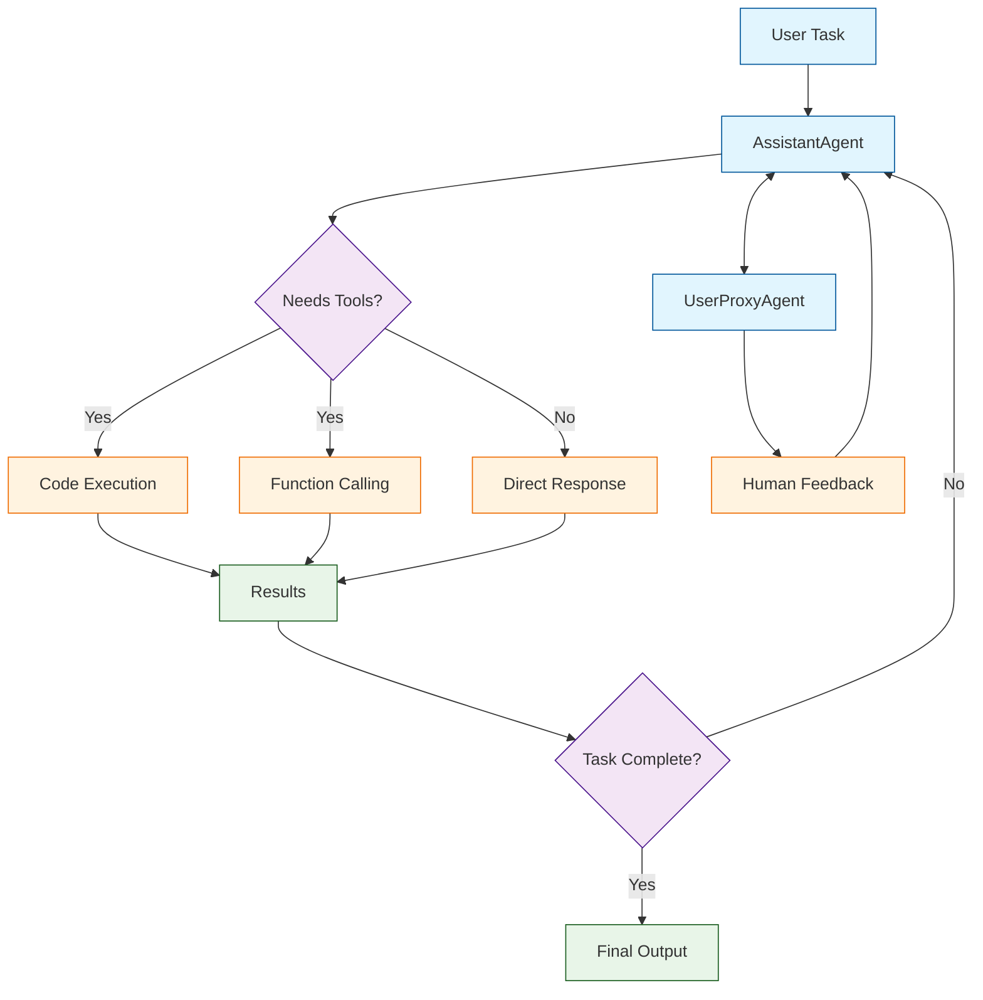

# AG2 Tutorial: Next-Generation Multi-Agent Framework

> Build collaborative AI agent systems with AG2, the community-driven successor to AutoGen.

<div align="center">

**🤖 Open-Source Multi-Agent AI Development**

[](https://github.com/ag2ai/ag2)

</div>

---

## 🎯 What is AG2?

**AG2**<sup>[View Repo](https://github.com/ag2ai/ag2)</sup> is the community-driven successor to Microsoft's AutoGen framework. It provides a powerful, open-source platform for building AI agents that can collaborate to solve complex tasks through natural conversation.

### AG2 vs AutoGen

| Aspect | AG2 | Microsoft AutoGen |
|:-------|:----|:------------------|
| **Governance** | Open community-driven | Microsoft-controlled |
| **Development** | Community contributions | Microsoft team |
| **License** | Apache 2.0 | MIT |
| **Focus** | Multi-agent collaboration | Part of Microsoft Agent Framework |
| **Repository** | [github.com/ag2ai/ag2](https://github.com/ag2ai/ag2) | [github.com/microsoft/autogen](https://github.com/microsoft/autogen) |

> **Note**: The original AutoGen creators transitioned to AG2 to promote open governance. Microsoft continues developing AutoGen as part of their Agent Framework.



## Core Concepts

### Agent Types

| Agent | Purpose | Key Features |
|:------|:--------|:-------------|
| **AssistantAgent** | AI-powered task solving | LLM-based reasoning, tool use |
| **UserProxyAgent** | Human interaction | Code execution, human feedback |
| **GroupChatManager** | Multi-agent coordination | Conversation flow, speaker selection |
| **ConversableAgent** | Base class for custom agents | Flexible conversation patterns |

### Conversation Patterns

- **Two-Agent Chat** - Simple back-and-forth between agents
- **Sequential Chat** - Ordered multi-agent workflows
- **Group Chat** - Multiple agents collaborating
- **Nested Chat** - Hierarchical agent structures

## Tutorial Chapters

1. **[Chapter 1: Getting Started](01-getting-started.md)** - Installation, setup, and your first AG2 agents
2. **[Chapter 2: Agent Types](02-agent-types.md)** - Understanding and configuring different agents
3. **[Chapter 3: Conversation Patterns](03-conversation-patterns.md)** - Two-agent, sequential, and group chats
4. **[Chapter 4: Code Execution](04-code-execution.md)** - Secure code execution with Docker
5. **[Chapter 5: Tool Integration](05-tool-integration.md)** - Function calling and external tools
6. **[Chapter 6: Group Chat](06-group-chat.md)** - Multi-agent collaboration and speaker selection
7. **[Chapter 7: Advanced Patterns](07-advanced-patterns.md)** - Nested chats, caching, and optimization
8. **[Chapter 8: Production Deployment](08-production.md)** - Scaling, monitoring, and best practices

## What You'll Learn

- **Create Conversational Agents** that collaborate through natural dialogue
- **Implement Code Execution** safely with Docker sandboxing
- **Build Multi-Agent Systems** with group chat coordination
- **Integrate External Tools** through function calling
- **Design Complex Workflows** with nested and sequential patterns
- **Handle Human-in-the-Loop** scenarios effectively
- **Deploy Production Systems** with proper scaling and monitoring

## Prerequisites

- Python 3.9+
- OpenAI API key (or other LLM provider)
- Docker (for code execution)
- Basic understanding of LLMs

## Quick Start

```bash
# Install AG2
pip install ag2

# Or with all extras
pip install ag2[all]
```

```python
from ag2 import AssistantAgent, UserProxyAgent

# Create an assistant agent
assistant = AssistantAgent(
    name="assistant",
    llm_config={
        "model": "gpt-4",
        "api_key": "your-api-key"
    }
)

# Create a user proxy agent
user_proxy = UserProxyAgent(
    name="user_proxy",
    human_input_mode="NEVER",  # Automatic mode
    code_execution_config={
        "work_dir": "coding",
        "use_docker": True
    }
)

# Start a conversation
user_proxy.initiate_chat(
    assistant,
    message="Write a Python function to calculate fibonacci numbers and test it."
)
```

## Example: Research Team

```python
from ag2 import AssistantAgent, UserProxyAgent, GroupChat, GroupChatManager

# Create specialized agents
researcher = AssistantAgent(
    name="Researcher",
    system_message="You are a research assistant. Search for and analyze information.",
    llm_config=llm_config
)

writer = AssistantAgent(
    name="Writer", 
    system_message="You are a technical writer. Create clear, well-structured content.",
    llm_config=llm_config
)

critic = AssistantAgent(
    name="Critic",
    system_message="You review content for accuracy and suggest improvements.",
    llm_config=llm_config
)

user_proxy = UserProxyAgent(
    name="User",
    human_input_mode="TERMINATE",
    code_execution_config=False
)

# Create group chat
group_chat = GroupChat(
    agents=[user_proxy, researcher, writer, critic],
    messages=[],
    max_round=10
)

manager = GroupChatManager(groupchat=group_chat, llm_config=llm_config)

# Start research task
user_proxy.initiate_chat(
    manager,
    message="Research and write a brief summary about quantum computing applications."
)
```

## Learning Path

### 🟢 Beginner Track
1. Chapters 1-3: Setup, agent types, and basic conversations
2. Build simple two-agent systems

### 🟡 Intermediate Track
1. Chapters 4-6: Code execution, tools, and group chat
2. Create collaborative multi-agent workflows

### 🔴 Advanced Track
1. Chapters 7-8: Advanced patterns and production deployment
2. Master enterprise-grade agent systems

---

**Ready to build multi-agent AI systems? Let's begin with [Chapter 1: Getting Started](01-getting-started.md)!**

*Generated for [Awesome Code Docs](https://github.com/johnxie/awesome-code-docs)*
