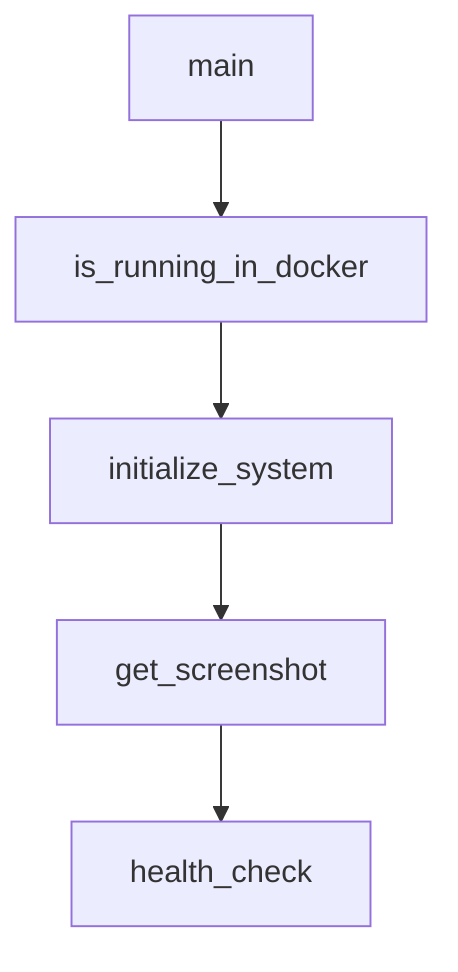

# Chapter 1: Getting Started

Welcome to **Chapter 1: Getting Started**. In this part of **AgenticSeek Tutorial: Local-First Autonomous Agent Operations**, you will build an intuitive mental model first, then move into concrete implementation details and practical production tradeoffs.


This chapter gets a clean AgenticSeek baseline running with the official Docker-first flow.

## Learning Goals

- clone and initialize the project safely
- configure baseline environment values in `.env`
- start services and validate backend health
- run first task in web mode and understand expected behavior

## Quick Start Flow

1. Clone and initialize:

```bash
git clone https://github.com/Fosowl/agenticSeek.git
cd agenticSeek
mv .env.example .env
```

2. Update required runtime paths and ports in `.env`:

- set `WORK_DIR` to a real local directory
- keep `SEARXNG_BASE_URL` at `http://searxng:8080` for Docker web mode
- keep API keys empty if running local models only

3. Start full web-mode stack:

```bash
./start_services.sh full
```

4. Wait until backend health checks report ready, then open:

- `http://localhost:3000/`

## First Task Check

Run a simple prompt that requires one tool and one follow-up, for example:

- "Search top three Rust learning resources and save them in my workspace."

You should observe task routing, intermediate tool work, and final answer synthesis.

## Operator Notes

- first Docker run can be slow due image downloads
- use explicit prompts for better routing in early prototype behavior
- avoid broad, ambiguous requests during first validation

## Source References

- [README Prerequisites and Setup](https://github.com/Fosowl/agenticSeek/blob/main/README.md)
- [Start Services Script](https://github.com/Fosowl/agenticSeek/blob/main/start_services.sh)
- [Environment Example](https://github.com/Fosowl/agenticSeek/blob/main/.env.example)

## Summary

You now have a working AgenticSeek baseline in web mode.

Next: [Chapter 2: Architecture and Routing System](02-architecture-and-routing-system.md)

## Source Code Walkthrough

### `cli.py`

The `main` function in [`cli.py`](https://github.com/Fosowl/agenticSeek/blob/HEAD/cli.py) handles a key part of this chapter's functionality:

```py
config.read('config.ini')

async def main():
    pretty_print("Initializing...", color="status")
    stealth_mode = config.getboolean('BROWSER', 'stealth_mode')
    personality_folder = "jarvis" if config.getboolean('MAIN', 'jarvis_personality') else "base"
    languages = config["MAIN"]["languages"].split(' ')

    provider = Provider(provider_name=config["MAIN"]["provider_name"],
                        model=config["MAIN"]["provider_model"],
                        server_address=config["MAIN"]["provider_server_address"],
                        is_local=config.getboolean('MAIN', 'is_local'))

    browser = Browser(
        create_driver(headless=config.getboolean('BROWSER', 'headless_browser'), stealth_mode=stealth_mode, lang=languages[0]),
        anticaptcha_manual_install=stealth_mode
    )

    agents = [
        CasualAgent(name=config["MAIN"]["agent_name"],
                    prompt_path=f"prompts/{personality_folder}/casual_agent.txt",
                    provider=provider, verbose=False),
        CoderAgent(name="coder",
                   prompt_path=f"prompts/{personality_folder}/coder_agent.txt",
                   provider=provider, verbose=False),
        FileAgent(name="File Agent",
                  prompt_path=f"prompts/{personality_folder}/file_agent.txt",
                  provider=provider, verbose=False),
        BrowserAgent(name="Browser",
                     prompt_path=f"prompts/{personality_folder}/browser_agent.txt",
                     provider=provider, verbose=False, browser=browser),
        PlannerAgent(name="Planner",
```

This function is important because it defines how AgenticSeek Tutorial: Local-First Autonomous Agent Operations implements the patterns covered in this chapter.

### `api.py`

The `is_running_in_docker` function in [`api.py`](https://github.com/Fosowl/agenticSeek/blob/HEAD/api.py) handles a key part of this chapter's functionality:

```py


def is_running_in_docker():
    """Detect if code is running inside a Docker container."""
    # Method 1: Check for .dockerenv file
    if os.path.exists('/.dockerenv'):
        return True
    
    # Method 2: Check cgroup
    try:
        with open('/proc/1/cgroup', 'r') as f:
            return 'docker' in f.read()
    except:
        pass
    
    return False


from celery import Celery

api = FastAPI(title="AgenticSeek API", version="0.1.0")
celery_app = Celery("tasks", broker="redis://localhost:6379/0", backend="redis://localhost:6379/0")
celery_app.conf.update(task_track_started=True)
logger = Logger("backend.log")
config = configparser.ConfigParser()
config.read('config.ini')

api.add_middleware(
    CORSMiddleware,
    allow_origins=["*"],
    allow_credentials=True,
    allow_methods=["*"],
```

This function is important because it defines how AgenticSeek Tutorial: Local-First Autonomous Agent Operations implements the patterns covered in this chapter.

### `api.py`

The `initialize_system` function in [`api.py`](https://github.com/Fosowl/agenticSeek/blob/HEAD/api.py) handles a key part of this chapter's functionality:

```py
api.mount("/screenshots", StaticFiles(directory=".screenshots"), name="screenshots")

def initialize_system():
    stealth_mode = config.getboolean('BROWSER', 'stealth_mode')
    personality_folder = "jarvis" if config.getboolean('MAIN', 'jarvis_personality') else "base"
    languages = config["MAIN"]["languages"].split(' ')
    
    # Force headless mode in Docker containers
    headless = config.getboolean('BROWSER', 'headless_browser')
    if is_running_in_docker() and not headless:
        # Print prominent warning to console (visible in docker-compose output)
        print("\n" + "*" * 70)
        print("*** WARNING: Detected Docker environment - forcing headless_browser=True ***")
        print("*** INFO: To see the browser, run 'python cli.py' on your host machine ***")
        print("*" * 70 + "\n")
        
        # Flush to ensure it's displayed immediately
        sys.stdout.flush()
        
        # Also log to file
        logger.warning("Detected Docker environment - forcing headless_browser=True")
        logger.info("To see the browser, run 'python cli.py' on your host machine instead")
        
        headless = True
    
    provider = Provider(
        provider_name=config["MAIN"]["provider_name"],
        model=config["MAIN"]["provider_model"],
        server_address=config["MAIN"]["provider_server_address"],
        is_local=config.getboolean('MAIN', 'is_local')
    )
    logger.info(f"Provider initialized: {provider.provider_name} ({provider.model})")
```

This function is important because it defines how AgenticSeek Tutorial: Local-First Autonomous Agent Operations implements the patterns covered in this chapter.

### `api.py`

The `get_screenshot` function in [`api.py`](https://github.com/Fosowl/agenticSeek/blob/HEAD/api.py) handles a key part of this chapter's functionality:

```py

@api.get("/screenshot")
async def get_screenshot():
    logger.info("Screenshot endpoint called")
    screenshot_path = ".screenshots/updated_screen.png"
    if os.path.exists(screenshot_path):
        return FileResponse(screenshot_path)
    logger.error("No screenshot available")
    return JSONResponse(
        status_code=404,
        content={"error": "No screenshot available"}
    )

@api.get("/health")
async def health_check():
    logger.info("Health check endpoint called")
    return {"status": "healthy", "version": "0.1.0"}

@api.get("/is_active")
async def is_active():
    logger.info("Is active endpoint called")
    return {"is_active": interaction.is_active}

@api.get("/stop")
async def stop():
    logger.info("Stop endpoint called")
    interaction.current_agent.request_stop()
    return JSONResponse(status_code=200, content={"status": "stopped"})

@api.get("/latest_answer")
async def get_latest_answer():
    global query_resp_history
```

This function is important because it defines how AgenticSeek Tutorial: Local-First Autonomous Agent Operations implements the patterns covered in this chapter.


## How These Components Connect


