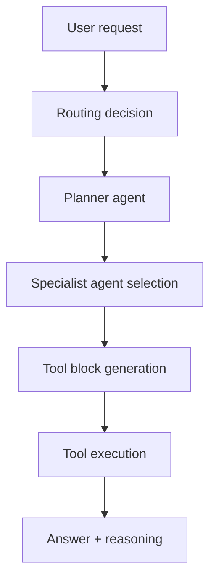

# Chapter 2: Architecture and Routing System

This chapter explains how AgenticSeek decomposes tasks across planner and specialist agents.

## Learning Goals

- map the high-level component boundaries
- understand how routing chooses specialist agents
- identify where prompts, tools, and execution loops live
- reason about failure domains across routing and execution

## System Components

Core directories to understand first:

- `llm_router/`: routing and model dispatch utilities
- `sources/agents/`: specialist agents (`planner`, `browser`, `code`, `file`, `mcp`, `casual`)
- `sources/tools/`: executable capabilities invoked by agent tool blocks
- `prompts/`: prompt templates (`base` and `jarvis` variants)
- `frontend/` + backend entrypoints: user interaction and orchestration surface

## Routing Mental Model

## Why This Matters Operationally

- planner quality directly affects downstream execution quality
- explicit user intents reduce wrong-agent assignment risk
- tool-block parsing is a critical control point for deterministic execution

## Architecture Review Checklist

- verify which agent class owns each new behavior
- keep tool scope narrow and single-purpose
- update related prompt templates when adding tools
- test routing behavior on at least three intent categories

## Source References

- [Architecture Diagram Assets](https://github.com/Fosowl/agenticSeek/tree/main/docs/technical)
- [Agents Source Directory](https://github.com/Fosowl/agenticSeek/tree/main/sources/agents)
- [Prompt Templates](https://github.com/Fosowl/agenticSeek/tree/main/prompts)

## Summary

You now understand where routing, agent logic, and tool execution boundaries sit.

Next: [Chapter 3: Installation, Runtime, and Provider Setup](03-installation-runtime-and-provider-setup.md)
