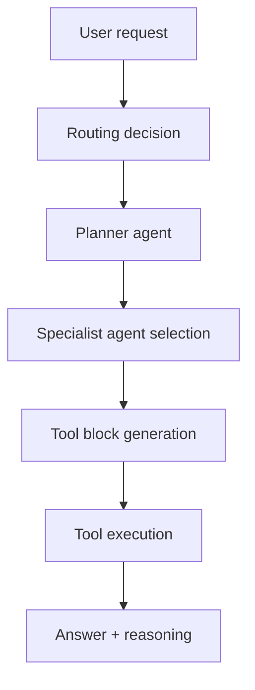
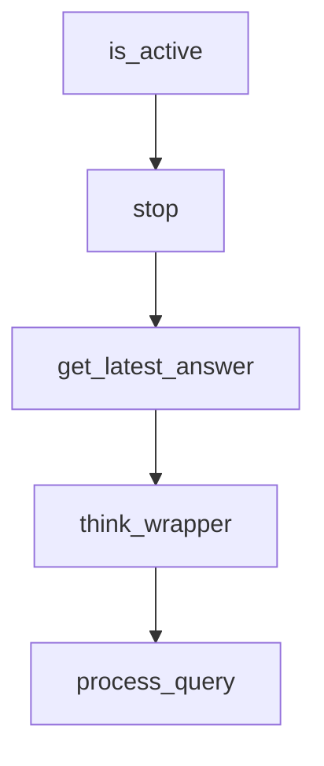

# Chapter 2: Architecture and Routing System

Welcome to **Chapter 2: Architecture and Routing System**. In this part of **AgenticSeek Tutorial: Local-First Autonomous Agent Operations**, you will build an intuitive mental model first, then move into concrete implementation details and practical production tradeoffs.


This chapter explains how AgenticSeek decomposes tasks across planner and specialist agents.

## Learning Goals

- map the high-level component boundaries
- understand how routing chooses specialist agents
- identify where prompts, tools, and execution loops live
- reason about failure domains across routing and execution

## System Components

Core directories to understand first:

- `llm_router/`: routing and model dispatch utilities
- `sources/agents/`: specialist agents (`planner`, `browser`, `code`, `file`, `mcp`, `casual`)
- `sources/tools/`: executable capabilities invoked by agent tool blocks
- `prompts/`: prompt templates (`base` and `jarvis` variants)
- `frontend/` + backend entrypoints: user interaction and orchestration surface

## Routing Mental Model


```mermaid
flowchart TD
    A[User request] --> B[Routing decision]
    B --> C[Planner agent]
    C --> D[Specialist agent selection]
    D --> E[Tool block generation]
    E --> F[Tool execution]
    F --> G[Answer + reasoning]
```

## Why This Matters Operationally

- planner quality directly affects downstream execution quality
- explicit user intents reduce wrong-agent assignment risk
- tool-block parsing is a critical control point for deterministic execution

## Architecture Review Checklist

- verify which agent class owns each new behavior
- keep tool scope narrow and single-purpose
- update related prompt templates when adding tools
- test routing behavior on at least three intent categories

## Source References

- [Architecture Diagram Assets](https://github.com/Fosowl/agenticSeek/tree/main/docs/technical)
- [Agents Source Directory](https://github.com/Fosowl/agenticSeek/tree/main/sources/agents)
- [Prompt Templates](https://github.com/Fosowl/agenticSeek/tree/main/prompts)

## Summary

You now understand where routing, agent logic, and tool execution boundaries sit.

Next: [Chapter 3: Installation, Runtime, and Provider Setup](03-installation-runtime-and-provider-setup.md)

## Depth Expansion Playbook

## Source Code Walkthrough

### `api.py`

The `is_active` function in [`api.py`](https://github.com/Fosowl/agenticSeek/blob/HEAD/api.py) handles a key part of this chapter's functionality:

```py
    return {"status": "healthy", "version": "0.1.0"}

@api.get("/is_active")
async def is_active():
    logger.info("Is active endpoint called")
    return {"is_active": interaction.is_active}

@api.get("/stop")
async def stop():
    logger.info("Stop endpoint called")
    interaction.current_agent.request_stop()
    return JSONResponse(status_code=200, content={"status": "stopped"})

@api.get("/latest_answer")
async def get_latest_answer():
    global query_resp_history
    if interaction.current_agent is None:
        return JSONResponse(status_code=404, content={"error": "No agent available"})
    uid = str(uuid.uuid4())
    if not any(q["answer"] == interaction.current_agent.last_answer for q in query_resp_history):
        query_resp = {
            "done": "false",
            "answer": interaction.current_agent.last_answer,
            "reasoning": interaction.current_agent.last_reasoning,
            "agent_name": interaction.current_agent.agent_name if interaction.current_agent else "None",
            "success": interaction.current_agent.success,
            "blocks": {f'{i}': block.jsonify() for i, block in enumerate(interaction.get_last_blocks_result())} if interaction.current_agent else {},
            "status": interaction.current_agent.get_status_message if interaction.current_agent else "No status available",
            "uid": uid
        }
        interaction.current_agent.last_answer = ""
        interaction.current_agent.last_reasoning = ""
```

This function is important because it defines how AgenticSeek Tutorial: Local-First Autonomous Agent Operations implements the patterns covered in this chapter.

### `api.py`

The `stop` function in [`api.py`](https://github.com/Fosowl/agenticSeek/blob/HEAD/api.py) handles a key part of this chapter's functionality:

```py
    return {"is_active": interaction.is_active}

@api.get("/stop")
async def stop():
    logger.info("Stop endpoint called")
    interaction.current_agent.request_stop()
    return JSONResponse(status_code=200, content={"status": "stopped"})

@api.get("/latest_answer")
async def get_latest_answer():
    global query_resp_history
    if interaction.current_agent is None:
        return JSONResponse(status_code=404, content={"error": "No agent available"})
    uid = str(uuid.uuid4())
    if not any(q["answer"] == interaction.current_agent.last_answer for q in query_resp_history):
        query_resp = {
            "done": "false",
            "answer": interaction.current_agent.last_answer,
            "reasoning": interaction.current_agent.last_reasoning,
            "agent_name": interaction.current_agent.agent_name if interaction.current_agent else "None",
            "success": interaction.current_agent.success,
            "blocks": {f'{i}': block.jsonify() for i, block in enumerate(interaction.get_last_blocks_result())} if interaction.current_agent else {},
            "status": interaction.current_agent.get_status_message if interaction.current_agent else "No status available",
            "uid": uid
        }
        interaction.current_agent.last_answer = ""
        interaction.current_agent.last_reasoning = ""
        query_resp_history.append(query_resp)
        return JSONResponse(status_code=200, content=query_resp)
    if query_resp_history:
        return JSONResponse(status_code=200, content=query_resp_history[-1])
    return JSONResponse(status_code=404, content={"error": "No answer available"})
```

This function is important because it defines how AgenticSeek Tutorial: Local-First Autonomous Agent Operations implements the patterns covered in this chapter.

### `api.py`

The `get_latest_answer` function in [`api.py`](https://github.com/Fosowl/agenticSeek/blob/HEAD/api.py) handles a key part of this chapter's functionality:

```py

@api.get("/latest_answer")
async def get_latest_answer():
    global query_resp_history
    if interaction.current_agent is None:
        return JSONResponse(status_code=404, content={"error": "No agent available"})
    uid = str(uuid.uuid4())
    if not any(q["answer"] == interaction.current_agent.last_answer for q in query_resp_history):
        query_resp = {
            "done": "false",
            "answer": interaction.current_agent.last_answer,
            "reasoning": interaction.current_agent.last_reasoning,
            "agent_name": interaction.current_agent.agent_name if interaction.current_agent else "None",
            "success": interaction.current_agent.success,
            "blocks": {f'{i}': block.jsonify() for i, block in enumerate(interaction.get_last_blocks_result())} if interaction.current_agent else {},
            "status": interaction.current_agent.get_status_message if interaction.current_agent else "No status available",
            "uid": uid
        }
        interaction.current_agent.last_answer = ""
        interaction.current_agent.last_reasoning = ""
        query_resp_history.append(query_resp)
        return JSONResponse(status_code=200, content=query_resp)
    if query_resp_history:
        return JSONResponse(status_code=200, content=query_resp_history[-1])
    return JSONResponse(status_code=404, content={"error": "No answer available"})

async def think_wrapper(interaction, query):
    try:
        interaction.last_query = query
        logger.info("Agents request is being processed")
        success = await interaction.think()
        if not success:
```

This function is important because it defines how AgenticSeek Tutorial: Local-First Autonomous Agent Operations implements the patterns covered in this chapter.

### `api.py`

The `think_wrapper` function in [`api.py`](https://github.com/Fosowl/agenticSeek/blob/HEAD/api.py) handles a key part of this chapter's functionality:

```py
    return JSONResponse(status_code=404, content={"error": "No answer available"})

async def think_wrapper(interaction, query):
    try:
        interaction.last_query = query
        logger.info("Agents request is being processed")
        success = await interaction.think()
        if not success:
            interaction.last_answer = "Error: No answer from agent"
            interaction.last_reasoning = "Error: No reasoning from agent"
            interaction.last_success = False
        else:
            interaction.last_success = True
        pretty_print(interaction.last_answer)
        interaction.speak_answer()
        return success
    except Exception as e:
        logger.error(f"Error in think_wrapper: {str(e)}")
        interaction.last_answer = f""
        interaction.last_reasoning = f"Error: {str(e)}"
        interaction.last_success = False
        raise e

@api.post("/query", response_model=QueryResponse)
async def process_query(request: QueryRequest):
    global is_generating, query_resp_history
    logger.info(f"Processing query: {request.query}")
    query_resp = QueryResponse(
        done="false",
        answer="",
        reasoning="",
        agent_name="Unknown",
```

This function is important because it defines how AgenticSeek Tutorial: Local-First Autonomous Agent Operations implements the patterns covered in this chapter.


## How These Components Connect


```mermaid
flowchart TD
    A[is_active]
    B[stop]
    C[get_latest_answer]
    D[think_wrapper]
    E[process_query]
    A --> B
    B --> C
    C --> D
    D --> E
```
