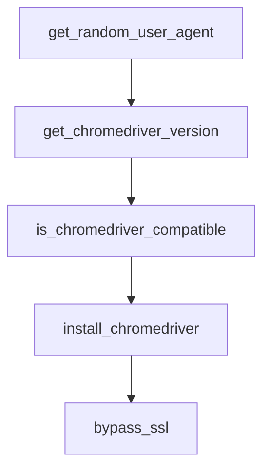

# Chapter 3: Installation, Runtime, and Provider Setup

Welcome to **Chapter 3: Installation, Runtime, and Provider Setup**. In this part of **AgenticSeek Tutorial: Local-First Autonomous Agent Operations**, you will build an intuitive mental model first, then move into concrete implementation details and practical production tradeoffs.


This chapter makes provider and runtime settings reproducible so setup drift does not break sessions.

## Learning Goals

- configure `config.ini` with valid provider/server values
- choose local vs API mode intentionally
- align `.env` and `config.ini` settings to operation mode
- validate configuration before full task execution

## Key Configuration Surfaces

- `.env`: infrastructure and secret settings (`SEARXNG_BASE_URL`, keys, workspace path)
- `config.ini`: provider behavior and runtime toggles (`is_local`, `provider_name`, `provider_model`)

## Baseline Local Provider Example

```ini
[MAIN]
is_local = True
provider_name = ollama
provider_model = deepseek-r1:14b
provider_server_address = http://127.0.0.1:11434
agent_name = Friday
recover_last_session = True
save_session = True

[BROWSER]
headless_browser = True
stealth_mode = True
```

## Common Configuration Errors

- missing `http://` in `provider_server_address`
- `provider_name` mismatch (`openai` vs `lm-studio` when running locally)
- invalid `WORK_DIR` path causing file operation failures
- copying commented config examples directly into strict INI parser contexts

## Validation Steps

- confirm provider endpoint is reachable before launching tasks
- verify docker services (`searxng`, `redis`, backend) are healthy
- run a file-write task to confirm workspace permissions

## Source References

- [README Config Section](https://github.com/Fosowl/agenticSeek/blob/main/README.md#config)
- [Default Config File](https://github.com/Fosowl/agenticSeek/blob/main/config.ini)
- [Install Script](https://github.com/Fosowl/agenticSeek/blob/main/install.sh)

## Summary

You now have a repeatable provider/runtime configuration strategy.

Next: [Chapter 4: Docker Web Mode and CLI Operations](04-docker-web-mode-and-cli-operations.md)

## Depth Expansion Playbook

## Source Code Walkthrough

### `sources/browser.py`

The `get_random_user_agent` function in [`sources/browser.py`](https://github.com/Fosowl/agenticSeek/blob/HEAD/sources/browser.py) handles a key part of this chapter's functionality:

```py
    return None

def get_random_user_agent() -> str:
    """Get a random user agent string with associated vendor."""
    user_agents = [
        {"ua": "Mozilla/5.0 (Windows NT 10.0; Win64; x64) AppleWebKit/537.36 (KHTML, like Gecko) Chrome/125.0.0.0 Safari/537.36", "vendor": "Google Inc."},
        {"ua": "Mozilla/5.0 (Macintosh; Intel Mac OS X 14_6_1) AppleWebKit/537.36 (KHTML, like Gecko) Chrome/125.0.0.0 Safari/537.36", "vendor": "Apple Inc."},
        {"ua": "Mozilla/5.0 (X11; Linux x86_64) AppleWebKit/537.36 (KHTML, like Gecko) Chrome/125.0.0.0 Safari/537.36", "vendor": "Google Inc."},
    ]
    return random.choice(user_agents)

def get_chromedriver_version(chromedriver_path: str) -> str:
    """Get the major version of a chromedriver binary. Returns empty string on failure."""
    try:
        result = subprocess.run(
            [chromedriver_path, "--version"],
            capture_output=True, text=True, timeout=10
        )
        # Output format: "ChromeDriver 125.0.6422.78 (...)"
        return result.stdout.strip().split()[1].split('.')[0]
    except Exception:
        return ""

def is_chromedriver_compatible(chromedriver_path: str) -> bool:
    """Check if a chromedriver binary is compatible with the installed Chrome version."""
    try:
        chrome_version = chromedriver_autoinstaller.get_chrome_version()
        if not chrome_version:
            return True  # Can't determine Chrome version, assume compatible
        chrome_major = chrome_version.split('.')[0]
        driver_major = get_chromedriver_version(chromedriver_path)
        if not driver_major:
```

This function is important because it defines how AgenticSeek Tutorial: Local-First Autonomous Agent Operations implements the patterns covered in this chapter.

### `sources/browser.py`

The `get_chromedriver_version` function in [`sources/browser.py`](https://github.com/Fosowl/agenticSeek/blob/HEAD/sources/browser.py) handles a key part of this chapter's functionality:

```py
    return random.choice(user_agents)

def get_chromedriver_version(chromedriver_path: str) -> str:
    """Get the major version of a chromedriver binary. Returns empty string on failure."""
    try:
        result = subprocess.run(
            [chromedriver_path, "--version"],
            capture_output=True, text=True, timeout=10
        )
        # Output format: "ChromeDriver 125.0.6422.78 (...)"
        return result.stdout.strip().split()[1].split('.')[0]
    except Exception:
        return ""

def is_chromedriver_compatible(chromedriver_path: str) -> bool:
    """Check if a chromedriver binary is compatible with the installed Chrome version."""
    try:
        chrome_version = chromedriver_autoinstaller.get_chrome_version()
        if not chrome_version:
            return True  # Can't determine Chrome version, assume compatible
        chrome_major = chrome_version.split('.')[0]
        driver_major = get_chromedriver_version(chromedriver_path)
        if not driver_major:
            return True  # Can't determine driver version, assume compatible
        return chrome_major == driver_major
    except Exception:
        return True  # On any error, assume compatible to avoid blocking

def install_chromedriver() -> str:
    """
    Install the ChromeDriver if not already installed. Return the path.
    Automatically updates the driver if the version does not match the installed Chrome.
```

This function is important because it defines how AgenticSeek Tutorial: Local-First Autonomous Agent Operations implements the patterns covered in this chapter.

### `sources/browser.py`

The `is_chromedriver_compatible` function in [`sources/browser.py`](https://github.com/Fosowl/agenticSeek/blob/HEAD/sources/browser.py) handles a key part of this chapter's functionality:

```py
        return ""

def is_chromedriver_compatible(chromedriver_path: str) -> bool:
    """Check if a chromedriver binary is compatible with the installed Chrome version."""
    try:
        chrome_version = chromedriver_autoinstaller.get_chrome_version()
        if not chrome_version:
            return True  # Can't determine Chrome version, assume compatible
        chrome_major = chrome_version.split('.')[0]
        driver_major = get_chromedriver_version(chromedriver_path)
        if not driver_major:
            return True  # Can't determine driver version, assume compatible
        return chrome_major == driver_major
    except Exception:
        return True  # On any error, assume compatible to avoid blocking

def install_chromedriver() -> str:
    """
    Install the ChromeDriver if not already installed. Return the path.
    Automatically updates the driver if the version does not match the installed Chrome.
    """
    # First try to use chromedriver in the project root directory (as per README)
    project_root_chromedriver = "./chromedriver"
    if os.path.exists(project_root_chromedriver) and os.access(project_root_chromedriver, os.X_OK):
        if is_chromedriver_compatible(project_root_chromedriver):
            print(f"Using ChromeDriver from project root: {project_root_chromedriver}")
            return project_root_chromedriver
        print("ChromeDriver in project root is outdated, attempting auto-update...")
    
    # Then try to use the system-installed chromedriver
    chromedriver_path = shutil.which("chromedriver")
    if chromedriver_path:
```

This function is important because it defines how AgenticSeek Tutorial: Local-First Autonomous Agent Operations implements the patterns covered in this chapter.

### `sources/browser.py`

The `install_chromedriver` function in [`sources/browser.py`](https://github.com/Fosowl/agenticSeek/blob/HEAD/sources/browser.py) handles a key part of this chapter's functionality:

```py
        return True  # On any error, assume compatible to avoid blocking

def install_chromedriver() -> str:
    """
    Install the ChromeDriver if not already installed. Return the path.
    Automatically updates the driver if the version does not match the installed Chrome.
    """
    # First try to use chromedriver in the project root directory (as per README)
    project_root_chromedriver = "./chromedriver"
    if os.path.exists(project_root_chromedriver) and os.access(project_root_chromedriver, os.X_OK):
        if is_chromedriver_compatible(project_root_chromedriver):
            print(f"Using ChromeDriver from project root: {project_root_chromedriver}")
            return project_root_chromedriver
        print("ChromeDriver in project root is outdated, attempting auto-update...")
    
    # Then try to use the system-installed chromedriver
    chromedriver_path = shutil.which("chromedriver")
    if chromedriver_path:
        if is_chromedriver_compatible(chromedriver_path):
            return chromedriver_path
        print(f"System ChromeDriver at {chromedriver_path} is outdated, attempting auto-update...")
    
    # In Docker environment, try the fixed path
    if os.path.exists('/.dockerenv'):
        docker_chromedriver_path = "/usr/local/bin/chromedriver"
        if os.path.exists(docker_chromedriver_path) and os.access(docker_chromedriver_path, os.X_OK):
            print(f"Using Docker ChromeDriver at {docker_chromedriver_path}")
            return docker_chromedriver_path
    
    # Auto-install matching ChromeDriver version
    try:
        print("Installing matching ChromeDriver version automatically...")
```

This function is important because it defines how AgenticSeek Tutorial: Local-First Autonomous Agent Operations implements the patterns covered in this chapter.


## How These Components Connect


