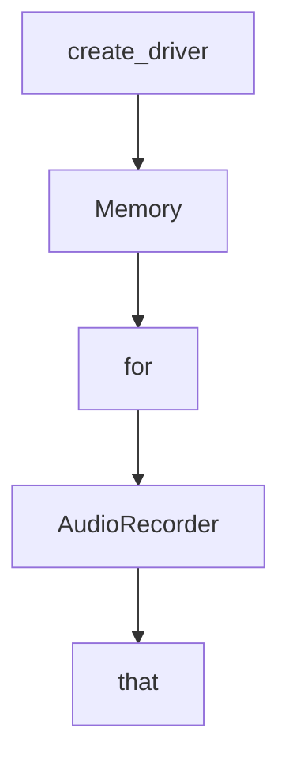

# Chapter 4: Docker Web Mode and CLI Operations

Welcome to **Chapter 4: Docker Web Mode and CLI Operations**. In this part of **AgenticSeek Tutorial: Local-First Autonomous Agent Operations**, you will build an intuitive mental model first, then move into concrete implementation details and practical production tradeoffs.


This chapter compares the two primary execution surfaces and shows how to operate each reliably.

## Learning Goals

- choose web mode or CLI mode based on workload
- run service startup paths correctly for each mode
- understand `SEARXNG_BASE_URL` differences between host and Docker contexts
- verify startup readiness before issuing expensive tasks

## Web Mode (Default)

Use this when you want browser-based interaction and full Docker orchestration.

```bash
./start_services.sh full
```

Expected behavior:

- backend + frontend + searxng + redis start together
- UI available at `http://localhost:3000`
- first startup may take several minutes

## CLI Mode

Use this when you need terminal-native execution and host-installed dependencies.

```bash
./install.sh
./start_services.sh
uv run python -m ensurepip
uv run cli.py
```

CLI mode requires host-aware values like:

- `SEARXNG_BASE_URL="http://localhost:8080"`

## Mode Selection Heuristics

- use web mode for team demos and visual monitoring
- use CLI mode for terminal automation and fast iteration
- use explicit prompts in both modes to improve routing reliability

## Source References

- [README Start Services and Run](https://github.com/Fosowl/agenticSeek/blob/main/README.md#start-services-and-run)
- [CLI Entrypoint](https://github.com/Fosowl/agenticSeek/blob/main/cli.py)
- [Windows Startup Script](https://github.com/Fosowl/agenticSeek/blob/main/start_services.cmd)

## Summary

You now know how to operate both web and CLI execution modes safely.

Next: [Chapter 5: Tools, Browser Automation, and Workspace Governance](05-tools-browser-automation-and-workspace-governance.md)

## Depth Expansion Playbook

## Source Code Walkthrough

### `sources/browser.py`

The `create_driver` function in [`sources/browser.py`](https://github.com/Fosowl/agenticSeek/blob/HEAD/sources/browser.py) handles a key part of this chapter's functionality:

```py
    return driver

def create_driver(headless=False, stealth_mode=True, crx_path="./crx/nopecha.crx", lang="en") -> webdriver.Chrome:
    """Create a Chrome WebDriver with specified options."""
    # Warn if trying to run non-headless in Docker
    if not headless and os.path.exists('/.dockerenv'):
        print("[WARNING] Running non-headless browser in Docker may fail!")
        print("[WARNING] Consider setting headless=True or headless_browser=True in config.ini")
    
    chrome_options = create_chrome_options(headless, stealth_mode, crx_path, lang)
    chromedriver_path = install_chromedriver()
    service = Service(chromedriver_path)
    
    if stealth_mode:
        driver = create_undetected_chromedriver(service, chrome_options)
        user_agent = get_random_user_agent()
        stealth(driver,
            languages=["en-US", "en"],
            vendor=user_agent["vendor"],
            platform="Win64" if "windows" in user_agent["ua"].lower() else "MacIntel" if "mac" in user_agent["ua"].lower() else "Linux x86_64",
            webgl_vendor="Intel Inc.",
            renderer="Intel Iris OpenGL Engine",
            fix_hairline=True,
        )
        return driver
    else:
        return webdriver.Chrome(service=service, options=chrome_options)

class Browser:
    def __init__(self, driver, anticaptcha_manual_install=False):
        """Initialize the browser with optional AntiCaptcha installation."""
        self.js_scripts_folder = "./sources/web_scripts/" if not __name__ == "__main__" else "./web_scripts/"
```

This function is important because it defines how AgenticSeek Tutorial: Local-First Autonomous Agent Operations implements the patterns covered in this chapter.

### `sources/memory.py`

The `Memory` class in [`sources/memory.py`](https://github.com/Fosowl/agenticSeek/blob/HEAD/sources/memory.py) handles a key part of this chapter's functionality:

```py
config.read('config.ini')

class Memory():
    """
    Memory is a class for managing the conversation memory
    It provides a method to compress the memory using summarization model.
    """
    def __init__(self, system_prompt: str,
                 recover_last_session: bool = False,
                 memory_compression: bool = True,
                 model_provider: str = "deepseek-r1:14b"):
        self.memory = [{'role': 'system', 'content': system_prompt}]
        
        self.logger = Logger("memory.log")
        self.session_time = datetime.datetime.now()
        self.session_id = str(uuid.uuid4())
        self.conversation_folder = f"conversations/"
        self.session_recovered = False
        if recover_last_session:
            self.load_memory()
            self.session_recovered = True
        # memory compression system
        self.model = None
        self.tokenizer = None
        self.device = self.get_cuda_device()
        self.memory_compression = memory_compression
        self.model_provider = model_provider
        if self.memory_compression:
            self.download_model()

    def get_ideal_ctx(self, model_name: str) -> int | None:
        """
```

This class is important because it defines how AgenticSeek Tutorial: Local-First Autonomous Agent Operations implements the patterns covered in this chapter.

### `sources/memory.py`

The `for` class in [`sources/memory.py`](https://github.com/Fosowl/agenticSeek/blob/HEAD/sources/memory.py) handles a key part of this chapter's functionality:

```py
from typing import List, Tuple, Type, Dict
import torch
from transformers import AutoTokenizer, AutoModelForSeq2SeqLM
import configparser

from sources.utility import timer_decorator, pretty_print, animate_thinking
from sources.logger import Logger

config = configparser.ConfigParser()
config.read('config.ini')

class Memory():
    """
    Memory is a class for managing the conversation memory
    It provides a method to compress the memory using summarization model.
    """
    def __init__(self, system_prompt: str,
                 recover_last_session: bool = False,
                 memory_compression: bool = True,
                 model_provider: str = "deepseek-r1:14b"):
        self.memory = [{'role': 'system', 'content': system_prompt}]
        
        self.logger = Logger("memory.log")
        self.session_time = datetime.datetime.now()
        self.session_id = str(uuid.uuid4())
        self.conversation_folder = f"conversations/"
        self.session_recovered = False
        if recover_last_session:
            self.load_memory()
            self.session_recovered = True
        # memory compression system
        self.model = None
```

This class is important because it defines how AgenticSeek Tutorial: Local-First Autonomous Agent Operations implements the patterns covered in this chapter.

### `sources/speech_to_text.py`

The `AudioRecorder` class in [`sources/speech_to_text.py`](https://github.com/Fosowl/agenticSeek/blob/HEAD/sources/speech_to_text.py) handles a key part of this chapter's functionality:

```py
done = False

class AudioRecorder:
    """
    AudioRecorder is a class that records audio from the microphone and adds it to the audio queue.
    """
    def __init__(self, format: int = pyaudio.paInt16, channels: int = 1, rate: int = 4096, chunk: int = 8192, record_seconds: int = 5, verbose: bool = False):
        self.format = format
        self.channels = channels
        self.rate = rate
        self.chunk = chunk
        self.record_seconds = record_seconds
        self.verbose = verbose
        self.thread = None
        self.audio = None
        if IMPORT_FOUND:
            self.audio = pyaudio.PyAudio()
            self.thread = threading.Thread(target=self._record, daemon=True)

    def _record(self) -> None:
        """
        Record audio from the microphone and add it to the audio queue.
        """
        if not IMPORT_FOUND:
            return
        stream = self.audio.open(format=self.format, channels=self.channels, rate=self.rate,
                                 input=True, frames_per_buffer=self.chunk)
        if self.verbose:
            print(Fore.GREEN + "AudioRecorder: Started recording..." + Fore.RESET)

        while not done:
            frames = []
```

This class is important because it defines how AgenticSeek Tutorial: Local-First Autonomous Agent Operations implements the patterns covered in this chapter.


## How These Components Connect


