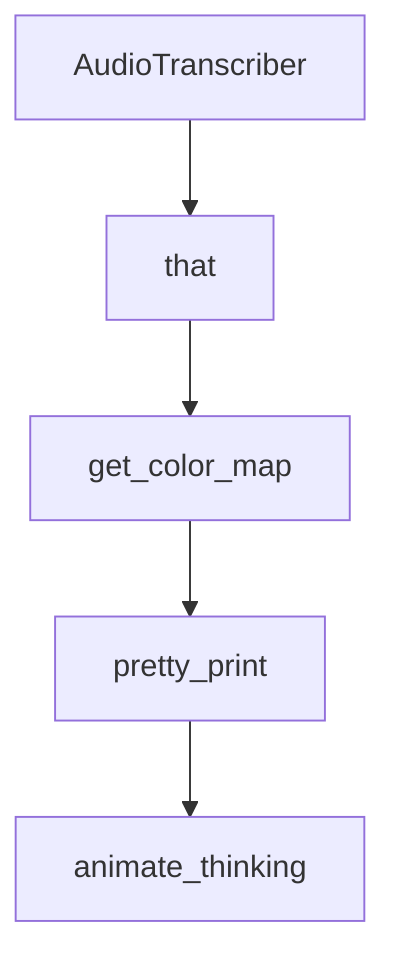

# Chapter 5: Tools, Browser Automation, and Workspace Governance

Welcome to **Chapter 5: Tools, Browser Automation, and Workspace Governance**. In this part of **AgenticSeek Tutorial: Local-First Autonomous Agent Operations**, you will build an intuitive mental model first, then move into concrete implementation details and practical production tradeoffs.


This chapter focuses on the highest-risk operational zone: autonomous tool execution over browser and files.

## Learning Goals

- understand the project's tool-block execution model
- reduce risk when agents can browse and write files
- structure workspace paths to avoid accidental data access
- enforce practical run-time safeguards

## Tool Block Contract

AgenticSeek tools are invoked by markdown-style code blocks with a tool name and payload.

Examples documented by the project include blocks like:

````text
```web_search
query text
```
````

This contract is parsed and dispatched by tool infrastructure in `sources/tools`.

## Workspace Governance Baseline

- create a dedicated work directory per project or task class
- avoid pointing `WORK_DIR` at sensitive home-level paths
- treat generated files as untrusted until reviewed
- keep backups for any directory where autonomous writes are enabled

## Browser Automation Risk Controls

- keep `headless_browser=True` for deterministic automated runs
- use `stealth_mode` only when needed for compatibility
- review logs for unexpected navigation or form interactions
- avoid high-privilege authenticated sessions while testing

## Source References

- [Contributing Guide: Tools](https://github.com/Fosowl/agenticSeek/blob/main/docs/CONTRIBUTING.md#implementing-and-using-tools)
- [Tools Source Directory](https://github.com/Fosowl/agenticSeek/tree/main/sources/tools)
- [README Known Issues](https://github.com/Fosowl/agenticSeek/blob/main/README.md#known-issues)

## Summary

You now have practical controls for safer tool execution and browser automation.

Next: [Chapter 6: Model Strategy and Remote Server Mode](06-model-strategy-and-remote-server-mode.md)

## Depth Expansion Playbook

## Source Code Walkthrough

### `sources/speech_to_text.py`

The `AudioTranscriber` class in [`sources/speech_to_text.py`](https://github.com/Fosowl/agenticSeek/blob/HEAD/sources/speech_to_text.py) handles a key part of this chapter's functionality:

```py
        return self.remove_hallucinations(result["text"])
    
class AudioTranscriber:
    """
    AudioTranscriber is a class that transcribes audio from the audio queue and adds it to the transcript.
    """
    def __init__(self, ai_name: str, verbose: bool = False):
        if not IMPORT_FOUND:
            print(Fore.RED + "AudioTranscriber: Speech to Text is disabled." + Fore.RESET)
            return
        self.verbose = verbose
        self.ai_name = ai_name
        self.transcriptor = Transcript()
        self.thread = threading.Thread(target=self._transcribe, daemon=True)
        self.trigger_words = {
            'EN': [f"{self.ai_name}", "hello", "hi"],
            'FR': [f"{self.ai_name}", "hello", "hi"],
            'ZH': [f"{self.ai_name}", "hello", "hi"],
            'ES': [f"{self.ai_name}", "hello", "hi"]
        }
        self.confirmation_words = {
            'EN': ["do it", "go ahead", "execute", "run", "start", "thanks", "would ya", "please", "okay?", "proceed", "continue", "go on", "do that", "go it", "do you understand?"],
            'FR': ["fais-le", "vas-y", "exécute", "lance", "commence", "merci", "tu veux bien", "s'il te plaît", "d'accord ?", "poursuis", "continue", "vas-y", "fais ça", "compris"],
            'ZH_CHT': ["做吧", "繼續", "執行", "運作看看", "開始", "謝謝", "可以嗎", "請", "好嗎", "進行", "做吧", "go", "do it", "執行吧", "懂了"],
            'ZH_SC': ["做吧", "继续", "执行", "运作看看", "开始", "谢谢", "可以吗", "请", "好吗", "运行", "做吧", "go", "do it", "执行吧", "懂了"],
            'ES': ["hazlo", "adelante", "ejecuta", "corre", "empieza", "gracias", "lo harías", "por favor", "¿vale?", "procede", "continúa", "sigue", "haz eso", "haz esa cosa"]
        }
        self.recorded = ""

    def get_transcript(self) -> str:
        global done
        buffer = self.recorded
```

This class is important because it defines how AgenticSeek Tutorial: Local-First Autonomous Agent Operations implements the patterns covered in this chapter.

### `sources/speech_to_text.py`

The `that` class in [`sources/speech_to_text.py`](https://github.com/Fosowl/agenticSeek/blob/HEAD/sources/speech_to_text.py) handles a key part of this chapter's functionality:

```py
class AudioRecorder:
    """
    AudioRecorder is a class that records audio from the microphone and adds it to the audio queue.
    """
    def __init__(self, format: int = pyaudio.paInt16, channels: int = 1, rate: int = 4096, chunk: int = 8192, record_seconds: int = 5, verbose: bool = False):
        self.format = format
        self.channels = channels
        self.rate = rate
        self.chunk = chunk
        self.record_seconds = record_seconds
        self.verbose = verbose
        self.thread = None
        self.audio = None
        if IMPORT_FOUND:
            self.audio = pyaudio.PyAudio()
            self.thread = threading.Thread(target=self._record, daemon=True)

    def _record(self) -> None:
        """
        Record audio from the microphone and add it to the audio queue.
        """
        if not IMPORT_FOUND:
            return
        stream = self.audio.open(format=self.format, channels=self.channels, rate=self.rate,
                                 input=True, frames_per_buffer=self.chunk)
        if self.verbose:
            print(Fore.GREEN + "AudioRecorder: Started recording..." + Fore.RESET)

        while not done:
            frames = []
            for _ in range(0, int(self.rate / self.chunk * self.record_seconds)):
                try:
```

This class is important because it defines how AgenticSeek Tutorial: Local-First Autonomous Agent Operations implements the patterns covered in this chapter.

### `sources/utility.py`

The `get_color_map` function in [`sources/utility.py`](https://github.com/Fosowl/agenticSeek/blob/HEAD/sources/utility.py) handles a key part of this chapter's functionality:

```py
current_animation_thread = None

def get_color_map():
    if platform.system().lower() != "windows":
        color_map = {
            "success": "green",
            "failure": "red",
            "status": "light_green",
            "code": "light_blue",
            "warning": "yellow",
            "output": "cyan",
            "info": "cyan"
        }
    else:
        color_map = {
            "success": "green",
            "failure": "red",
            "status": "light_green",
            "code": "light_blue",
            "warning": "yellow",
            "output": "cyan",
            "info": "black"
        }
    return color_map

def pretty_print(text, color="info", no_newline=False):
    """
    Print text with color formatting.

    Args:
        text (str): The text to print
        color (str, optional): The color to use. Defaults to "info".
```

This function is important because it defines how AgenticSeek Tutorial: Local-First Autonomous Agent Operations implements the patterns covered in this chapter.

### `sources/utility.py`

The `pretty_print` function in [`sources/utility.py`](https://github.com/Fosowl/agenticSeek/blob/HEAD/sources/utility.py) handles a key part of this chapter's functionality:

```py
    return color_map

def pretty_print(text, color="info", no_newline=False):
    """
    Print text with color formatting.

    Args:
        text (str): The text to print
        color (str, optional): The color to use. Defaults to "info".
            Valid colors are:
            - "success": Green
            - "failure": Red 
            - "status": Light green
            - "code": Light blue
            - "warning": Yellow
            - "output": Cyan
            - "default": Black (Windows only)
    """
    thinking_event.set()
    if current_animation_thread and current_animation_thread.is_alive():
        current_animation_thread.join()
    thinking_event.clear()
    
    color_map = get_color_map()
    if color not in color_map:
        color = "info"
    print(colored(text, color_map[color]), end='' if no_newline else "\n")

def animate_thinking(text, color="status", duration=120):
    """
    Animate a thinking spinner while a task is being executed.
    It use a daemon thread to run the animation. This will not block the main thread.
```

This function is important because it defines how AgenticSeek Tutorial: Local-First Autonomous Agent Operations implements the patterns covered in this chapter.


## How These Components Connect


