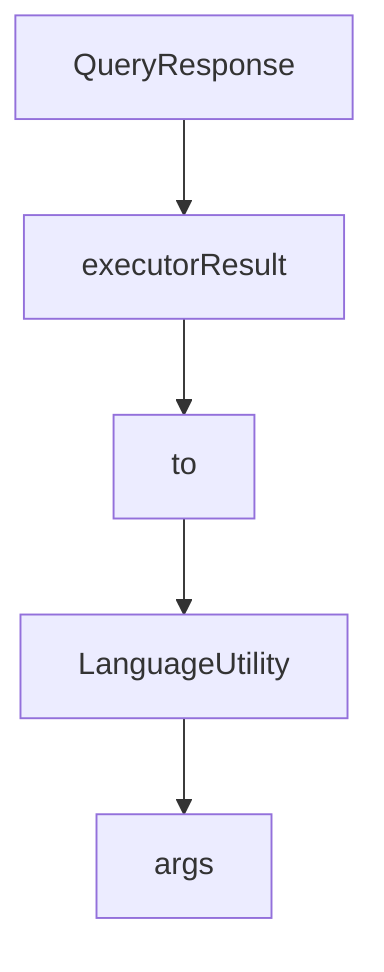

# Chapter 6: Model Strategy and Remote Server Mode

Welcome to **Chapter 6: Model Strategy and Remote Server Mode**. In this part of **AgenticSeek Tutorial: Local-First Autonomous Agent Operations**, you will build an intuitive mental model first, then move into concrete implementation details and practical production tradeoffs.


This chapter helps you select model-provider strategy based on cost, latency, and privacy constraints.

## Learning Goals

- compare local model mode vs API mode vs self-hosted server mode
- understand tradeoffs for hardware-constrained environments
- configure remote server operation cleanly
- prevent common provider-mode misconfiguration

## Provider Modes

- local mode (`is_local=True`): best for privacy and cost control
- API mode (`is_local=False`): best for limited local hardware
- server mode (`provider_name=server`): best when model runs on separate machine

## Remote Server Pattern

For server mode, run the LLM server process on remote host, then set:

```ini
[MAIN]
is_local = False
provider_name = server
provider_model = deepseek-r1:70b
provider_server_address = http://<server-ip>:3333
```

This pattern keeps interaction device lightweight while preserving self-hosted model control.

## Decision Matrix

| Constraint | Recommended Mode |
|:-----------|:-----------------|
| Strong privacy + enough GPU | Local mode |
| Limited local hardware | API mode |
| Strong privacy + remote GPU server | Server mode |

## Source References

- [README Local Provider Setup](https://github.com/Fosowl/agenticSeek/blob/main/README.md#setup-for-running-llm-locally-on-your-machine)
- [README API Provider Setup](https://github.com/Fosowl/agenticSeek/blob/main/README.md#setup-to-run-with-an-api)
- [LLM Server Directory](https://github.com/Fosowl/agenticSeek/tree/main/llm_server)

## Summary

You now have a clear provider strategy aligned to hardware and governance needs.

Next: [Chapter 7: Troubleshooting and Reliability Playbook](07-troubleshooting-and-reliability-playbook.md)

## Depth Expansion Playbook

## Source Code Walkthrough

### `sources/schemas.py`

The `QueryResponse` class in [`sources/schemas.py`](https://github.com/Fosowl/agenticSeek/blob/HEAD/sources/schemas.py) handles a key part of this chapter's functionality:

```py
        }

class QueryResponse(BaseModel):
    done: str
    answer: str
    reasoning: str
    agent_name: str
    success: str
    blocks: dict
    status: str
    uid: str

    def __str__(self):
        return f"Done: {self.done}, Answer: {self.answer}, Agent Name: {self.agent_name}, Success: {self.success}, Blocks: {self.blocks}, Status: {self.status}, UID: {self.uid}"

    def jsonify(self):
        return {
            "done": self.done,
            "answer": self.answer,
            "reasoning": self.reasoning,
            "agent_name": self.agent_name,
            "success": self.success,
            "blocks": self.blocks,
            "status": self.status,
            "uid": self.uid
        }

class executorResult:
    """
    A class to store the result of a tool execution.
    """
    def __init__(self, block: str, feedback: str, success: bool, tool_type: str):
```

This class is important because it defines how AgenticSeek Tutorial: Local-First Autonomous Agent Operations implements the patterns covered in this chapter.

### `sources/schemas.py`

The `executorResult` class in [`sources/schemas.py`](https://github.com/Fosowl/agenticSeek/blob/HEAD/sources/schemas.py) handles a key part of this chapter's functionality:

```py
        }

class executorResult:
    """
    A class to store the result of a tool execution.
    """
    def __init__(self, block: str, feedback: str, success: bool, tool_type: str):
        """
        Initialize an agent with execution results.

        Args:
            block: The content or code block processed by the agent.
            feedback: Feedback or response information from the execution.
            success: Boolean indicating whether the agent's execution was successful.
            tool_type: The type of tool used by the agent for execution.
        """
        self.block = block
        self.feedback = feedback
        self.success = success
        self.tool_type = tool_type
    
    def __str__(self):
        return f"Tool: {self.tool_type}\nBlock: {self.block}\nFeedback: {self.feedback}\nSuccess: {self.success}"
    
    def jsonify(self):
        return {
            "block": self.block,
            "feedback": self.feedback,
            "success": self.success,
            "tool_type": self.tool_type
        }

```

This class is important because it defines how AgenticSeek Tutorial: Local-First Autonomous Agent Operations implements the patterns covered in this chapter.

### `sources/schemas.py`

The `to` class in [`sources/schemas.py`](https://github.com/Fosowl/agenticSeek/blob/HEAD/sources/schemas.py) handles a key part of this chapter's functionality:

```py
        }

class executorResult:
    """
    A class to store the result of a tool execution.
    """
    def __init__(self, block: str, feedback: str, success: bool, tool_type: str):
        """
        Initialize an agent with execution results.

        Args:
            block: The content or code block processed by the agent.
            feedback: Feedback or response information from the execution.
            success: Boolean indicating whether the agent's execution was successful.
            tool_type: The type of tool used by the agent for execution.
        """
        self.block = block
        self.feedback = feedback
        self.success = success
        self.tool_type = tool_type
    
    def __str__(self):
        return f"Tool: {self.tool_type}\nBlock: {self.block}\nFeedback: {self.feedback}\nSuccess: {self.success}"
    
    def jsonify(self):
        return {
            "block": self.block,
            "feedback": self.feedback,
            "success": self.success,
            "tool_type": self.tool_type
        }

```

This class is important because it defines how AgenticSeek Tutorial: Local-First Autonomous Agent Operations implements the patterns covered in this chapter.

### `sources/language.py`

The `LanguageUtility` class in [`sources/language.py`](https://github.com/Fosowl/agenticSeek/blob/HEAD/sources/language.py) handles a key part of this chapter's functionality:

```py
from sources.logger import Logger

class LanguageUtility:
    """LanguageUtility for language, or emotion identification"""
    def __init__(self, supported_language: List[str] = ["en", "fr", "zh"]):
        """
        Initialize the LanguageUtility class
        args:
            supported_language: list of languages for translation, determine which Helsinki-NLP model to load
        """
        self.translators_tokenizer = None 
        self.translators_model = None
        self.logger = Logger("language.log")
        self.supported_language = supported_language
        self.load_model()
    
    def load_model(self) -> None:
        animate_thinking("Loading language utility...", color="status")
        self.translators_tokenizer = {lang: MarianTokenizer.from_pretrained(f"Helsinki-NLP/opus-mt-{lang}-en") for lang in self.supported_language if lang != "en"}
        self.translators_model = {lang: MarianMTModel.from_pretrained(f"Helsinki-NLP/opus-mt-{lang}-en") for lang in self.supported_language if lang != "en"}
    
    def detect_language(self, text: str) -> str:
        """
        Detect the language of the given text using langdetect
        Limited to the supported languages list because of the model tendency to mistake similar languages
        Args:
            text: string to analyze
        Returns: ISO639-1 language code
        """
        langid.set_languages(self.supported_language)
        lang, score = langid.classify(text)
        self.logger.info(f"Identified: {text} as {lang} with conf {score}")
```

This class is important because it defines how AgenticSeek Tutorial: Local-First Autonomous Agent Operations implements the patterns covered in this chapter.


## How These Components Connect


