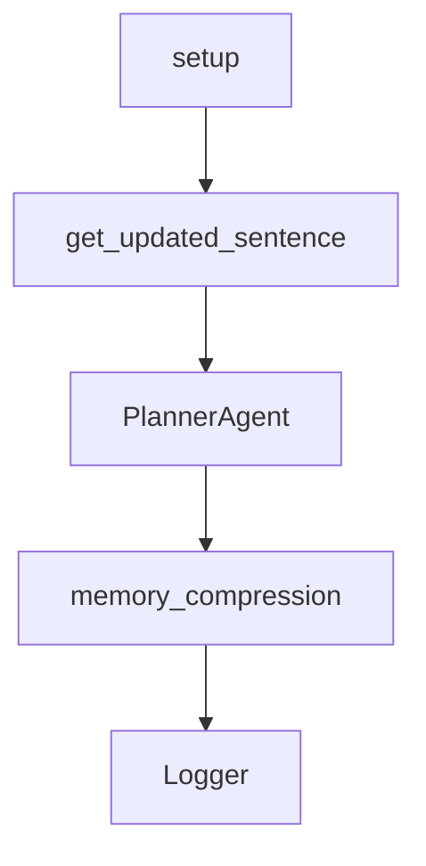

# Chapter 7: Troubleshooting and Reliability Playbook

Welcome to **Chapter 7: Troubleshooting and Reliability Playbook**. In this part of **AgenticSeek Tutorial: Local-First Autonomous Agent Operations**, you will build an intuitive mental model first, then move into concrete implementation details and practical production tradeoffs.


This chapter covers the failure modes you will hit most often and how to recover quickly.

## Learning Goals

- diagnose ChromeDriver compatibility failures
- fix provider connection adapter errors
- resolve SearxNG endpoint misconfiguration
- build a repeatable incident triage routine

## High-Frequency Issues

### ChromeDriver Version Mismatch

Symptoms:

- `SessionNotCreatedException`
- browser startup failures in automation tasks

First actions:

- verify local browser version
- install matching ChromeDriver major version
- ensure executable permissions and correct location

### Provider Connection Adapter Errors

Symptoms:

- errors like "No connection adapters were found"

First actions:

- confirm `provider_server_address` includes protocol (`http://`)
- verify model server endpoint and port reachability

### Missing SearxNG Base URL

Symptoms:

- `SearxNG base URL must be provided` runtime error

First actions:

- set `SEARXNG_BASE_URL` based on mode
- use `http://searxng:8080` in Docker web mode
- use `http://localhost:8080` in host CLI mode

## Reliability Habit Loop

- reproduce with smallest possible prompt
- isolate to config, provider, browser, or tool layer
- capture logs and final config deltas
- only then widen back to full task scope

## Source References

- [README Troubleshooting](https://github.com/Fosowl/agenticSeek/blob/main/README.md#troubleshooting)
- [README ChromeDriver Issues](https://github.com/Fosowl/agenticSeek/blob/main/README.md#chromedriver-issues)
- [README FAQ](https://github.com/Fosowl/agenticSeek/blob/main/README.md#faq)

## Summary

You now have a practical incident-response playbook for AgenticSeek operations.

Next: [Chapter 8: Contribution Workflow and Project Governance](08-contribution-workflow-and-project-governance.md)

## Source Code Walkthrough

### `llm_server/app.py`

The `setup` function in [`llm_server/app.py`](https://github.com/Fosowl/agenticSeek/blob/HEAD/llm_server/app.py) handles a key part of this chapter's functionality:

```py
    return jsonify({"error": "Generation already in progress"}), 402

@app.route('/setup', methods=['POST'])
def setup():
    data = request.get_json()
    model = data.get('model', None)
    if model is None:
        return jsonify({"error": "Model not provided"}), 403
    generator.set_model(model)
    return jsonify({"message": "Model set"}), 200

@app.route('/get_updated_sentence')
def get_updated_sentence():
    if not generator:
        return jsonify({"error": "Generator not initialized"}), 405
    print(generator.get_status())
    return generator.get_status()

if __name__ == '__main__':
    app.run(host='0.0.0.0', threaded=True, debug=True, port=args.port)
```

This function is important because it defines how AgenticSeek Tutorial: Local-First Autonomous Agent Operations implements the patterns covered in this chapter.

### `llm_server/app.py`

The `get_updated_sentence` function in [`llm_server/app.py`](https://github.com/Fosowl/agenticSeek/blob/HEAD/llm_server/app.py) handles a key part of this chapter's functionality:

```py
    return jsonify({"message": "Model set"}), 200

@app.route('/get_updated_sentence')
def get_updated_sentence():
    if not generator:
        return jsonify({"error": "Generator not initialized"}), 405
    print(generator.get_status())
    return generator.get_status()

if __name__ == '__main__':
    app.run(host='0.0.0.0', threaded=True, debug=True, port=args.port)
```

This function is important because it defines how AgenticSeek Tutorial: Local-First Autonomous Agent Operations implements the patterns covered in this chapter.

### `sources/agents/planner_agent.py`

The `PlannerAgent` class in [`sources/agents/planner_agent.py`](https://github.com/Fosowl/agenticSeek/blob/HEAD/sources/agents/planner_agent.py) handles a key part of this chapter's functionality:

```py
from sources.memory import Memory

class PlannerAgent(Agent):
    def __init__(self, name, prompt_path, provider, verbose=False, browser=None):
        """
        The planner agent is a special agent that divides and conquers the task.
        """
        super().__init__(name, prompt_path, provider, verbose, None)
        self.tools = {
            "json": Tools()
        }
        self.tools['json'].tag = "json"
        self.browser = browser
        self.agents = {
            "coder": CoderAgent(name, "prompts/base/coder_agent.txt", provider, verbose=False),
            "file": FileAgent(name, "prompts/base/file_agent.txt", provider, verbose=False),
            "web": BrowserAgent(name, "prompts/base/browser_agent.txt", provider, verbose=False, browser=browser),
            "casual": CasualAgent(name, "prompts/base/casual_agent.txt", provider, verbose=False)
        }
        self.role = "planification"
        self.type = "planner_agent"
        self.memory = Memory(self.load_prompt(prompt_path),
                                recover_last_session=False, # session recovery in handled by the interaction class
                                memory_compression=False,
                                model_provider=provider.get_model_name())
        self.logger = Logger("planner_agent.log")
    
    def get_task_names(self, text: str) -> List[str]:
        """
        Extracts task names from the given text.
        This method processes a multi-line string, where each line may represent a task name.
        containing '##' or starting with a digit. The valid task names are collected and returned.
```

This class is important because it defines how AgenticSeek Tutorial: Local-First Autonomous Agent Operations implements the patterns covered in this chapter.

### `sources/agents/planner_agent.py`

The `memory_compression` class in [`sources/agents/planner_agent.py`](https://github.com/Fosowl/agenticSeek/blob/HEAD/sources/agents/planner_agent.py) handles a key part of this chapter's functionality:

```py
        self.memory = Memory(self.load_prompt(prompt_path),
                                recover_last_session=False, # session recovery in handled by the interaction class
                                memory_compression=False,
                                model_provider=provider.get_model_name())
        self.logger = Logger("planner_agent.log")
    
    def get_task_names(self, text: str) -> List[str]:
        """
        Extracts task names from the given text.
        This method processes a multi-line string, where each line may represent a task name.
        containing '##' or starting with a digit. The valid task names are collected and returned.
        Args:
            text (str): A string containing potential task titles (eg: Task 1: I will...).
        Returns:
            List[str]: A list of extracted task names that meet the specified criteria.
        """
        tasks_names = []
        lines = text.strip().split('\n')
        for line in lines:
            if line is None:
                continue
            line = line.strip()
            if len(line) == 0:
                continue
            if '##' in line or line[0].isdigit():
                tasks_names.append(line)
                continue
        self.logger.info(f"Found {len(tasks_names)} tasks names.")
        return tasks_names

    def parse_agent_tasks(self, text: str) -> List[Tuple[str, str]]:
        """
```

This class is important because it defines how AgenticSeek Tutorial: Local-First Autonomous Agent Operations implements the patterns covered in this chapter.


## How These Components Connect


