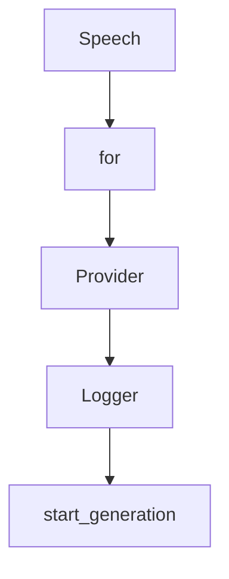

# Chapter 7: Troubleshooting and Reliability Playbook

Welcome to **Chapter 7: Troubleshooting and Reliability Playbook**. In this part of **AgenticSeek Tutorial: Local-First Autonomous Agent Operations**, you will build an intuitive mental model first, then move into concrete implementation details and practical production tradeoffs.


This chapter covers the failure modes you will hit most often and how to recover quickly.

## Learning Goals

- diagnose ChromeDriver compatibility failures
- fix provider connection adapter errors
- resolve SearxNG endpoint misconfiguration
- build a repeatable incident triage routine

## High-Frequency Issues

### ChromeDriver Version Mismatch

Symptoms:

- `SessionNotCreatedException`
- browser startup failures in automation tasks

First actions:

- verify local browser version
- install matching ChromeDriver major version
- ensure executable permissions and correct location

### Provider Connection Adapter Errors

Symptoms:

- errors like "No connection adapters were found"

First actions:

- confirm `provider_server_address` includes protocol (`http://`)
- verify model server endpoint and port reachability

### Missing SearxNG Base URL

Symptoms:

- `SearxNG base URL must be provided` runtime error

First actions:

- set `SEARXNG_BASE_URL` based on mode
- use `http://searxng:8080` in Docker web mode
- use `http://localhost:8080` in host CLI mode

## Reliability Habit Loop

- reproduce with smallest possible prompt
- isolate to config, provider, browser, or tool layer
- capture logs and final config deltas
- only then widen back to full task scope

## Source References

- [README Troubleshooting](https://github.com/Fosowl/agenticSeek/blob/main/README.md#troubleshooting)
- [README ChromeDriver Issues](https://github.com/Fosowl/agenticSeek/blob/main/README.md#chromedriver-issues)
- [README FAQ](https://github.com/Fosowl/agenticSeek/blob/main/README.md#faq)

## Summary

You now have a practical incident-response playbook for AgenticSeek operations.

Next: [Chapter 8: Contribution Workflow and Project Governance](08-contribution-workflow-and-project-governance.md)

## Depth Expansion Playbook

## Source Code Walkthrough

### `sources/text_to_speech.py`

The `Speech` class in [`sources/text_to_speech.py`](https://github.com/Fosowl/agenticSeek/blob/HEAD/sources/text_to_speech.py) handles a key part of this chapter's functionality:

```py
    import soundfile as sf
except ImportError:
    print("Speech synthesis disabled. To enable TTS, install: pip install kokoro==0.9.4 soundfile ipython")
    print("Note: kokoro requires Python <3.12 due to num2words dependency.")
    IMPORT_FOUND = False

if __name__ == "__main__":
    from utility import pretty_print, animate_thinking
else:
    from sources.utility import pretty_print, animate_thinking

class Speech():
    """
    Speech is a class for generating speech from text.
    """
    def __init__(self, enable: bool = True, language: str = "en", voice_idx: int = 6) -> None:
        self.lang_map = {
            "en": 'a',
            "zh": 'z',
            "fr": 'f',
            "ja": 'j'
        }
        self.voice_map = {
            "en": ['af_kore', 'af_bella', 'af_alloy', 'af_nicole', 'af_nova', 'af_sky', 'am_echo', 'am_michael', 'am_puck'],
            "zh": ['zf_xiaobei', 'zf_xiaoni', 'zf_xiaoxiao', 'zf_xiaoyi', 'zm_yunjian', 'zm_yunxi', 'zm_yunxia', 'zm_yunyang'],
            "ja": ['jf_alpha', 'jf_gongitsune', 'jm_kumo'],
            "fr": ['ff_siwis']
        }
        self.pipeline = None
        self.language = language
        if enable and IMPORT_FOUND:
            self.pipeline = KPipeline(lang_code=self.lang_map[language])
```

This class is important because it defines how AgenticSeek Tutorial: Local-First Autonomous Agent Operations implements the patterns covered in this chapter.

### `sources/text_to_speech.py`

The `for` class in [`sources/text_to_speech.py`](https://github.com/Fosowl/agenticSeek/blob/HEAD/sources/text_to_speech.py) handles a key part of this chapter's functionality:

```py
import os, sys
import re
import platform
import subprocess
from sys import modules
from typing import List, Tuple, Type, Dict

IMPORT_FOUND = True
try:
    from kokoro import KPipeline
    from IPython.display import display, Audio
    import soundfile as sf
except ImportError:
    print("Speech synthesis disabled. To enable TTS, install: pip install kokoro==0.9.4 soundfile ipython")
    print("Note: kokoro requires Python <3.12 due to num2words dependency.")
    IMPORT_FOUND = False

if __name__ == "__main__":
    from utility import pretty_print, animate_thinking
else:
    from sources.utility import pretty_print, animate_thinking

class Speech():
    """
    Speech is a class for generating speech from text.
    """
    def __init__(self, enable: bool = True, language: str = "en", voice_idx: int = 6) -> None:
        self.lang_map = {
            "en": 'a',
            "zh": 'z',
            "fr": 'f',
            "ja": 'j'
```

This class is important because it defines how AgenticSeek Tutorial: Local-First Autonomous Agent Operations implements the patterns covered in this chapter.

### `sources/llm_provider.py`

The `Provider` class in [`sources/llm_provider.py`](https://github.com/Fosowl/agenticSeek/blob/HEAD/sources/llm_provider.py) handles a key part of this chapter's functionality:

```py
from sources.utility import pretty_print, animate_thinking

class Provider:
    def __init__(self, provider_name, model, server_address="127.0.0.1:5000", is_local=False):
        self.provider_name = provider_name.lower()
        self.model = model
        self.is_local = is_local
        self.server_ip = server_address
        self.server_address = server_address
        self.available_providers = {
            "ollama": self.ollama_fn,
            "server": self.server_fn,
            "openai": self.openai_fn,
            "lm-studio": self.lm_studio_fn,
            "huggingface": self.huggingface_fn,
            "google": self.google_fn,
            "deepseek": self.deepseek_fn,
            "together": self.together_fn,
            "dsk_deepseek": self.dsk_deepseek,
            "openrouter": self.openrouter_fn,
            "minimax": self.minimax_fn,
            "test": self.test_fn
        }
        self.logger = Logger("provider.log")
        self.api_key = None
        self.internal_url, self.in_docker = self.get_internal_url()
        self.unsafe_providers = ["openai", "deepseek", "dsk_deepseek", "together", "google", "openrouter", "minimax"]
        if self.provider_name not in self.available_providers:
            raise ValueError(f"Unknown provider: {provider_name}")
        if self.provider_name in self.unsafe_providers and self.is_local == False:
            pretty_print("Warning: you are using an API provider. You data will be sent to the cloud.", color="warning")
            self.api_key = self.get_api_key(self.provider_name)
```

This class is important because it defines how AgenticSeek Tutorial: Local-First Autonomous Agent Operations implements the patterns covered in this chapter.

### `sources/logger.py`

The `Logger` class in [`sources/logger.py`](https://github.com/Fosowl/agenticSeek/blob/HEAD/sources/logger.py) handles a key part of this chapter's functionality:

```py
import logging

class Logger:
    def __init__(self, log_filename):
        self.folder = '.logs'
        self.create_folder(self.folder)
        self.log_path = os.path.join(self.folder, log_filename)
        self.enabled = True
        self.logger = None
        self.last_log_msg = ""
        if self.enabled:
            self.create_logging(log_filename)

    def create_logging(self, log_filename):
        self.logger = logging.getLogger(log_filename)
        self.logger.setLevel(logging.DEBUG)
        self.logger.handlers.clear()
        self.logger.propagate = False
        file_handler = logging.FileHandler(self.log_path)
        formatter = logging.Formatter('%(asctime)s - %(name)s - %(levelname)s - %(message)s')
        file_handler.setFormatter(formatter)
        self.logger.addHandler(file_handler)

    
    def create_folder(self, path):
        """Create log dir"""
        try:
            if not os.path.exists(path):
                os.makedirs(path, exist_ok=True) 
            return True
        except Exception as e:
            self.enabled = False
```

This class is important because it defines how AgenticSeek Tutorial: Local-First Autonomous Agent Operations implements the patterns covered in this chapter.


## How These Components Connect


