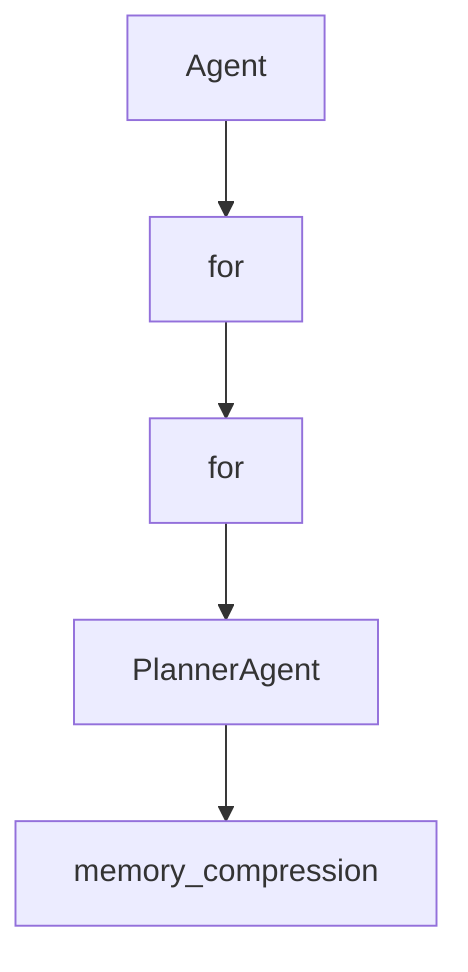

# Chapter 8: Contribution Workflow and Project Governance

Welcome to **Chapter 8: Contribution Workflow and Project Governance**. In this part of **AgenticSeek Tutorial: Local-First Autonomous Agent Operations**, you will build an intuitive mental model first, then move into concrete implementation details and practical production tradeoffs.


This chapter explains how to contribute effectively while preserving local-first architecture goals.

## Learning Goals

- follow the project's contribution flow from branch to PR
- align new work with privacy-first and modular-agent principles
- contribute new tools and agents without destabilizing routing
- improve docs/tests while keeping operator trust high

## Contribution Workflow

1. Fork and create a focused branch.
2. Implement one coherent improvement per PR.
3. Validate runtime behavior locally.
4. Submit PR with clear context and expected behavior changes.

## Project Governance Principles

From the project contribution guidance, prioritize:

- local-first privacy guarantees
- modular agent architecture with single responsibilities
- tool-level extensibility and testability
- graceful failure handling with meaningful feedback

## High-Impact Contribution Areas

- routing quality and agent-selection improvements
- browser/tool reliability hardening
- cross-platform startup experience and install ergonomics
- docs and troubleshooting clarity improvements

## Source References

- [AgenticSeek Contribution Guide](https://github.com/Fosowl/agenticSeek/blob/main/docs/CONTRIBUTING.md)
- [Open Issues](https://github.com/Fosowl/agenticSeek/issues)
- [Project Discussions](https://github.com/Fosowl/agenticSeek/discussions)

## Summary

You now have an end-to-end view of how to operate and contribute to AgenticSeek responsibly.

Next steps:

- repeat this track on your own hardware profile
- document your provider and model results for reproducibility
- contribute one focused improvement with tests and docs

## Depth Expansion Playbook

## Source Code Walkthrough

### `sources/agents/agent.py`

The `Agent` class in [`sources/agents/agent.py`](https://github.com/Fosowl/agenticSeek/blob/HEAD/sources/agents/agent.py) handles a key part of this chapter's functionality:

```py
random.seed(time.time())

class Agent():
    """
    An abstract class for all agents.
    """
    def __init__(self, name: str,
                       prompt_path:str,
                       provider,
                       verbose=False,
                       browser=None) -> None:
        """
        Args:
            name (str): Name of the agent.
            prompt_path (str): Path to the prompt file for the agent.
            provider: The provider for the LLM.
            recover_last_session (bool, optional): Whether to recover the last conversation. 
            verbose (bool, optional): Enable verbose logging if True. Defaults to False.
            browser: The browser class for web navigation (only for browser agent).
        """
            
        self.agent_name = name
        self.browser = browser
        self.role = None
        self.type = None
        self.current_directory = os.getcwd()
        self.llm = provider 
        self.memory = None
        self.tools = {}
        self.blocks_result = []
        self.success = True
        self.last_answer = ""
```

This class is important because it defines how AgenticSeek Tutorial: Local-First Autonomous Agent Operations implements the patterns covered in this chapter.

### `sources/agents/agent.py`

The `for` class in [`sources/agents/agent.py`](https://github.com/Fosowl/agenticSeek/blob/HEAD/sources/agents/agent.py) handles a key part of this chapter's functionality:

```py
class Agent():
    """
    An abstract class for all agents.
    """
    def __init__(self, name: str,
                       prompt_path:str,
                       provider,
                       verbose=False,
                       browser=None) -> None:
        """
        Args:
            name (str): Name of the agent.
            prompt_path (str): Path to the prompt file for the agent.
            provider: The provider for the LLM.
            recover_last_session (bool, optional): Whether to recover the last conversation. 
            verbose (bool, optional): Enable verbose logging if True. Defaults to False.
            browser: The browser class for web navigation (only for browser agent).
        """
            
        self.agent_name = name
        self.browser = browser
        self.role = None
        self.type = None
        self.current_directory = os.getcwd()
        self.llm = provider 
        self.memory = None
        self.tools = {}
        self.blocks_result = []
        self.success = True
        self.last_answer = ""
        self.last_reasoning = ""
        self.status_message = "Haven't started yet"
```

This class is important because it defines how AgenticSeek Tutorial: Local-First Autonomous Agent Operations implements the patterns covered in this chapter.

### `sources/agents/agent.py`

The `for` class in [`sources/agents/agent.py`](https://github.com/Fosowl/agenticSeek/blob/HEAD/sources/agents/agent.py) handles a key part of this chapter's functionality:

```py
class Agent():
    """
    An abstract class for all agents.
    """
    def __init__(self, name: str,
                       prompt_path:str,
                       provider,
                       verbose=False,
                       browser=None) -> None:
        """
        Args:
            name (str): Name of the agent.
            prompt_path (str): Path to the prompt file for the agent.
            provider: The provider for the LLM.
            recover_last_session (bool, optional): Whether to recover the last conversation. 
            verbose (bool, optional): Enable verbose logging if True. Defaults to False.
            browser: The browser class for web navigation (only for browser agent).
        """
            
        self.agent_name = name
        self.browser = browser
        self.role = None
        self.type = None
        self.current_directory = os.getcwd()
        self.llm = provider 
        self.memory = None
        self.tools = {}
        self.blocks_result = []
        self.success = True
        self.last_answer = ""
        self.last_reasoning = ""
        self.status_message = "Haven't started yet"
```

This class is important because it defines how AgenticSeek Tutorial: Local-First Autonomous Agent Operations implements the patterns covered in this chapter.

### `sources/agents/planner_agent.py`

The `PlannerAgent` class in [`sources/agents/planner_agent.py`](https://github.com/Fosowl/agenticSeek/blob/HEAD/sources/agents/planner_agent.py) handles a key part of this chapter's functionality:

```py
from sources.memory import Memory

class PlannerAgent(Agent):
    def __init__(self, name, prompt_path, provider, verbose=False, browser=None):
        """
        The planner agent is a special agent that divides and conquers the task.
        """
        super().__init__(name, prompt_path, provider, verbose, None)
        self.tools = {
            "json": Tools()
        }
        self.tools['json'].tag = "json"
        self.browser = browser
        self.agents = {
            "coder": CoderAgent(name, "prompts/base/coder_agent.txt", provider, verbose=False),
            "file": FileAgent(name, "prompts/base/file_agent.txt", provider, verbose=False),
            "web": BrowserAgent(name, "prompts/base/browser_agent.txt", provider, verbose=False, browser=browser),
            "casual": CasualAgent(name, "prompts/base/casual_agent.txt", provider, verbose=False)
        }
        self.role = "planification"
        self.type = "planner_agent"
        self.memory = Memory(self.load_prompt(prompt_path),
                                recover_last_session=False, # session recovery in handled by the interaction class
                                memory_compression=False,
                                model_provider=provider.get_model_name())
        self.logger = Logger("planner_agent.log")
    
    def get_task_names(self, text: str) -> List[str]:
        """
        Extracts task names from the given text.
        This method processes a multi-line string, where each line may represent a task name.
        containing '##' or starting with a digit. The valid task names are collected and returned.
```

This class is important because it defines how AgenticSeek Tutorial: Local-First Autonomous Agent Operations implements the patterns covered in this chapter.


## How These Components Connect


