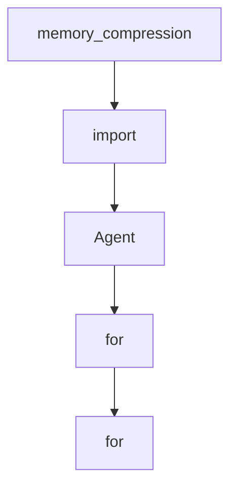

# Chapter 8: Contribution Workflow and Project Governance

Welcome to **Chapter 8: Contribution Workflow and Project Governance**. In this part of **AgenticSeek Tutorial: Local-First Autonomous Agent Operations**, you will build an intuitive mental model first, then move into concrete implementation details and practical production tradeoffs.


This chapter explains how to contribute effectively while preserving local-first architecture goals.

## Learning Goals

- follow the project's contribution flow from branch to PR
- align new work with privacy-first and modular-agent principles
- contribute new tools and agents without destabilizing routing
- improve docs/tests while keeping operator trust high

## Contribution Workflow

1. Fork and create a focused branch.
2. Implement one coherent improvement per PR.
3. Validate runtime behavior locally.
4. Submit PR with clear context and expected behavior changes.

## Project Governance Principles

From the project contribution guidance, prioritize:

- local-first privacy guarantees
- modular agent architecture with single responsibilities
- tool-level extensibility and testability
- graceful failure handling with meaningful feedback

## High-Impact Contribution Areas

- routing quality and agent-selection improvements
- browser/tool reliability hardening
- cross-platform startup experience and install ergonomics
- docs and troubleshooting clarity improvements

## Source References

- [AgenticSeek Contribution Guide](https://github.com/Fosowl/agenticSeek/blob/main/docs/CONTRIBUTING.md)
- [Open Issues](https://github.com/Fosowl/agenticSeek/issues)
- [Project Discussions](https://github.com/Fosowl/agenticSeek/discussions)

## Summary

You now have an end-to-end view of how to operate and contribute to AgenticSeek responsibly.

Next steps:

- repeat this track on your own hardware profile
- document your provider and model results for reproducibility
- contribute one focused improvement with tests and docs

## Source Code Walkthrough

### `sources/agents/browser_agent.py`

The `memory_compression` class in [`sources/agents/browser_agent.py`](https://github.com/Fosowl/agenticSeek/blob/HEAD/sources/agents/browser_agent.py) handles a key part of this chapter's functionality:

```py
        self.memory = Memory(self.load_prompt(prompt_path),
                        recover_last_session=False, # session recovery in handled by the interaction class
                        memory_compression=False,
                        model_provider=provider.get_model_name() if provider else None)
    
    def get_today_date(self) -> str:
        """Get the date"""
        date_time = date.today()
        return date_time.strftime("%B %d, %Y")

    def extract_links(self, search_result: str) -> List[str]:
        """Extract all links from a sentence."""
        pattern = r'(https?://\S+|www\.\S+)'
        matches = re.findall(pattern, search_result)
        trailing_punct = ".,!?;:)"
        cleaned_links = [link.rstrip(trailing_punct) for link in matches]
        self.logger.info(f"Extracted links: {cleaned_links}")
        return self.clean_links(cleaned_links)
    
    def extract_form(self, text: str) -> List[str]:
        """Extract form written by the LLM in format [input_name](value)"""
        inputs = []
        matches = re.findall(r"\[\w+\]\([^)]+\)", text)
        return matches
        
    def clean_links(self, links: List[str]) -> List[str]:
        """Ensure no '.' at the end of link"""
        links_clean = []
        for link in links:
            link = link.strip()
            if not (link[-1].isalpha() or link[-1].isdigit()):
                links_clean.append(link[:-1])
```

This class is important because it defines how AgenticSeek Tutorial: Local-First Autonomous Agent Operations implements the patterns covered in this chapter.

### `sources/agents/browser_agent.py`

The `import` interface in [`sources/agents/browser_agent.py`](https://github.com/Fosowl/agenticSeek/blob/HEAD/sources/agents/browser_agent.py) handles a key part of this chapter's functionality:

```py
import re
import time
from datetime import date
from typing import List, Tuple, Type, Dict
from enum import Enum
import asyncio

from sources.utility import pretty_print, animate_thinking
from sources.agents.agent import Agent
from sources.tools.searxSearch import searxSearch
from sources.browser import Browser
from sources.logger import Logger
from sources.memory import Memory

class Action(Enum):
    REQUEST_EXIT = "REQUEST_EXIT"
    FORM_FILLED = "FORM_FILLED"
    GO_BACK = "GO_BACK"
    NAVIGATE = "NAVIGATE"
    SEARCH = "SEARCH"
    
class BrowserAgent(Agent):
    def __init__(self, name, prompt_path, provider, verbose=False, browser=None):
        """
        The Browser agent is an agent that navigate the web autonomously in search of answer
        """
        super().__init__(name, prompt_path, provider, verbose, browser)
        self.tools = {
            "web_search": searxSearch(),
        }
```

This interface is important because it defines how AgenticSeek Tutorial: Local-First Autonomous Agent Operations implements the patterns covered in this chapter.

### `sources/agents/agent.py`

The `Agent` class in [`sources/agents/agent.py`](https://github.com/Fosowl/agenticSeek/blob/HEAD/sources/agents/agent.py) handles a key part of this chapter's functionality:

```py
random.seed(time.time())

class Agent():
    """
    An abstract class for all agents.
    """
    def __init__(self, name: str,
                       prompt_path:str,
                       provider,
                       verbose=False,
                       browser=None) -> None:
        """
        Args:
            name (str): Name of the agent.
            prompt_path (str): Path to the prompt file for the agent.
            provider: The provider for the LLM.
            recover_last_session (bool, optional): Whether to recover the last conversation. 
            verbose (bool, optional): Enable verbose logging if True. Defaults to False.
            browser: The browser class for web navigation (only for browser agent).
        """
            
        self.agent_name = name
        self.browser = browser
        self.role = None
        self.type = None
        self.current_directory = os.getcwd()
        self.llm = provider 
        self.memory = None
        self.tools = {}
        self.blocks_result = []
        self.success = True
        self.last_answer = ""
```

This class is important because it defines how AgenticSeek Tutorial: Local-First Autonomous Agent Operations implements the patterns covered in this chapter.

### `sources/agents/agent.py`

The `for` class in [`sources/agents/agent.py`](https://github.com/Fosowl/agenticSeek/blob/HEAD/sources/agents/agent.py) handles a key part of this chapter's functionality:

```py
class Agent():
    """
    An abstract class for all agents.
    """
    def __init__(self, name: str,
                       prompt_path:str,
                       provider,
                       verbose=False,
                       browser=None) -> None:
        """
        Args:
            name (str): Name of the agent.
            prompt_path (str): Path to the prompt file for the agent.
            provider: The provider for the LLM.
            recover_last_session (bool, optional): Whether to recover the last conversation. 
            verbose (bool, optional): Enable verbose logging if True. Defaults to False.
            browser: The browser class for web navigation (only for browser agent).
        """
            
        self.agent_name = name
        self.browser = browser
        self.role = None
        self.type = None
        self.current_directory = os.getcwd()
        self.llm = provider 
        self.memory = None
        self.tools = {}
        self.blocks_result = []
        self.success = True
        self.last_answer = ""
        self.last_reasoning = ""
        self.status_message = "Haven't started yet"
```

This class is important because it defines how AgenticSeek Tutorial: Local-First Autonomous Agent Operations implements the patterns covered in this chapter.


## How These Components Connect


