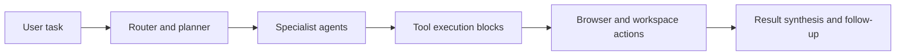

# AgenticSeek Tutorial: Local-First Autonomous Agent Operations

> Learn how to use `Fosowl/agenticSeek` to run multi-agent planning, browsing, and coding workflows with local model support, Docker-first runtime defaults, and practical operator guardrails.

## Why This Track Matters

AgenticSeek is one of the larger local-first autonomous-agent projects targeting end-to-end workflows across browsing, coding, and file operations without mandatory cloud dependencies.

This track focuses on:

- reliable local setup across Docker web mode and CLI mode
- clear understanding of the agent-routing architecture
- safe runtime configuration of providers, workspace paths, and browser automation
- practical operations and troubleshooting patterns for day-to-day usage

## Current Snapshot (auto-updated)

- repository: [`Fosowl/agenticSeek`](https://github.com/Fosowl/agenticSeek)
- stars: about **25.0k**
- latest release: **none tagged** (rolling `main`)
- recent push activity: **November 15, 2025**
- project positioning: fully local Manus-style autonomous assistant with multi-agent routing

## Mental Model

## Chapter Guide

| Chapter | Key Question | Outcome |
|:--------|:-------------|:--------|
| [01 - Getting Started](01-getting-started.md) | How do I boot a working local AgenticSeek setup quickly? | Stable baseline |
| [02 - Architecture and Routing System](02-architecture-and-routing-system.md) | How do routing and specialist agents coordinate? | Strong system mental model |
| [03 - Installation, Runtime, and Provider Setup](03-installation-runtime-and-provider-setup.md) | How do I configure `.env` and `config.ini` safely? | Reproducible configuration |
| [04 - Docker Web Mode and CLI Operations](04-docker-web-mode-and-cli-operations.md) | How do I choose and run web mode vs CLI mode? | Reliable operations flow |
| [05 - Tools, Browser Automation, and Workspace Governance](05-tools-browser-automation-and-workspace-governance.md) | How do tool execution and file access work safely? | Better operational safety |
| [06 - Model Strategy and Remote Server Mode](06-model-strategy-and-remote-server-mode.md) | How do local, API, and self-hosted server modes differ? | Better provider decisions |
| [07 - Troubleshooting and Reliability Playbook](07-troubleshooting-and-reliability-playbook.md) | How do I diagnose common runtime failures fast? | Faster incident recovery |
| [08 - Contribution Workflow and Project Governance](08-contribution-workflow-and-project-governance.md) | How do I contribute without breaking stability? | Contributor readiness |

## What You Will Learn

- how to run AgenticSeek in local-first production-like loops
- how to tune provider/runtime settings for your hardware constraints
- how to reduce risk in autonomous browser and file operations
- how to contribute with clear architecture and testing expectations

## Source References

- [AgenticSeek Repository](https://github.com/Fosowl/agenticSeek)
- [AgenticSeek README](https://github.com/Fosowl/agenticSeek/blob/main/README.md)
- [Contribution Guide](https://github.com/Fosowl/agenticSeek/blob/main/docs/CONTRIBUTING.md)
- [Docker Compose Runtime](https://github.com/Fosowl/agenticSeek/blob/main/docker-compose.yml)
- [Default Config](https://github.com/Fosowl/agenticSeek/blob/main/config.ini)

## Related Tutorials

- [OpenCode Tutorial](../opencode-tutorial/)
- [Mini-SWE-Agent Tutorial](../mini-swe-agent-tutorial/)
- [Qwen-Agent Tutorial](../qwen-agent-tutorial/)
- [OpenHands Tutorial](../openhands-tutorial/)

---

Start with [Chapter 1: Getting Started](01-getting-started.md).

## Navigation & Backlinks

- [Start Here: Chapter 1: Getting Started](01-getting-started.md)
- [Back to Main Catalog](../../README.md#-tutorial-catalog)
- [Browse A-Z Tutorial Directory](../../discoverability/tutorial-directory.md)
- [Search by Intent](../../discoverability/query-hub.md)
- [Explore Category Hubs](../../README.md#category-hubs)

## Full Chapter Map

1. [Chapter 1: Getting Started](01-getting-started.md)
2. [Chapter 2: Architecture and Routing System](02-architecture-and-routing-system.md)
3. [Chapter 3: Installation, Runtime, and Provider Setup](03-installation-runtime-and-provider-setup.md)
4. [Chapter 4: Docker Web Mode and CLI Operations](04-docker-web-mode-and-cli-operations.md)
5. [Chapter 5: Tools, Browser Automation, and Workspace Governance](05-tools-browser-automation-and-workspace-governance.md)
6. [Chapter 6: Model Strategy and Remote Server Mode](06-model-strategy-and-remote-server-mode.md)
7. [Chapter 7: Troubleshooting and Reliability Playbook](07-troubleshooting-and-reliability-playbook.md)
8. [Chapter 8: Contribution Workflow and Project Governance](08-contribution-workflow-and-project-governance.md)

*Generated by [AI Codebase Knowledge Builder](https://github.com/The-Pocket/Tutorial-Codebase-Knowledge)*
