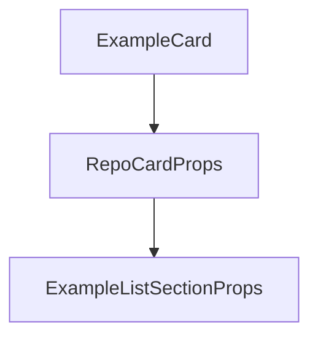

# Chapter 1: Getting Started

Welcome to **Chapter 1: Getting Started**. In this part of **AGENTS.md Tutorial: Open Standard for Coding-Agent Guidance in Repositories**, you will build an intuitive mental model first, then move into concrete implementation details and practical production tradeoffs.


This chapter gets your first AGENTS.md in place with immediate practical value.

## Learning Goals

- create a minimal AGENTS.md scaffold
- document dev/test/PR expectations clearly
- avoid vague or contradictory instructions
- validate that agent behavior improves in practice

## Fast Start Pattern

- add `AGENTS.md` at repository root
- include dev environment, test, and PR guidance first
- keep instructions concrete and executable

## Source References

- [AGENTS.md README](https://github.com/agentsmd/agents.md/blob/main/README.md)
- [Sample AGENTS.md File](https://github.com/agentsmd/agents.md/blob/main/AGENTS.md)

## Summary

You now have a usable AGENTS.md baseline.

Next: [Chapter 2: Section Design and Instruction Quality](02-section-design-and-instruction-quality.md)

## Depth Expansion Playbook

## Source Code Walkthrough

### `components/ExampleListSection.tsx`

The `ExampleCard` function in [`components/ExampleListSection.tsx`](https://github.com/agentsmd/agents.md/blob/HEAD/components/ExampleListSection.tsx) handles a key part of this chapter's functionality:

```tsx
    <div className="grid grid-cols-1 sm:grid-cols-2 md:grid-cols-3 lg:grid-cols-4 gap-4">
      {REPOS.map((repo, key) => (
        <ExampleCard
          key={repo.name}
          repo={repo}
          avatars={contributorsByRepo[repo.name]?.avatars ?? []}
          hideOnSmall={key > 3}
          hideOnMedium={key > 2}
          totalContributors={
            contributorsByRepo[repo.name]?.total ??
            contributorsByRepo[repo.name]?.avatars.length ??
            0
          }
        />
      ))}
    </div>
    <div className="flex justify-center mt-6">
      <a
        href="https://github.com/search?q=path%3AAGENTS.md+NOT+is%3Afork+NOT+is%3Aarchived&type=code"
        className="text-base font-medium underline hover:no-underline"
      >
        View 60k+ examples on GitHub
      </a>
    </div>
  </>
);

const ExampleListSection = ({
  contributorsByRepo = {},
  standalone = false,
}: ExampleListSectionProps) => {
  if (standalone) {
```

This function is important because it defines how AGENTS.md Tutorial: Open Standard for Coding-Agent Guidance in Repositories implements the patterns covered in this chapter.

### `components/ExampleListSection.tsx`

The `RepoCardProps` interface in [`components/ExampleListSection.tsx`](https://github.com/agentsmd/agents.md/blob/HEAD/components/ExampleListSection.tsx) handles a key part of this chapter's functionality:

```tsx
};

interface RepoCardProps {
  /** e.g. "openai/codex" */
  name: string;
  /** Short 1-2 line summary */
  description: string;
  /** Primary language */
  language: string;
}

/** Hard-coded examples used for the marketing page. */
const REPOS: RepoCardProps[] = [
  {
    name: "openai/codex",
    description: "General-purpose CLI tooling for AI coding agents.",
    language: "Rust",
  },
  {
    name: "apache/airflow",
    description:
      "Platform to programmatically author, schedule, and monitor workflows.",
    language: "Python",
  },
  {
    name: "temporalio/sdk-java",
    description:
      "Java SDK for Temporal, workflow orchestration defined in code.",
    language: "Java",
  },
  {
    name: "PlutoLang/Pluto",
```

This interface is important because it defines how AGENTS.md Tutorial: Open Standard for Coding-Agent Guidance in Repositories implements the patterns covered in this chapter.

### `components/ExampleListSection.tsx`

The `ExampleListSectionProps` interface in [`components/ExampleListSection.tsx`](https://github.com/agentsmd/agents.md/blob/HEAD/components/ExampleListSection.tsx) handles a key part of this chapter's functionality:

```tsx
];

interface ExampleListSectionProps {
  contributorsByRepo?: Record<string, { avatars: string[]; total: number }>;
  standalone?: boolean; // if false wraps with its own section
}

const InnerGrid = ({
  contributorsByRepo = {},
}: {
  contributorsByRepo: Record<string, { avatars: string[]; total: number }>;
}) => (
  <>
    <div className="grid grid-cols-1 sm:grid-cols-2 md:grid-cols-3 lg:grid-cols-4 gap-4">
      {REPOS.map((repo, key) => (
        <ExampleCard
          key={repo.name}
          repo={repo}
          avatars={contributorsByRepo[repo.name]?.avatars ?? []}
          hideOnSmall={key > 3}
          hideOnMedium={key > 2}
          totalContributors={
            contributorsByRepo[repo.name]?.total ??
            contributorsByRepo[repo.name]?.avatars.length ??
            0
          }
        />
      ))}
    </div>
    <div className="flex justify-center mt-6">
      <a
        href="https://github.com/search?q=path%3AAGENTS.md+NOT+is%3Afork+NOT+is%3Aarchived&type=code"
```

This interface is important because it defines how AGENTS.md Tutorial: Open Standard for Coding-Agent Guidance in Repositories implements the patterns covered in this chapter.


## How These Components Connect


