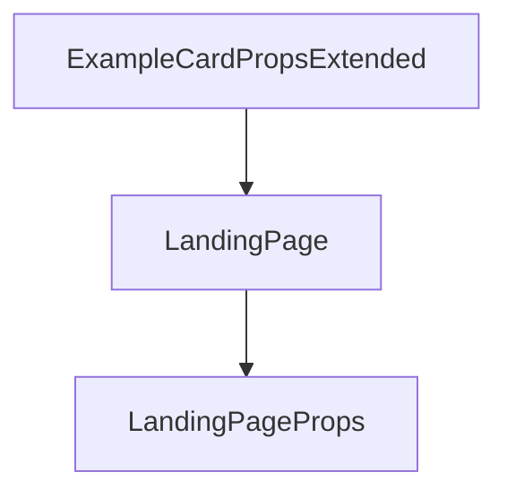

# Chapter 2: Section Design and Instruction Quality

Welcome to **Chapter 2: Section Design and Instruction Quality**. In this part of **AGENTS.md Tutorial: Open Standard for Coding-Agent Guidance in Repositories**, you will build an intuitive mental model first, then move into concrete implementation details and practical production tradeoffs.


This chapter covers how to write instructions that agents can execute reliably.

## Learning Goals

- choose high-impact section categories
- write deterministic operational instructions
- avoid ambiguous language and hidden assumptions
- make tradeoffs explicit for better agent choices

## High-Signal Sections

- environment/tooling setup expectations
- build/test/lint command requirements
- PR and branching conventions
- safety constraints and prohibited actions

## Source References

- [AGENTS.md README Example](https://github.com/agentsmd/agents.md/blob/main/README.md)
- [AGENTS.md Project Site](https://agents.md)

## Summary

You now understand how section quality directly impacts agent behavior quality.

Next: [Chapter 3: Tool-Agnostic Portability Patterns](03-tool-agnostic-portability-patterns.md)

## Depth Expansion Playbook

## Source Code Walkthrough

### `components/ExampleListSection.tsx`

The `ExampleCardPropsExtended` interface in [`components/ExampleListSection.tsx`](https://github.com/agentsmd/agents.md/blob/HEAD/components/ExampleListSection.tsx) handles a key part of this chapter's functionality:

```tsx
};

interface ExampleCardPropsExtended {
  repo: RepoCardProps;
  avatars?: string[];
  totalContributors?: number;
  hideOnSmall?: boolean;
  hideOnMedium?: boolean;
}

function ExampleCard({
  repo,
  avatars = [],
  totalContributors = 0,
  hideOnSmall = false,
  hideOnMedium = false,
}: ExampleCardPropsExtended) {
  // Show top 3 contributors; ensure highest-ranked appears rightmost.
  const orderedAvatars = avatars.slice(0, 3).reverse();
  // Badge background color based on GitHub language colors
  const badgeBg = LANG_BG_COLORS[repo.language] ?? "#6b7280";

  return (
    <a
      href={`https://github.com/${repo.name}/blob/-/AGENTS.md`}
      target="_blank"
      rel="noopener noreferrer"
      className={`lg:aspect-video bg-white dark:bg-black border border-gray-200 dark:border-gray-700 rounded-lg shadow-sm flex flex-col justify-between p-4 hover:bg-gray-50 dark:hover:bg-gray-800 transition-colors ${
        hideOnSmall
          ? "hidden lg:flex"
          : hideOnMedium
          ? "flex md:hidden lg:flex"
```

This interface is important because it defines how AGENTS.md Tutorial: Open Standard for Coding-Agent Guidance in Repositories implements the patterns covered in this chapter.

### `pages/index.tsx`

The `LandingPage` function in [`pages/index.tsx`](https://github.com/agentsmd/agents.md/blob/HEAD/pages/index.tsx) handles a key part of this chapter's functionality:

```tsx
import AboutSection from "@/components/AboutSection";

interface LandingPageProps {
  contributorsByRepo: Record<string, { avatars: string[]; total: number }>;
}

export default function LandingPage({ contributorsByRepo }: LandingPageProps) {
  return (
    <div className="flex flex-col min-h-screen items-stretch font-sans">
      <main>
        <Hero />
        <WhySection />
        <CompatibilitySection />
        <ExamplesSection contributorsByRepo={contributorsByRepo} />
        <HowToUseSection />
        <div className="flex-1 flex flex-col gap-4 mt-16">
          <AboutSection />
          <FAQSection />
        </div>
      </main>

      <Footer />
    </div>
  );
}

// Simple in-memory cache. In production this avoids refetching during
// the Node.js process lifetime, while in development it prevents hitting
// the GitHub rate-limit when you refresh the page a few times.
let cachedContributors:
  | {
      data: Record<string, { avatars: string[]; total: number }>;
```

This function is important because it defines how AGENTS.md Tutorial: Open Standard for Coding-Agent Guidance in Repositories implements the patterns covered in this chapter.

### `pages/index.tsx`

The `LandingPageProps` interface in [`pages/index.tsx`](https://github.com/agentsmd/agents.md/blob/HEAD/pages/index.tsx) handles a key part of this chapter's functionality:

```tsx
import AboutSection from "@/components/AboutSection";

interface LandingPageProps {
  contributorsByRepo: Record<string, { avatars: string[]; total: number }>;
}

export default function LandingPage({ contributorsByRepo }: LandingPageProps) {
  return (
    <div className="flex flex-col min-h-screen items-stretch font-sans">
      <main>
        <Hero />
        <WhySection />
        <CompatibilitySection />
        <ExamplesSection contributorsByRepo={contributorsByRepo} />
        <HowToUseSection />
        <div className="flex-1 flex flex-col gap-4 mt-16">
          <AboutSection />
          <FAQSection />
        </div>
      </main>

      <Footer />
    </div>
  );
}

// Simple in-memory cache. In production this avoids refetching during
// the Node.js process lifetime, while in development it prevents hitting
// the GitHub rate-limit when you refresh the page a few times.
let cachedContributors:
  | {
      data: Record<string, { avatars: string[]; total: number }>;
```

This interface is important because it defines how AGENTS.md Tutorial: Open Standard for Coding-Agent Guidance in Repositories implements the patterns covered in this chapter.


## How These Components Connect


