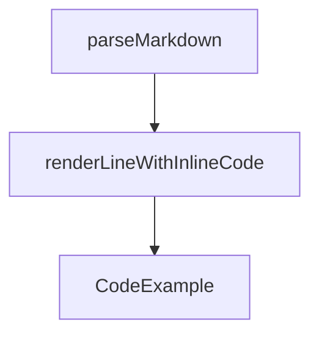

# Chapter 3: Tool-Agnostic Portability Patterns

Welcome to **Chapter 3: Tool-Agnostic Portability Patterns**. In this part of **AGENTS.md Tutorial: Open Standard for Coding-Agent Guidance in Repositories**, you will build an intuitive mental model first, then move into concrete implementation details and practical production tradeoffs.


This chapter explains how to keep instructions effective across multiple coding-agent tools.

## Learning Goals

- avoid vendor-specific lock-in where unnecessary
- write commands and policies in neutral terms
- preserve behavior consistency across agents
- maintain one source of truth for project guidance

## Portability Strategy

- prefer universal shell commands and repo paths
- isolate tool-specific notes to explicit sections
- keep core expectations independent of any single agent

## Source References

- [AGENTS.md Repository](https://github.com/agentsmd/agents.md)
- [AGENTS.md File in This Repo](https://github.com/agentsmd/agents.md/blob/main/AGENTS.md)

## Summary

You now have a pattern for multi-agent portability without duplicated docs.

Next: [Chapter 4: Repository Structure and Scope Strategy](04-repository-structure-and-scope-strategy.md)

## Depth Expansion Playbook

## Source Code Walkthrough

### `components/CodeExample.tsx`

The `parseMarkdown` function in [`components/CodeExample.tsx`](https://github.com/agentsmd/agents.md/blob/HEAD/components/CodeExample.tsx) handles a key part of this chapter's functionality:

```tsx
 * Very lightly highlight the Markdown without fully parsing it.
 */
function parseMarkdown(md: string): React.ReactNode[] {
  const lines = md.split("\n");
  const elements: React.ReactNode[] = [];

  for (let i = 0; i < lines.length; i++) {
    const line = lines[i];

    // Handle headers
    if (line.startsWith("# ") || line.startsWith("## ") || line.startsWith("### ")) {
      elements.push(
        <div key={i} className="font-bold">
          {line}
        </div>
      );
    } else if (line.startsWith("- ")) {
      // Handle list items with inline code
      elements.push(
        <div key={i}>
          {renderLineWithInlineCode(line)}
        </div>
      );
    } else if (line.trim() === "") {
      // Handle empty lines
      elements.push(<div key={i}>&nbsp;</div>);
    } else {
      // Handle regular lines with inline code
      elements.push(
        <div key={i}>
          {renderLineWithInlineCode(line)}
        </div>
```

This function is important because it defines how AGENTS.md Tutorial: Open Standard for Coding-Agent Guidance in Repositories implements the patterns covered in this chapter.

### `components/CodeExample.tsx`

The `renderLineWithInlineCode` function in [`components/CodeExample.tsx`](https://github.com/agentsmd/agents.md/blob/HEAD/components/CodeExample.tsx) handles a key part of this chapter's functionality:

```tsx
      elements.push(
        <div key={i}>
          {renderLineWithInlineCode(line)}
        </div>
      );
    } else if (line.trim() === "") {
      // Handle empty lines
      elements.push(<div key={i}>&nbsp;</div>);
    } else {
      // Handle regular lines with inline code
      elements.push(
        <div key={i}>
          {renderLineWithInlineCode(line)}
        </div>
      );
    }
  }

  return elements;
}

/**
 * Render a line with inline code highlighting
 */
function renderLineWithInlineCode(line: string): React.ReactNode {
  const parts = line.split(/(`[^`]+`)/g);

  return parts.map((part, index) => {
    if (part.startsWith("`") && part.endsWith("`")) {
      // This is inline code
      return (
        <span key={index} className="bg-gray-200 dark:bg-gray-800 px-1 rounded">
```

This function is important because it defines how AGENTS.md Tutorial: Open Standard for Coding-Agent Guidance in Repositories implements the patterns covered in this chapter.

### `components/CodeExample.tsx`

The `CodeExample` function in [`components/CodeExample.tsx`](https://github.com/agentsmd/agents.md/blob/HEAD/components/CodeExample.tsx) handles a key part of this chapter's functionality:

```tsx
import CopyIcon from "./icons/CopyIcon";

interface CodeExampleProps {
  /** Markdown content to display; falls back to default example if not provided */
  code?: string;
  /** Optional URL for "View on GitHub" link */
  href?: string;
  /** If true, render only the code block without the section wrapper */
  compact?: boolean;
  /** Override Tailwind height classes for the <pre> block */
  heightClass?: string;

  /**
   * When true, vertically center the content and copy button – useful for
   * single-line shell commands shown inside a short container (e.g. FAQ).
   */
  centerVertically?: boolean;
}

export const HERO_AGENTS_MD = `# AGENTS.md

## Setup commands
- Install deps: \`pnpm install\`
- Start dev server: \`pnpm dev\`
- Run tests: \`pnpm test\`

## Code style
- TypeScript strict mode
- Single quotes, no semicolons
- Use functional patterns where possible`;

const EXAMPLE_AGENTS_MD = `# Sample AGENTS.md file
```

This function is important because it defines how AGENTS.md Tutorial: Open Standard for Coding-Agent Guidance in Repositories implements the patterns covered in this chapter.


## How These Components Connect


