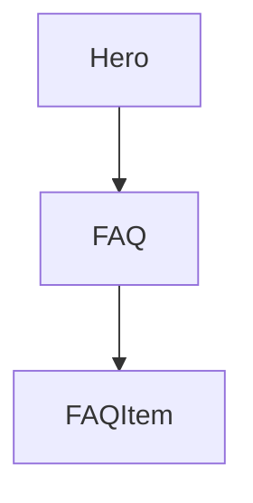

# Chapter 3: Tool-Agnostic Portability Patterns

Welcome to **Chapter 3: Tool-Agnostic Portability Patterns**. In this part of **AGENTS.md Tutorial: Open Standard for Coding-Agent Guidance in Repositories**, you will build an intuitive mental model first, then move into concrete implementation details and practical production tradeoffs.


This chapter explains how to keep instructions effective across multiple coding-agent tools.

## Learning Goals

- avoid vendor-specific lock-in where unnecessary
- write commands and policies in neutral terms
- preserve behavior consistency across agents
- maintain one source of truth for project guidance

## Portability Strategy

- prefer universal shell commands and repo paths
- isolate tool-specific notes to explicit sections
- keep core expectations independent of any single agent

## Source References

- [AGENTS.md Repository](https://github.com/agentsmd/agents.md)
- [AGENTS.md File in This Repo](https://github.com/agentsmd/agents.md/blob/main/AGENTS.md)

## Summary

You now have a pattern for multi-agent portability without duplicated docs.

Next: [Chapter 4: Repository Structure and Scope Strategy](04-repository-structure-and-scope-strategy.md)

## Source Code Walkthrough

### `AGENTS.md`

The portability story is grounded in the [`AGENTS.md`](https://github.com/agentsmd/agents.md/blob/HEAD/AGENTS.md) specification file itself, which deliberately avoids any tool-specific syntax. Plain Markdown headings are the only required structure — no YAML front matter, no proprietary directives — which is what makes the format portable across Claude Code, Codex, Copilot, Cursor, and other agents.

Reviewing the upstream `AGENTS.md` shows which conventions are tool-agnostic (headings, bullet lists, fenced code blocks for commands) versus optional enhancements that some tools support.
            .
          </p>

```

This function is important because it defines how AGENTS.md Tutorial: Open Standard for Coding-Agent Guidance in Repositories implements the patterns covered in this chapter.

### `components/FAQSection.tsx`

The `FAQ` function in [`components/FAQSection.tsx`](https://github.com/agentsmd/agents.md/blob/HEAD/components/FAQSection.tsx) handles a key part of this chapter's functionality:

```tsx
import CodeExample from "@/components/CodeExample";

interface FAQItem {
  question: string;
  answer: React.ReactNode;
}

export default function FAQ() {
  const faqItems: FAQItem[] = [
    {
      question: "Are there required fields?",
      answer:
        "No. AGENTS.md is just standard Markdown. Use any headings you like; the agent simply parses the text you provide.",
    },
    {
      question: "What if instructions conflict?",
      answer:
        "The closest AGENTS.md to the edited file wins; explicit user chat prompts override everything.",
    },
    {
      question: "Will the agent run testing commands found in AGENTS.md automatically?",
      answer:
        "Yes—if you list them. The agent will attempt to execute relevant programmatic checks and fix failures before finishing the task.",
    },
    {
      question: "Can I update it later?",
      answer: "Absolutely. Treat AGENTS.md as living documentation.",
    },
    {
      question: "How do I migrate existing docs to AGENTS.md?",
      answer: (
        <>
```

This function is important because it defines how AGENTS.md Tutorial: Open Standard for Coding-Agent Guidance in Repositories implements the patterns covered in this chapter.

### `components/FAQSection.tsx`

The `FAQItem` interface in [`components/FAQSection.tsx`](https://github.com/agentsmd/agents.md/blob/HEAD/components/FAQSection.tsx) handles a key part of this chapter's functionality:

```tsx
import CodeExample from "@/components/CodeExample";

interface FAQItem {
  question: string;
  answer: React.ReactNode;
}

export default function FAQ() {
  const faqItems: FAQItem[] = [
    {
      question: "Are there required fields?",
      answer:
        "No. AGENTS.md is just standard Markdown. Use any headings you like; the agent simply parses the text you provide.",
    },
    {
      question: "What if instructions conflict?",
      answer:
        "The closest AGENTS.md to the edited file wins; explicit user chat prompts override everything.",
    },
    {
      question: "Will the agent run testing commands found in AGENTS.md automatically?",
      answer:
        "Yes—if you list them. The agent will attempt to execute relevant programmatic checks and fix failures before finishing the task.",
    },
    {
      question: "Can I update it later?",
      answer: "Absolutely. Treat AGENTS.md as living documentation.",
    },
    {
      question: "How do I migrate existing docs to AGENTS.md?",
      answer: (
        <>
```

This interface is important because it defines how AGENTS.md Tutorial: Open Standard for Coding-Agent Guidance in Repositories implements the patterns covered in this chapter.


## How These Components Connect


