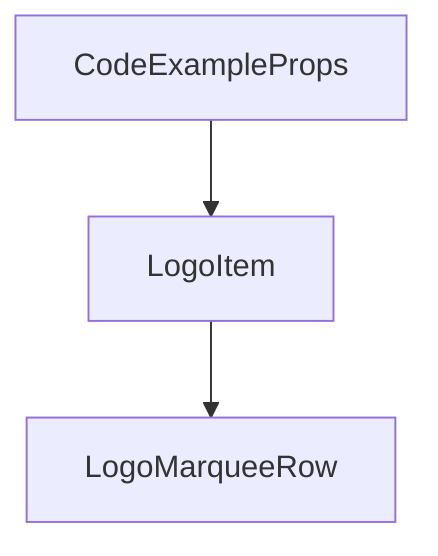

# Chapter 4: Repository Structure and Scope Strategy

Welcome to **Chapter 4: Repository Structure and Scope Strategy**. In this part of **AGENTS.md Tutorial: Open Standard for Coding-Agent Guidance in Repositories**, you will build an intuitive mental model first, then move into concrete implementation details and practical production tradeoffs.


This chapter focuses on scoping AGENTS.md guidance in complex repositories.

## Learning Goals

- define root-level guidance clearly
- handle subproject-specific overrides safely
- reduce conflicts in monorepos
- keep ownership boundaries explicit

## Scope Patterns

- root AGENTS.md for global policies
- subdirectory AGENTS.md where workflows diverge
- explicit precedence and conflict-resolution rules

## Source References

- [AGENTS.md Standard Repository](https://github.com/agentsmd/agents.md)
- [AGENTS.md Website](https://agents.md)

## Summary

You now can scale AGENTS.md patterns from small repos to monorepos.

Next: [Chapter 5: Testing, Linting, and CI Alignment](05-testing-linting-and-ci-alignment.md)

## Depth Expansion Playbook

## Source Code Walkthrough

### `components/CodeExample.tsx`

The `CodeExampleProps` interface in [`components/CodeExample.tsx`](https://github.com/agentsmd/agents.md/blob/HEAD/components/CodeExample.tsx) handles a key part of this chapter's functionality:

```tsx
import CopyIcon from "./icons/CopyIcon";

interface CodeExampleProps {
  /** Markdown content to display; falls back to default example if not provided */
  code?: string;
  /** Optional URL for "View on GitHub" link */
  href?: string;
  /** If true, render only the code block without the section wrapper */
  compact?: boolean;
  /** Override Tailwind height classes for the <pre> block */
  heightClass?: string;

  /**
   * When true, vertically center the content and copy button – useful for
   * single-line shell commands shown inside a short container (e.g. FAQ).
   */
  centerVertically?: boolean;
}

export const HERO_AGENTS_MD = `# AGENTS.md

## Setup commands
- Install deps: \`pnpm install\`
- Start dev server: \`pnpm dev\`
- Run tests: \`pnpm test\`

## Code style
- TypeScript strict mode
- Single quotes, no semicolons
- Use functional patterns where possible`;

const EXAMPLE_AGENTS_MD = `# Sample AGENTS.md file
```

This interface is important because it defines how AGENTS.md Tutorial: Open Standard for Coding-Agent Guidance in Repositories implements the patterns covered in this chapter.

### `components/CompatibilitySection.tsx`

The `LogoItem` function in [`components/CompatibilitySection.tsx`](https://github.com/agentsmd/agents.md/blob/HEAD/components/CompatibilitySection.tsx) handles a key part of this chapter's functionality:

```tsx
};

type LogoItemProps = AgentEntry & {
  variant?: "marquee" | "grid";
};

function LogoItem({
  name,
  url,
  from,
  imageSrc,
  imageSrcLight,
  imageSrcDark,
  variant = "marquee",
}: LogoItemProps) {
  const baseClasses =
    variant === "grid"
      ? "flex h-full w-full min-w-0 items-center gap-4"
      : "flex h-20 min-w-[280px] items-center gap-4 pr-10";

  return (
    <a
      href={url}
      target="_blank"
      rel="noopener noreferrer"
      className={baseClasses}
    >
      <div className="flex h-16 w-16 items-center justify-center">
        {imageSrcLight && imageSrcDark ? (
          <>
            <Image
              src={imageSrcLight}
```

This function is important because it defines how AGENTS.md Tutorial: Open Standard for Coding-Agent Guidance in Repositories implements the patterns covered in this chapter.

### `components/CompatibilitySection.tsx`

The `LogoMarqueeRow` function in [`components/CompatibilitySection.tsx`](https://github.com/agentsmd/agents.md/blob/HEAD/components/CompatibilitySection.tsx) handles a key part of this chapter's functionality:

```tsx
}

function LogoMarqueeRow({
  agents,
  isActive,
  duration,
  offset,
}: {
  agents: AgentEntry[];
  isActive: boolean;
  duration: number;
  offset?: number;
}) {
  const doubledAgents = useMemo(() => [...agents, ...agents], [agents]);

  if (doubledAgents.length === 0) {
    return null;
  }

  const trackStyle = {
    animationPlayState: isActive ? "running" : "paused",
    animationDelay: offset ? `${offset}s` : undefined,
    "--marquee-duration": `${duration}s`,
  } as React.CSSProperties;

  return (
    <div className="w-full overflow-hidden">
      <div
        className="logo-marquee-track flex items-center gap-8 py-3"
        style={trackStyle}
      >
        {doubledAgents.map((agent, index) => (
```

This function is important because it defines how AGENTS.md Tutorial: Open Standard for Coding-Agent Guidance in Repositories implements the patterns covered in this chapter.


## How These Components Connect


