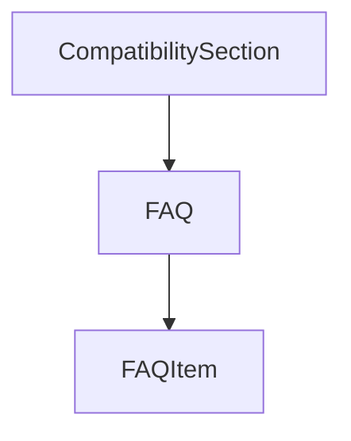

# Chapter 5: Testing, Linting, and CI Alignment

Welcome to **Chapter 5: Testing, Linting, and CI Alignment**. In this part of **AGENTS.md Tutorial: Open Standard for Coding-Agent Guidance in Repositories**, you will build an intuitive mental model first, then move into concrete implementation details and practical production tradeoffs.


This chapter connects AGENTS.md instructions to actual quality gates.

## Learning Goals

- encode required checks in agent instructions
- map local commands to CI workflows
- reduce false-positive “task complete” outcomes
- ensure agent outputs are merge-ready

## Alignment Checklist

- explicit lint/test/build commands
- required pass criteria before PR submission
- path-specific test guidance for monorepos

## Source References

- [AGENTS.md README Example Sections](https://github.com/agentsmd/agents.md/blob/main/README.md)
- [AGENTS.md README (Testing Guidance Example)](https://github.com/agentsmd/agents.md/blob/main/README.md)

## Summary

You now can align AGENTS.md behavior with enforceable CI outcomes.

Next: [Chapter 6: Team Rollout and Adoption Playbook](06-team-rollout-and-adoption-playbook.md)

## Depth Expansion Playbook

## Source Code Walkthrough

### `components/CompatibilitySection.tsx`

The `CompatibilitySection` function in [`components/CompatibilitySection.tsx`](https://github.com/agentsmd/agents.md/blob/HEAD/components/CompatibilitySection.tsx) handles a key part of this chapter's functionality:

```tsx
}

export default function CompatibilitySection() {
  const containerRef = useRef<HTMLDivElement | null>(null);
  const [isInView, setIsInView] = useState(false);
  const [shuffledAgents, setShuffledAgents] = useState<AgentEntry[]>(agents);
  const [showGrid, setShowGrid] = useState(false);

  useEffect(() => {
    setShuffledAgents(shuffleAgents(agents));
  }, []);

  useEffect(() => {
    if (showGrid) {
      setIsInView(false);
      return;
    }

    const node = containerRef.current;
    if (!node) {
      return;
    }

    const observer = new IntersectionObserver(
      ([entry]) => {
        setIsInView(entry.isIntersecting && entry.intersectionRatio > 0);
      },
      {
        threshold: 0,
      }
    );

```

This function is important because it defines how AGENTS.md Tutorial: Open Standard for Coding-Agent Guidance in Repositories implements the patterns covered in this chapter.

### `components/FAQSection.tsx`

The `FAQ` function in [`components/FAQSection.tsx`](https://github.com/agentsmd/agents.md/blob/HEAD/components/FAQSection.tsx) handles a key part of this chapter's functionality:

```tsx
import CodeExample from "@/components/CodeExample";

interface FAQItem {
  question: string;
  answer: React.ReactNode;
}

export default function FAQ() {
  const faqItems: FAQItem[] = [
    {
      question: "Are there required fields?",
      answer:
        "No. AGENTS.md is just standard Markdown. Use any headings you like; the agent simply parses the text you provide.",
    },
    {
      question: "What if instructions conflict?",
      answer:
        "The closest AGENTS.md to the edited file wins; explicit user chat prompts override everything.",
    },
    {
      question: "Will the agent run testing commands found in AGENTS.md automatically?",
      answer:
        "Yes—if you list them. The agent will attempt to execute relevant programmatic checks and fix failures before finishing the task.",
    },
    {
      question: "Can I update it later?",
      answer: "Absolutely. Treat AGENTS.md as living documentation.",
    },
    {
      question: "How do I migrate existing docs to AGENTS.md?",
      answer: (
        <>
```

This function is important because it defines how AGENTS.md Tutorial: Open Standard for Coding-Agent Guidance in Repositories implements the patterns covered in this chapter.

### `components/FAQSection.tsx`

The `FAQItem` interface in [`components/FAQSection.tsx`](https://github.com/agentsmd/agents.md/blob/HEAD/components/FAQSection.tsx) handles a key part of this chapter's functionality:

```tsx
import CodeExample from "@/components/CodeExample";

interface FAQItem {
  question: string;
  answer: React.ReactNode;
}

export default function FAQ() {
  const faqItems: FAQItem[] = [
    {
      question: "Are there required fields?",
      answer:
        "No. AGENTS.md is just standard Markdown. Use any headings you like; the agent simply parses the text you provide.",
    },
    {
      question: "What if instructions conflict?",
      answer:
        "The closest AGENTS.md to the edited file wins; explicit user chat prompts override everything.",
    },
    {
      question: "Will the agent run testing commands found in AGENTS.md automatically?",
      answer:
        "Yes—if you list them. The agent will attempt to execute relevant programmatic checks and fix failures before finishing the task.",
    },
    {
      question: "Can I update it later?",
      answer: "Absolutely. Treat AGENTS.md as living documentation.",
    },
    {
      question: "How do I migrate existing docs to AGENTS.md?",
      answer: (
        <>
```

This interface is important because it defines how AGENTS.md Tutorial: Open Standard for Coding-Agent Guidance in Repositories implements the patterns covered in this chapter.


## How These Components Connect


