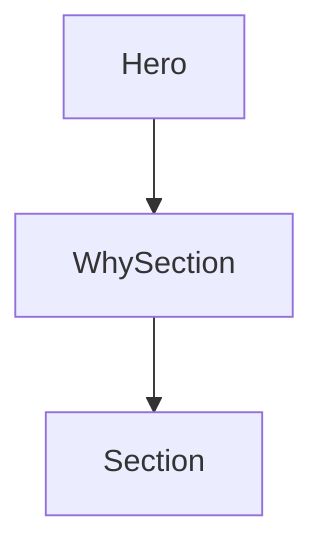

# Chapter 6: Team Rollout and Adoption Playbook

Welcome to **Chapter 6: Team Rollout and Adoption Playbook**. In this part of **AGENTS.md Tutorial: Open Standard for Coding-Agent Guidance in Repositories**, you will build an intuitive mental model first, then move into concrete implementation details and practical production tradeoffs.


This chapter covers adoption sequencing for teams introducing AGENTS.md.

## Learning Goals

- launch AGENTS.md without workflow disruption
- train contributors on new expectations
- measure impact on PR quality and cycle time
- iterate instruction quality from real usage feedback

## Rollout Steps

1. start with one high-traffic repository
2. add baseline sections and required checks
3. collect failure modes from agent runs
4. refine wording and expand to more repos

## Source References

- [AGENTS.md Project Site](https://agents.md)
- [AGENTS.md Issues](https://github.com/agentsmd/agents.md/issues)

## Summary

You now have a practical rollout path for organization-wide AGENTS.md adoption.

Next: [Chapter 7: Governance, Versioning, and Drift Control](07-governance-versioning-and-drift-control.md)

## Depth Expansion Playbook

## Source Code Walkthrough

### `components/Hero.tsx`

The `Hero` function in [`components/Hero.tsx`](https://github.com/agentsmd/agents.md/blob/HEAD/components/Hero.tsx) handles a key part of this chapter's functionality:

```tsx
import GitHubIcon from "@/components/icons/GitHubIcon";

export default function Hero() {
  return (
    <header className="px-6 py-20 bg-gray-50 dark:bg-gray-900/40 border-b border-gray-100 dark:border-gray-800">
      <div className="max-w-6xl mx-auto grid grid-cols-1 lg:grid-cols-2 gap-10 items-start">
        {/*
          On large screens we want the primary CTA buttons to align with the
          bottom edge of the code block rendered in the right column. Making
          the left column a full-height flex container and pushing the CTA row
          to the bottom (via `lg:justify-between`) achieves this without
          disturbing the natural flow on small screens where the layout stacks
          vertically.
        */}
        <div className="flex flex-col items-start text-left sm:items-start max-w-prose">
          <h1 className="text-5xl md:text-6xl font-bold tracking-tight">AGENTS.md</h1>

          <p className="mt-2 text-lg leading-relaxed text-gray-700 dark:text-gray-300">
            A simple, open format for guiding coding agents,{" "}
            <br className="hidden sm:block" />
            used by over{" "}
            <a
              href="https://github.com/search?q=path%3AAGENTS.md+NOT+is%3Afork+NOT+is%3Aarchived&type=code"
              target="_blank"
              rel="noopener noreferrer"
              className="underline hover:no-underline"
            >
              60k open-source projects
            </a>
            .
          </p>

```

This function is important because it defines how AGENTS.md Tutorial: Open Standard for Coding-Agent Guidance in Repositories implements the patterns covered in this chapter.

### `components/WhySection.tsx`

The `WhySection` function in [`components/WhySection.tsx`](https://github.com/agentsmd/agents.md/blob/HEAD/components/WhySection.tsx) handles a key part of this chapter's functionality:

```tsx
import LinkIcon from "@/components/icons/LinkIcon";

export default function WhySection() {
  return (
    <Section
      id="why"
      title="Why AGENTS.md?"
      className="pt-24 pb-12"
      center
      maxWidthClass="max-w-3xl"
    >
      <div className="space-y-4">
        <p className="mb-4">
          README.md files are for humans: quick starts, project descriptions,
          and contribution guidelines.
        </p>
        <p className="mb-4">
          AGENTS.md complements this by containing the extra, sometimes detailed
          context coding agents need: build steps, tests, and conventions that
          might clutter a README or aren&rsquo;t relevant to human contributors.
        </p>
        <p className="mb-4">We intentionally kept it separate to:</p>
        <div className="flex flex-col gap-4">
          <div className="flex items-center gap-3">
            <ClipboardIcon />
            <p>
              <span className="font-semibold block">
                Give agents a clear, predictable place for instructions.
              </span>
            </p>
          </div>

```

This function is important because it defines how AGENTS.md Tutorial: Open Standard for Coding-Agent Guidance in Repositories implements the patterns covered in this chapter.

### `components/Section.tsx`

The `Section` function in [`components/Section.tsx`](https://github.com/agentsmd/agents.md/blob/HEAD/components/Section.tsx) handles a key part of this chapter's functionality:

```tsx
import React from "react";

export type SectionProps = React.PropsWithChildren<{
  id?: string;
  className?: string;
  title: string;
  /**
   * Center the heading and inner content horizontally (text-center).
   */
  center?: boolean;
  /**
   * Tailwind max-width utility to override the default container width.
   * e.g. "max-w-4xl".  Defaults to "max-w-6xl".
   */
  maxWidthClass?: string;
}>;

export default function Section({
  className = "",
  id,
  title,
  children,
  center = false,
  maxWidthClass = "max-w-6xl",
}: SectionProps) {
  const containerClasses = `${maxWidthClass} mx-auto flex flex-col gap-6`;

  return (
    <section id={id} className={className + " px-6"}>
      <div className={containerClasses}>
        <h2
          className={`text-3xl font-semibold tracking-tight ${center ? "mx-auto text-center" : ""}`}
```

This function is important because it defines how AGENTS.md Tutorial: Open Standard for Coding-Agent Guidance in Repositories implements the patterns covered in this chapter.


## How These Components Connect


